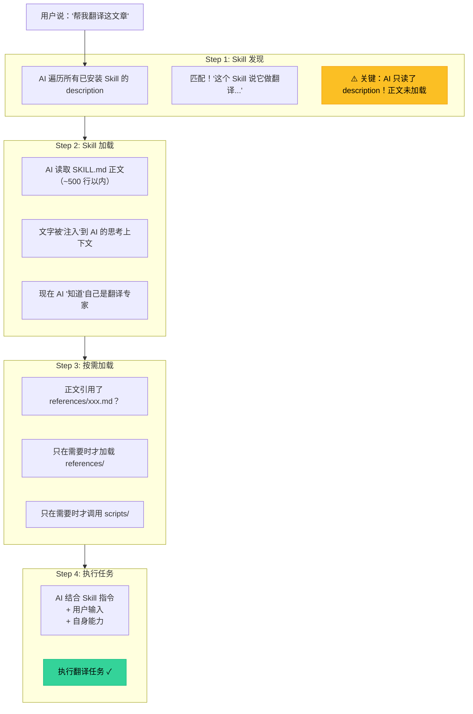
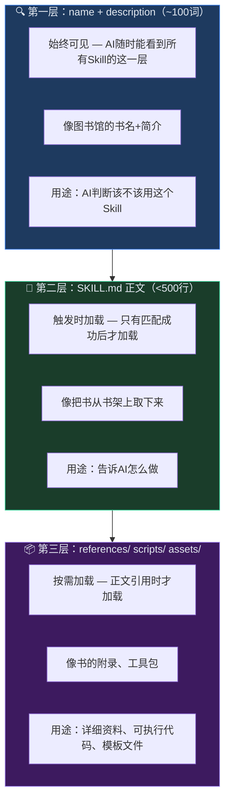
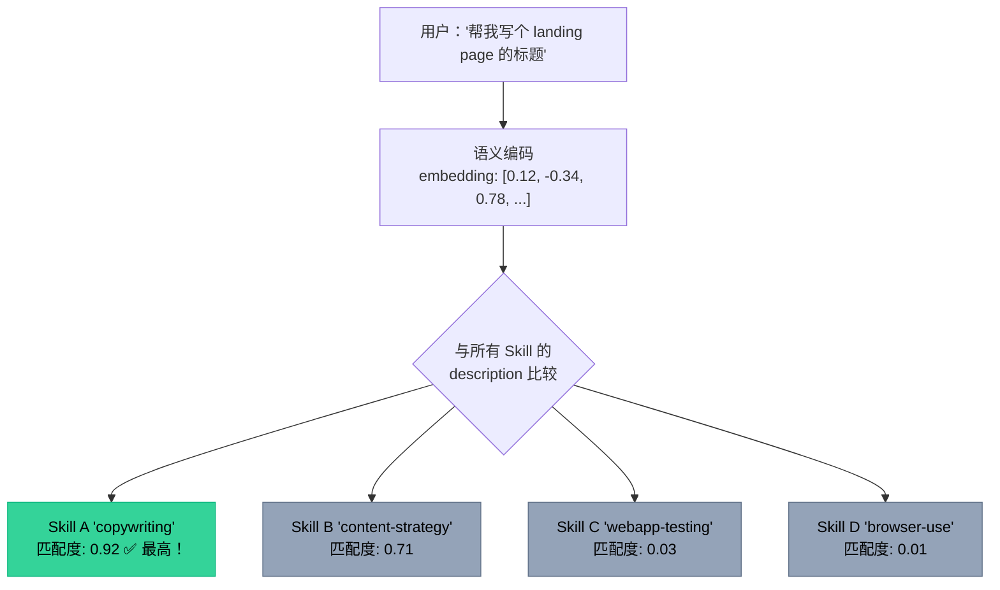

# L0-01：Skill到底是什么？—— 三分钟搞懂AI技能包的秘密

> 🎯 **学什么**：彻底理解 Skill 是什么、AI 如何使用它、以及它为什么这样设计。
> 💡 **难易度**：⭐ | ⏱️ **预计时间**：30 分钟

***

## 1. 课程概览

### 先做一个思想实验

> 💡 **白话小课堂**： 你有没有遇到过这种情况——让AI写文案，第一次写得特别好，第二次却跑偏了？这不是AI心情不好，而是你给它的"指导文字"不一样。

假设你是第一次用 Claude Code。你发现 AI 有时候很聪明，有时候很蠢。同样的任务，有时候做得很好，有时候完全跑偏。**为什么？**

答案藏在 AI 的工作方式里。AI 不是"学会"了某个技能——它只是在处理你给它的文字。**你给它的文字质量，决定了它的输出质量。**

Skill 就是解决这个问题的——**它把最好的"给 AI 的文字"固化下来，每次都能复用。**

### 本课回答 5 个问题

| #   | 问题                             | 为什么重要                 |
| --- | ------------------------------ | --------------------- |
| 1   | Skill 到底是什么？（不是比喻，是技术层面）       | 理解本质才能灵活运用            |
| 2   | AI 是怎么"看到"和"使用" Skill 的？       | 理解机制才能写出好 description |
| 3   | 为什么 Skill 采用三级加载设计？            | 理解这个才能正确拆分 SKILL.md   |
| 4   | description 为什么是 Skill 最重要的部分？ | 90% 的 Skill 问题出在这里    |
| 5   | Skill 和 System Prompt 有什么区别？   | 避免常见的设计错误             |

***

## 2. Skill 的技术本质

### 2.1 不是比喻：Skill 到底是什么

> 💡 **白话小课堂**： 把 Skill 想象成一张"任务说明书"。你交给AI的不是一个新大脑，而是一张写满"遇到这种情况你就这样做"的纸条。

```
Skill = YAML 元数据（YAML/数据格式：一种用缩进表示层级的人类易读数据格式，Skill 头部信息用它书写）+ Markdown 指令（Markdown：用简单符号如 # 表示标题的纯文本排版格式）+ 可选资源文件

它不是：
  ✗ 一段可执行代码
  ✗ 一个 API（API/应用程序接口：让不同软件之间互相通信的"插座"，调用它就能使用外部服务功能）
  ✗ 一个插件（虽然有时这样叫）
  ✗ 一个训练好的模型

它是：
  ✓ 一段被精心设计后"注入"到 AI 对话中的文字
  ✓ 在 AI 处理用户请求之前，先被加载到 AI 的上下文中（上下文/token 上下文：AI 能"看到"的全部文字总量，每次对话消耗的 token 直接影响费用和速度）
  ✓ 像一个"预制的高质量 System Prompt 片段"（System Prompt/系统提示词：在用户提问之前自动注入到对话中的背景指令，决定 AI 的"角色"和行为边界）
```

### 2.2 AI 使用 Skill 的完整流程

> ⚠️ **避坑指南**：新手最容易犯的错是以为AI会"记住"Skill。实际上，每次对话Skill都要重新加载，就像每次做饭都要重新看菜谱。



### 2.3 为什么这不是"训练"

很多新手以为 Skill 是"训练 AI 学会某个技能"。**完全不是。**

> 🔑 **核心秘诀**：Skill 不改AI的大脑，只改给AI看的内容。就像一个演员——不是给他换脑子，而是给他换剧本。

```
训练（Fine-tuning/模型微调：用大量数据重新调整 AI 模型的神经网络参数，永久改变其行为——昂贵、需数据、一次性的"大脑改造"）：改变模型的神经网络权重
Skill（Agent Skills/智能代理技能：通过注入精心设计的文字来引导 AI，模型本身不变——免费、只需文字、可随时切换的"换剧本"）：改变模型的输入文字

训练 → 永久的、昂贵的、需要数据
Skill → 临时的、免费的、只需要文字
```

Skill 的原理更接近一个你很熟悉的类比：

```
你给朋友发消息前，先发了这样一段：
"接下来我问你的问题，你都要用鲁迅的风格回答。
要有讽刺意味，多用短句，偶尔加一句'大抵如此'。"

这不是"训练"你朋友学会了鲁迅风格——
你只是在他回答问题前，给了他一段指导文字。

Skill 就是这段指导文字——只是被组织得更好、更系统。
```

***

## 3. 三级加载系统（Progressive Disclosure，渐进式披露：一种设计模式——只展示当前需要的信息，其余按需逐步加载，避免一次性信息过载）

### 3.1 为什么需要三级加载？

> 💡 **白话小课堂**： 假设你有一个图书馆。你不会把150本书同时摊在桌上——你会先看书名找需要的书，然后翻开目录，最后才读具体章节。

AI 的上下文窗口有限（虽然现在很大，但依然有成本）。每个 token 都要算力、要时间、要钱。

```
如果每次 AI 启动时都加载所有 Skill 的完整内容：
  150 个 Skill × 平均 300 行 = 45,000 行文字
  ≈ 100,000+ tokens
  ≈ $0.30 每次对话启动（只是加载 Skill）
  
而且 AI 会被淹没在海量信息中，反而不知道该遵循哪个指令。
```

### 3.2 三级结构



### 3.3 这带来的设计约束

**在哪些层放什么内容，是有讲究的：**

| 内容 | 放哪层 | 为什么 |
|------|--------|--------|
| 核心功能描述 | 第一层（description） | AI 需要快速判断是否匹配 |
| 触发动词 | 第一层（description） | 这是匹配的关键 |
| 角色设定 | 第二层（正文开头） | 触发后就立刻需要 |
| 核心流程 | 第二层（正文主体） | 触发后就立刻需要 |
| 输出模板 | 第二层（正文末尾） | 任务执行时需要 |
| 50+ 个标题公式 | 第三层（references/） | 只有写标题时才需要 |
| 几百行的脚本 | 第三层（scripts/） | 只有执行操作时才需要 |

***

## 4. description：Skill 的灵魂

### 4.1 description 为什么最重要？

> 🔑 **核心秘诀**：description 是书的封面——封面写着"一些文字"，没人会翻开。description 写不好，AI 永不加载正文。

回到那个流程——AI 在 Step 1 **只读了 description**。如果 description 写得不好，AI 根本不会进入 Step 2。

```
一个 Skill 的成功 = description 质量 × 正文质量

如果 description 是 0（AI 没匹配到），
那么正文写得再好也没用，因为永远不会被加载。
```

### 4.2 description 的三要素

看一个真实的好例子（copywriting Skill）：

```yaml
description: When the user wants to write, rewrite, or improve marketing 
copy for any page — including homepage, landing pages, pricing pages, 
feature pages. Also use when the user says "write copy for," "improve 
this copy," "rewrite this page," "marketing copy," "headline help," 
"CTA copy," "value proposition." For email copy, see email-sequence. 
For editing existing copy, see copy-editing.
```

中文翻译：

> **描述**（description/描述字段：Skill 的"自我介绍"，写在 YAML 头部，是 AI 判断是否加载这个 Skill 的唯一依据——写得不好 AI 永远不会用它）：当用户想要撰写、重写或改进任何页面的营销文案时使用——
> 包括首页（homepage）、落地页（landing page/着陆页：用户点击广告后到达的第一个页面，专门为转化设计）、定价页（pricing page）、功能页（feature page）。当用户说"写文案"、"改进这段文案"、
> "重写这个页面"、"营销文案"、"标题帮助"、"CTA文案"（CTA/Call to Action/行动号召：引导用户点击的按钮或文案，如"立即购买""免费试用"）、"价值主张"（value proposition：你的产品为什么值得买的核心理由）时触发。
> 如果是邮件文案，用 email-sequence。如果是编辑已有文案，用 copy-editing。

拆解这个 description：

```
元素 1: 功能描述（这个 Skill 做什么）
  "write, rewrite, or improve marketing copy for any page"
  翻译：「撰写、重写或改进任何页面的营销文案」
  → 一句话说清楚 Skill 的职责范围

元素 2: 触发词列表（用户会怎么说）
  "write copy for", "improve this copy", "rewrite this page"...
  翻译：「写文案」、「改进这段文案」、「重写这个页面」……
  → 覆盖中英文、口语和书面语、缩写和完整说法

元素 3: 边界标注（什么时候不用，用哪个替代）
  "For email copy, see email-sequence"
  翻译：「如果是邮件文案，用 email-sequence」
  "For editing existing copy, see copy-editing"
  翻译：「如果是编辑已有文案，用 copy-editing」
  → 避免多个 Skill 抢同一个任务，告诉 AI 正确的分工
```

**每个 description 都必须包含这三样。**

### 4.3 深度理解：description 是向量检索

从技术角度看，AI 匹配 Skill 的过程类似于向量检索（embedding/向量检索：将文字转成数学向量，通过计算向量之间的"距离"来判断语义相似度——距离越近越匹配）：



这就是为什么 description 里的触发词越多、越具体、越接近用户的自然语言，匹配就越准。

***

## 5. Skill vs System Prompt

### 5.1 区别

| 维度 | System Prompt | Skill |
|------|---------------|-------|
| **生命周期** | 整个会话都生效 | 需要时才加载 |
| **数量** | 1 个 | 可以装很多个 |
| **粒度** | 粗（全局角色） | 细（具体任务） |
| **复用** | 手动复制粘贴 | 标准化安装 |
| **管理** | 散落在各处 | 统一目录结构 |
| **社区** | 个人维护 | 可共享、可发现 |

### 5.2 一个比喻

> 💡 **白话小课堂**：System Prompt 像你的职业身份——"我是一个律师"，所有对话都受这个身份影响。Skill 像你的工具箱——需要修水管拿扳手，需要拧螺丝拿螺丝刀，互不干扰。

```
System Prompt = 你的简历
  "我是一个有 10 年经验的前端工程师，熟悉 React、TypeScript..."
  → 只有一个，全局生效

Skill = 你的工具箱
  "修水管用这个扳手，拧螺丝用这个螺丝刀，量尺寸用这个卷尺..."
  → 有很多个，需要哪个拿哪个
```

### 5.3 什么时候用 System Prompt，什么时候用 Skill？

```
用 System Prompt 当：
  ✓ 需要全局生效的角色或规则
  ✓ AI 在所有对话中都要遵守的东西
  
用 Skill 当：
  ✓ 只在特定任务中需要的能力
  ✓ 你希望在不同对话中复用
  ✓ 你想分享给别人使用
  ✓ 任务之间互不干扰
```

***

## 6. 打个比方：Skill 就像是……

> 💡 **白话小课堂**： 没有 Skill，每次做红烧肉你都要从头说一遍"焯水、炒糖色、放八角"——说法不同，结果不同。有了 Skill，你只说"做红烧肉"，AI 翻开标准操作手册，每次味道一样好。

***

## 7. 掌握检验

请回答以下 7 道题（答案在末尾）：

**Q1**：AI 发现匹配的 Skill 时，第一个加载的是什么？
- A) SKILL.md 正文
- B) references/ 中的文件
- C) description 字段
- D) scripts/ 中的脚本


**Q2**：为什么 SKILL.md 建议控制在 500 行以内？
- A) 因为 GitHub 的显示限制
- B) 为了节约 AI 上下文成本，避免信息过载
- C) 因为 YAML 解析器的限制
- D) 只是为了看起来整洁

**Q3**：description 必须包含哪三样东西？（用自己的话回答）

**Q4**：以下哪个是 description 中最重要的内容？
- A) Skill 的作者信息
- B) 触发动词和短语
- C) Skill 的版本号
- D) 安装方法

**Q5**：判断正误——"Skill 是训练 AI 学会某个技能的方法"。

**Q6**：以下哪种场景最适合使用 Skill 而不是 System Prompt？
- A) 让 AI 在所有对话中都使用中文回复
- B) 让 AI 始终扮演一个有 10 年经验的资深律师
- C) 只在用户需要翻译文档时才加载的翻译专家能力
- D) 设定 AI 永远不能透露内部技术细节的安全守则


**Q7**：根据三级加载的设计约束，以下哪组内容应该放在 SKILL.md 正文（第二层），而不是 references/（第三层）？
- A) 五十种标题公式模板库
- B) 几百行的 Python 辅助脚本
- C) 核心执行流程和输出格式模板
- D) 行业术语参考词典


***

## 8. 答案

<details>
<summary>点击查看答案</summary>

**Q1**：**C** — AI 先看所有 Skill 的 description，只有匹配了才加载正文。description 是第一层（始终可见），正文是第二层（触发时加载）。

**Q2**：**B** — 超过 500 行会导致上下文成本过高，信息过载反而降低 AI 表现。详细内容应移到 references/ 按需加载。

**Q3**：功能描述（这个 Skill 做什么）、触发词列表（用户会怎么说，中英文、口语书面语全覆盖）、边界标注（什么时候不用/用什么替代）。

**Q4**：**B** — 触发动词和短语直接决定了 AI 能否正确匹配到你的 Skill。description 是向量检索的匹配目标，触发词越丰富，命中率越高。

**Q5**：**错误** — Skill 是通过注入精心设计的文字来引导 AI 的行为，AI 的模型权重没有发生任何改变。它等价于"一段在正确时间被放在正确位置的高质量文字"，而非训练（Fine-tuning）。

**Q6**：**C** — Skill 适合特定任务、按需加载、多 Skill 互不干扰、可跨对话复用。A/B/D 都需要在整个对话生命周期中持续生效，属于全局角色或规则，适合放在 System Prompt 中。

**Q7**：**C** — 核心执行流程和输出模板是 Skill 触发后立刻需要的内容，必须放在第二层（SKILL.md 正文）。A（标题公式库）、B（辅助脚本）、D（术语词典）都是"只有特定步骤才需要"的详细资料，应放在第三层按需加载以节约上下文。

（6/7 通过）

</details>

***

## 9. 延伸阅读

- [[Skill写作教程-从零开始|Skill写作入门教程]] — 第一课和第二课深入讲解 YAML 和 description
- [[../../原始资料/Skills/marketingskills/CLAUDE.md|Marketing Skills Agent 指南]] — 看 description 最佳实践
- [[Skill大师课程/Level0-先修课/L0-02-环境搭建与工具链|下一课：动手搭建AI工作台]]

***

> 💡 **记住这句话**：Skill 的本质不是代码，不是模型，是**一段精心设计的文字，在正确的时间被放在正确的位置**。写好 Skill 的关键，是理解 AI 在什么时候读到什么内容。
