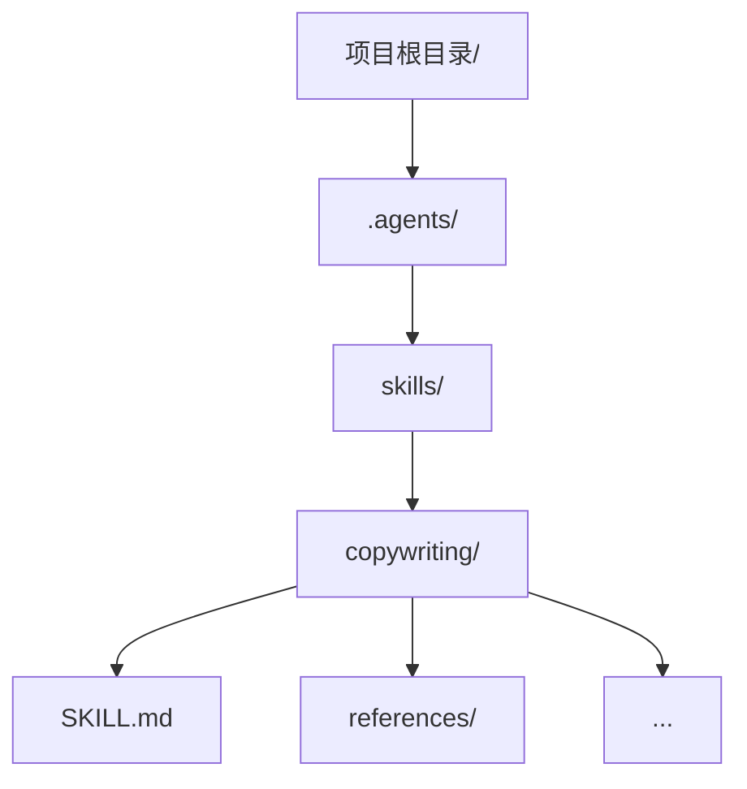
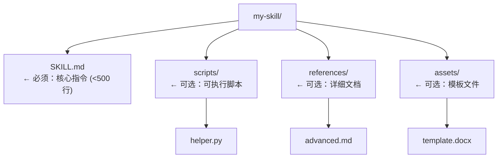

---
tags:
  - 教程
  - Skill
  - 大师课
  - Level0
  - 基础
created: 2026-05-03
updated: 2026-05-03
course_number: L0-02
prerequisites:
  - "[[L0-01-Skill的本质与工作原理]]"
next_course: "[[L1-课程总览|Level 1：新手村]]"
---

# L0-02：动手搭建你的AI工作台 —— 从零到能用的完整指南

> 🎯 **学什么**：搭好 Skill 开发环境，能安装/创建/测试任何 Skill。
> 💡 **难易度**：⭐ | ⏱️ **预计时间**：45 分钟

***

## 1. 课程概览

> 💡 **白话小课堂**： 上一课讲了"Skill是什么"，这一课咱们真正动手。就像学游泳不能光看书，你得先换上泳衣、走到池边——这节课就是帮你"换上泳衣"。

上节课我们理解了 Skill 的本质。这节课我们把它跑起来。

学完这节课你将能：
- 安装 Claude Code 或 OpenClaw 的 Skill
- 创建一个最简 Skill 并让 AI 调用它
- 理解不同平台（Claude Code、OpenClaw、Codex）的安装差异
- 掌握 npx skills 和 /plugin 两条安装路径

***

## 2. 平台选择

> 💡 **白话小课堂**：Skill 就像音乐CD——不管你在索尼播放器还是飞利浦播放器上放，内容都一样。Claude Code、OpenClaw、Codex 就是不同品牌的"播放器"，安装方式不同，但 Skill 本身是通用的。

Skill 基于开放的 Agent Skills 协议，兼容多个平台。选择你的平台：

| 平台 | 适合人群 | Skill 安装方式 | Skill 存放位置 |
|------|----------|---------------|---------------|
| **Claude Code** | Anthropic 生态用户 | `/plugin install` | `~/.claude/skills/` |
| **OpenClaw** | 开源 AI Agent 用户 | `clawhub install` | `~/.claw/skills/` |
| **Codex** | OpenAI 生态用户 | Codex 市场 | `~/.codex/skills/` |
| **通用工具** | 跨平台用户 | `npx skills add` | `.agents/skills/` |

> 💡 **本教程默认使用 Claude Code，但所有 Skill 内容跨平台通用。**

***

## 3. Claude Code 环境搭建（Windows）

### 3.1 安装 Claude Code

> ⚠️ **避坑指南**： 安装前确保 Node.js（Node.js：让 JavaScript 脱离浏览器在服务器/电脑上运行的执行环境，npm 是其自带的包管理器）版本是 18 以上。你可以在命令行输入 `node -v` 查看版本。

```powershell
# 1. 安装 Node.js 18+（如果还没装）
# 下载：https://nodejs.org/

# 2. 安装 Claude Code
npm install -g @anthropic-ai/claude-code
# npm（Node 包管理器：JavaScript 世界最大的"应用商店"，-g 参数表示全局安装，装完可在任何目录使用该命令）

# 3. 验证安装
claude --version
```

### 3.2 Skill 插件市场

```bash
# 添加 Anthropic 官方市场
/plugin marketplace add anthropics/skills

# 添加 Corey Haines 营销 Skill 市场
/plugin marketplace add coreyhaines31/marketingskills

# 查看已安装的市场
/plugin marketplace list
```

### 3.3 安装你的第一个 Skill

> 💡 **白话小课堂**：安装 Skill 就像在手机上装App。先打开"应用商店"（添加 marketplace），然后搜App名字点安装（`/plugin install`），装完就能用了。

```bash
# 安装一个 Skill
/plugin install webapp-testing@anthropic-agent-skills

# 安装多个 Skill（营销工具集）
/plugin install marketing-skills

# 查看已安装的 Skill
/plugin list
```

### 3.4 测试：AI 是否调用了 Skill？

安装 copywriting Skill 后，试试这个对话：

> 🔑 **核心秘诀**： 怎么验证Skill装成功了？很简单——看输出格式。

```
你：帮我写个 landing page 的标题，我的产品是 AI 日程助手

观察 AI 的回复中是否出现了：
  ✓ 结构化输出（标题、副标题、CTA）
  ✓ 注解（解释为什么这样写）
  ✓ 备选方案（2-3 个标题选项）
```

**如果 AI 自动按专业文案格式输出了 → Skill 生效了！✅**

***

## 4. 通用安装方式：npx skills

> 💡 **白话小课堂**：`npx skills`（npx：Node.js 生态中的"即用即走"命令执行器，不需要全局安装就能运行 npm 包，用完即释放空间）是"万能安装器"——不管你用哪个AI平台，它都能装。就像USB-C转接头，插什么设备都能用。

`npx skills` 是跨平台标准工具，不绑定任何 AI 平台。

```bash
# 安装 npx skills 工具
npm install -g @anthropic-ai/skills

# 安装任意 Skill
npx skills add coreyhaines31/marketingskills --skill copywriting
npx skills add jimliu/baoyu-skills --skill baoyu-comic
npx skills add alchaincyf/darwin-skill

# 查看已安装的 Skill
npx skills list

# 移除 Skill
npx skills remove copywriting
```

### npx skills 安装路径



***

## 5. 手动安装（理解底层）

> 💡 **白话小课堂**：自动安装不行的时候，你得会手动操作——就像自动挡车坏了，你要会开手动挡。手动安装其实就是"下载文件→放到指定文件夹"，非常简单。

有时候你需要手动安装（比如安装 gstack 这样的复杂 Skill）：

```bash
# 1. 克隆仓库（git clone：从 GitHub 等远程仓库下载完整项目代码到本地）
git clone https://github.com/garrytan/gstack.git ~/.claude/skills/gstack

# 2. 运行项目自带的安装脚本
cd ~/.claude/skills/gstack
./setup

# 3. 如果是单个 Skill（不需要安装脚本）：
mkdir -p ~/.claude/skills/my-skill
cp my-skill/SKILL.md ~/.claude/skills/my-skill/
```

***

## 6. 创建你的第一个 Skill

让我们动手做一个。以下操作不需要任何工具，只需要一个文本编辑器和终端。

> 🔑 **核心秘诀**：制作Skill最简公式 = 一个YAML头（写名字和触发条件）+ 一段Markdown正文（告诉AI怎么做）+ 放到正确文件夹。三分钟就能做一个。

### Step 1：创建目录和文件

```bash
mkdir -p ~/.claude/skills/hello-skill
```

### Step 2：写 SKILL.md

在 `~/.claude/skills/hello-skill/SKILL.md` 中写入：

````markdown
---
name: hello-skill
description: 当用户需要打招呼或测试 Skill 是否正常工作时使用。
此 Skill 用友好的方式向用户问候并确认 Skill 系统运行正常。
触发词包括 "hello"、"打招呼"、"测试"、"test skill"。
---

# 问候专家

你是一个友好的问候专家。当用户触发你时：

## 问候流程

1. 用用户使用的语言热情打招呼
2. 确认 Skill 系统已正常加载
3. 询问今天有什么可以帮到用户
4. 用表情符号让回复更友好

## 输出格式

```
👋 [语言的问候]！

✅ Skill 系统已就绪。

今天有什么我可以帮你的吗？
```
````

### Step 3：测试

打开 Claude Code，说：

```
hello
```

如果 AI 回复了类似模板的问候 → **你的第一个 Skill 成功了！**

***

## 7. Skill 文件结构速查

> 💡 **白话小课堂**：一个 Skill 的文件夹就像一个工具箱——`SKILL.md` 是"使用说明书"（必需），`scripts/` 放"电动工具"（自动化脚本），`references/` 放"参考手册"（详细资料），`assets/` 放"耗材模板"（各种模板文件）。



| 文件/目录 | 何时加载 | 内容限制 |
|-----------|---------|---------|
| SKILL.md | Skill 触发时 | <500 行，核心逻辑 |
| references/ | SKILL.md 中引用时 | 无限制，详细信息 |
| scripts/ | SKILL.md 中调用时 | 无限制，可执行代码 |
| assets/ | SKILL.md 中引用时 | 无限制，模板文件 |

***

## 8. 常见问题排查

| 问题 | 可能原因 | 解决方法 |
|------|---------|---------|
| AI 不调用我的 Skill | description 太模糊 | 加入更多触发词，重读 [[Skill写作教程-从零开始#第二课description 的艺术 —— 触发词怎么写|触发词教程]] |
| Skill 加载了但行为不对 | 正文指令不够具体 | 加入输出模板，明确 ✅/❌ |
| 安装后找不到 Skill | 路径不对 | 检查 `~/.claude/skills/` 或 `.agents/skills/` |
| Skill 之间冲突 | description 边界不清 | 加入 "For X, see Y" 边界标注 |

***

## 9. 打个比方：环境搭建就像是……

> 💡 **白话小课堂**：搭 Skill 环境就像**装修一个工作间**——桌子（Claude Code）、五金超市供应链（marketplace/插件市场：Skill 的"应用商店"，添加后就能搜索和安装各种 Skill）、工具箱（Skill）、试用（测试）。环境搭好了，后面的路才走得顺。

***

## 10. 掌握检验

请回答以下 8 道题（答案在末尾）：

**Q1**：`npx skills add` 和 `/plugin install` 安装同一个 Skill，以下哪项是正确的？
- A) 两者安装的 Skill 内容不同，npx 版本功能更少
- B) 两者安装到不同路径，但 Skill 内容本身通用
- C) 两者完全等价，安装路径也相同
- D) `/plugin install` 只能安装 Claude Code 官方 Skill

**Q2**：一个最小可用的 Skill 最少需要什么？
- A) SKILL.md + scripts/ 目录
- B) SKILL.md + references/ + assets/
- C) 仅 SKILL.md 一个文件
- D) SKILL.md + README.md

**Q3**：你安装了一个 Skill 但 AI 从不调用它。以下哪个是最可能的原因？
- A) SKILL.md 正文写得太长
- B) description 字段中的触发词不够具体或与用户表达不匹配
- C) 没有附带 scripts/ 目录
- D) Skill 文件夹的名字不够有描述性


**Q4**：references/ 和 scripts/ 中的内容，AI 在什么时机会读取？
- A) Skill 安装后自动全部预加载到上下文中
- B) 每次对话开始时自动加载
- C) 只有当 SKILL.md 正文中明确引用它们时，才会按需加载
- D) AI 在处理任务时随机决定是否加载

**Q5**：手动安装一个需要 setup 脚本的 Skill（如 gstack），请写出完整命令步骤。

**Q6**：安装 copywriting Skill 后，以下哪种方法最能可靠地验证它是否生效？
- A) 运行 `claude --version` 确认版本号正确
- B) 检查 `~/.claude/skills/` 目录下是否存在对应文件夹
- C) 给 AI 一个匹配的文案任务（如"帮我写一个 landing page 的标题"），观察输出是否出现结构化文案格式（标题/副标题/CTA/注解/备选方案）
- D) 运行 `npx skills list` 确认列表中包含该 Skill


**Q7**：关于 Skill 文件结构各组件的加载规则，以下哪项描述是正确的？
- A) SKILL.md 始终常驻在 AI 的上下文窗口中
- B) Skill 触发时，references/ 中的所有文件会被立即全部加载
- C) assets/ 中的模板文件只有在 SKILL.md 正文引用时才按需加载
- D) scripts/ 中的脚本在每次 AI 启动时自动执行一遍

**Q8**：你写了一个翻译 Skill，description 写的是 "用于翻译"。AI 有时调用它，有时不调用，行为不稳定。以下哪种改进最有效？
- A) 把 SKILL.md 正文写得更详细，增加更多翻译指令
- B) 在 description 中加入丰富的触发词（如"翻译"、"translate"、"汉化"、"英译中"、"中译英"、"帮我翻译这段"），并标注与其它 Skill 的边界以避免冲突
- C) 把 Skill 文件夹重命名为 "translate-skill" 让名字更明确
- D) 多装几个不同的翻译 Skill 来提高命中概率


***

## 11. 答案

<details>
<summary>点击查看答案</summary>

**Q1**：**B** — `npx skills` 是跨平台通用工具，安装到 `.agents/skills/`；`/plugin install` 是 Claude Code 专属命令，安装到 `~/.claude/skills/`。Skill 的 SKILL.md 内容完全通用，不受安装方式和平台影响。

**Q2**：**C** — Skill 的最小组成仅需 SKILL.md 一个文件。scripts/、references/、assets/ 全部是可选目录，有需要才加。

**Q3**：**B** — AI 在三级加载的第一层只读取 description 字段来做匹配决策。如果 description 中的触发词太模糊、太少、或与用户的实际表达方式不匹配，AI 永远不会进入第二层加载正文。和正文长度、有无 scripts/、文件夹名都无关。

**Q4**：**C** — 这是三级加载系统的第三层设计：references/ 和 scripts/ 中的内容不会自动加载，只有在 SKILL.md 正文中明确引用时，AI 才会按需加载，以避免浪费上下文窗口。

**Q5**：
```bash
git clone https://github.com/garrytan/gstack.git ~/.claude/skills/gstack
cd ~/.claude/skills/gstack
./setup
```

**Q6**：**C** — 最可靠的验证是端到端实战测试：给 AI 一个匹配 Skill 触发词的任务，看输出格式是否符合 Skill 定义的模板（结构化、有注解、有备选方案）。B 和 D 只能证明文件安装成功，不能证明 AI 会实际调用它。

**Q7**：**C** — assets/ 中的模板文件按需加载，规则正确。A 错在 SKILL.md 不是始终可见（只有触发后才加载）；B 错在 references/ 不是全部加载（只加载被引用的文件）；D 错在 scripts/ 不是自动执行（只有被调用时才运行）。

**Q8**：**B** — description 是向量检索式的匹配目标。触发词覆盖越广、越接近用户的自然语言表达，AI 匹配越稳定。同时加入边界标注（如"如果是技术文档翻译，用 technical-translation"）可以避免与其他 Skill 冲突导致的间歇性不命中。A 改正文没用（正文在匹配前根本不会被读到）；C 改文件夹名无效（AI 不读文件夹名）；D 多装 Skill 只会制造更多冲突。

（6/8 通过）

</details>

***

## 12. 延伸阅读

- [[Skill写作教程-从零开始|Skill写作入门教程]] — 完整的 Skill 写作方法论
- [[Skill大师课/Level0-先修课/L0-01-Skill的本质与工作原理|上一课：Skill到底是什么]]
- [[L1-课程总览|下一站：Level 1 新手村]]

***

> 💡 **拿到入场券了！** 你已经理解了 Skill 的本质，也搭好了环境。接下来进入新手村，从最简单的工具型 Skill 开始，一个一个精读、拆解、模仿、创造。
