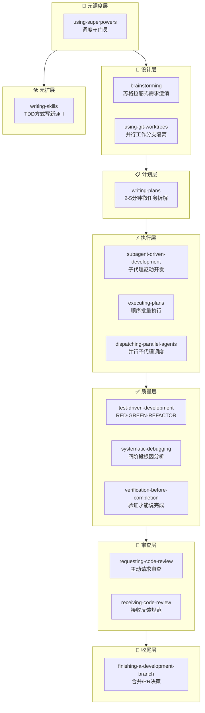

---
tags:
  - 教程
  - Skill
  - 大师课
  - Level5
  - 大师
  - 开发方法学
  - 流程纪律
created: 2026-05-06
updated: 2026-05-06
course_number: L5-25
prerequisites:
  - "[[L4-课程总览|Level 4 毕业]]"
  - "[[L5-09-Skill创建器|L5-09 Skill创建器]]"
next_course: "[[L5-26-OpenSpec规范驱动开发|L5-26 OpenSpec规范驱动开发]]"
---

# L5-25：超能力框架 Superpowers —— 用14个互锁Skill驯服AI编程流程

> 🎯 **学什么**：深入掌握 Superpowers 框架的14个互锁技能，理解"门控设计"如何强制AI遵循软件工程纪律。
> 💡 **难易度**：⭐⭐⭐⭐⭐ | ⏱️ **预计时间**：60 分钟

***

## 1. 课程概览

> 💡 **白话小课堂**：你有没有遇到过这种情况——让AI写代码，它跳过设计直接开写，然后你发现方向全错？Superpowers 就是解决这个问题的：它用14个互相卡位的"关卡"，逼着AI先想清楚再动手。

Superpowers 是 Jesse Vincent（obra）创建的 AI 编程方法学框架。它不是教你"怎么用某个工具"，而是教你"怎么让AI用正确的方法写代码"。

学完这节课你将能：
- 理解 Superpowers 的"门控设计"（Gate：硬门槛，不满足条件绝对过不去的流程关卡）哲学
- 掌握 using-superpowers 调度入口的1%规则和 Red Flags 系统
- 理解14个技能如何形成 brainstorm→plan→TDD→review→ship 的完整链路
- 能安装并在自己的项目中使用 Superpowers

***

## 2. 核心理念：为什么要"管住"AI？

### 2.1 问题：AI太"自由"了

> 💡 **白话小课堂**：给AI完全的自由，它就像一个刚学会开车但没学过交规的人——技术能开，但会闯红灯、逆行、在高速上掉头。Superpowers 就是AI的"交规"。

当 AI 编码代理（AI Coding Agent：能自主完成编程任务的AI代理——不只是回答问题，而是能自己创建文件、写代码、跑测试、做决策）没有流程约束时：

```
常见失败模式：
1. 跳过设计直接写代码 → 方向错了，全部重来
2. 不写测试 → 功能能跑，但藏着bug
3. 一边写一边"发明"需求 → 做出来的和用户要的不一样
4. 多个任务混在一起 → 代码乱成一团
5. 宣称"做完了"但没验证 → 交付不可靠
```

### 2.2 解法：互锁的 Gate 网络

Superpowers 的答案是把软件工程的"最佳实践"变成**不可跳过的关卡**：

```
 brainstorm  →  plan  →  TDD  →  review  →  ship
    🚧           🚧        🚧        🚧         🚧
  (Gate)      (Gate)    (Gate)    (Gate)     (Gate)
  
不做完上一步，绝不进入下一步。
```

> 🔑 **核心秘诀**：Jesse 提出了 Rule vs Gate vs Hook 的概念区分——Rule 有绕过路径（"我先做完这个再说"），Gate 没有绕过路径（下一步被完全阻塞）。Superpowers 里几乎每个关键转换都是 Gate。

***

## 3. 铁律与调度核心：using-superpowers

### 3.1 铁律（Iron Law）

> 💡 **白话小课堂**：这是整个框架的"宪法第一条"——没有任何讨论余地，没有任何例外。

```
IF A SKILL APPLIES TO YOUR TASK, YOU DO NOT HAVE A CHOICE. YOU MUST USE IT.
（如果某个技能适用于你的任务，你没有选择，必须用它。）

This is not negotiable. This is not optional.
（这不是可以商量的事。这不是可选项。）
You cannot rationalize your way out of this.
（你不能用任何理由绕过这个规则。）
```

### 3.2 1% 规则

> 🔑 **核心秘诀**：即使只有1%的可能性某个技能适用，也要先调用它检查。宁可用了发现不需要，也不能需要的时候没用上。

**原文**：
> "Even a 1% chance a skill might apply means that you should invoke the skill to check. If an invoked skill turns out to be wrong for the situation, you don't need to use it."

### 3.3 Red Flags 表（防止AI自我合理化）

Jesse 发现 AI 特别擅长给自己找借口。所以他预判了 AI 所有的"合理化借口"，做了这个表：

| AI 的想法（合理化借口） | 现实 |
|---|---|
| "这只是个简单问题" | 问题就是任务，检查技能 |
| "我需要先了解更多上下文" | 技能检查在澄清问题**之前** |
| "让我先探索代码库" | 技能告诉你**如何**探索 |
| "我记得这个技能" | 技能会演进，读当前版本 |
| "这个技能太过头了" | 简单的事会变复杂，用它 |
| "我先做这一件小事" | 在做任何事**之前**检查 |
| "我知道那是什么意思" | 知道概念 ≠ 使用技能，调用它 |

### 3.4 调度流程图（SKILL.md 中的 DOT 图）

> 💡 **白话小课堂**：Jesse发现Claude特别擅长遵循DOT格式的流程图，所以用DOT写了一个决策树。注意看它怎么拦住了 EnterPlanMode——防止Claude自带的plan mode成为绕过brainstorming的捷径。

```
用户消息 → 有skill适用？（1%规则）→ YES → 调用Skill → 宣布"Using [skill]" 
                                          → 有checklist？→ 创建TodoWrite → 严格执行
                                          
         → NO（确定不适用）→ 正常响应

特殊分支：About to EnterPlanMode? → 已经brainstorm过了？→ NO → 先brainstorm
```

***

## 4. 14个核心技能全景图

> 💡 **白话小课堂**：这14个技能像一个F1车队的维修站——每个位置有人专门负责一件事，但合在一起完成了一个不可能单独完成的任务。



### 4.1 元调度层

| 技能 | 一句话 | 为什么是 Gate |
|------|--------|--------------|
| **using-superpowers** | 在任何行动前强制检查可用技能 | 无此技能，整个框架不生效 |

### 4.2 设计层

| 技能 | 一句话 | 设计亮点 |
|------|--------|---------|
| **brainstorming** | 苏格拉底式提问，先澄清需求再设计——"在动手之前，确保你解决的问题是正确的" | 不允许跳过设计直接进入实现 |
| **using-git-worktrees** | 为每个功能创建隔离的 Git 工作树（Git Worktree：Git 的高级功能——允许在同一仓库同时签出多个分支到不同目录，每个功能在完全隔离的环境中开发，互不干扰） | 并行开发不打架 |

### 4.3 计划层

| 技能 | 一句话 | 设计亮点 |
|------|--------|---------|
| **writing-plans** | 将设计拆成 2-5 分钟的微任务，每个任务都有验收标准 | 粒度控制——太大无法追踪，太小浪费精力 |

### 4.4 执行层

| 技能 | 一句话 | 设计亮点 |
|------|--------|---------|
| **subagent-driven-development** | 子代理逐任务执行 + 两阶段审查（子代理：Subagent，由主 AI 代理派出的独立工作代理——每个负责一个微任务，完成后向主代理汇报） | 关注点分离——主代理管计划，子代理管执行 |
| **executing-plans** | 当不用子代理时，按顺序批量执行 + 人类检查点（检查点/Checkpoint：在多个任务之间设置的确认节点——让人类检查进度和方向，避免连续犯错） | 保留了"人类在循环中"的选项 |
| **dispatching-parallel-agents** | 多个独立问题时并行处理 | 利用 AI 的并行能力加速 |

### 4.5 质量层

| 技能 | 一句话 | 设计亮点 |
|------|--------|---------|
| **test-driven-development** | 严格 RED（先写失败测试）→ GREEN（写最少代码让测试通过）→ REFACTOR（重构优化）循环 | 禁止跳过测试写代码 |
| **systematic-debugging** | 四阶段根因分析（根因分析/Root Cause Analysis：不停留在表面现象，而是层层追问"为什么"，直到找到问题的真正源头） | 禁止"试着改一下看能不能好"的随机修复 |
| **verification-before-completion** | 必须跑验证命令才能宣称"完成了" | 禁止"我觉得应该没问题" |

### 4.6 审查层

| 技能 | 一句话 | 设计亮点 |
|------|--------|---------|
| **requesting-code-review** | 在提交前先做预审查清单（预审查/Pre-review：自己先审查一遍自己的代码——用检查清单逐项核对，确保代码在让别人看之前已经"拿得出手"） | 把审查变成主动行为而不是被动接受 |
| **receiving-code-review** | 技术性接收反馈——不辩解、不防御、直接修 | 防止"我写的代码就是最好的"心理 |

### 4.7 收尾层

| 技能 | 一句话 | 设计亮点 |
|------|--------|---------|
| **finishing-a-development-branch** | 合并/PR/丢弃/继续的四选一决策树 | 防止分支无限漂移 |

### 4.8 元扩展

| 技能 | 一句话 | 设计亮点 |
|------|--------|---------|
| **writing-skills** | 用 TDD 思路写新 Skill 的元技能（元技能/Meta-Skill：创建技能的技能——它不解决具体业务问题，而是教你如何设计、编写、测试一个新的 Skill） | 框架可以自我进化 |

> 🔑 **核心秘诀**：14个技能看起来多，但本质上只有一条主线——**"想清楚 → 拆小 → 严格做 → 验证 → 审查 → 收尾"**。每一个技能只是这条主线上的一个"交警"。

***

## 5. SessionStart Hook：框架的"启动引擎"

> 💡 **白话小课堂**：框架写得再好，如果AI不读就白搭。SessionStart Hook 就像一个在你打开 Claude Code 时自动弹出来的小便签——"嘿，你有超能力可以用，去读一下说明书！"

```xml
<session-start-hook>
<EXTREMELY_IMPORTANT>
You have Superpowers.
**RIGHT NOW, go read**: @.../skills/getting-started/SKILL.md
</EXTREMELY_IMPORTANT>
</session-start-hook>
```

这段极短的提示（< 2000 tokens，约等于 AI 处理"一片面包"的成本——相当于每次对话多花不到 0.1 美分的 token）教 Claude 三件事：
1. **你现在有 skills** —— 提醒 AI 框架已安装
2. **Skills 通过脚本搜索 + Markdown 读取来发现** —— 告诉 AI "怎么找到它们"
3. **有 Skill 可用就必须用** —— 触发 1% 规则

> ⚠️ **避坑指南**：Jesse 说这段提示是"token轻量级"的——少于2000 tokens。关键在于不能长——太长AI会忽略，太短AI不重视。"EXTREMELY IMPORTANT"不是随便写的，是经过实验证明能引起AI注意的措辞。

***

## 6. 深度思考：Superpowers 与 gstack 的设计哲学对比

> 💡 **白话小课堂**：两个顶级框架，两种不同的哲学——Superpowers 像"交规"（不管你开什么车，交规都一样），gstack 像"4S店全套服务"（从买车、保养、修车、二手车全包）。

| 维度 | Superpowers | gstack |
|------|-----------|--------|
| **作者背景** | Jesse Vincent：开源社区老炮 | Garry Tan：YC CEO/投资人 |
| **核心哲学** | "流程纪律自动化"——把方法论变成 Gate | "角色扮演协作"——AI扮演CEO/审查员/QA |
| **技能数量** | 14 个（精挑细选的最小集） | 50+ 个（全覆盖工程体系） |
| **适用场景** | 通用软件开发（语言/框架无关） | 完整的企业级工程团队模拟 |
| **启动机制** | SessionStart Hook（轻量注入） | 内置在技能中（渐进式加载） |
| **风格** | 极简主义——每个技能只做一件事 | 企业级——覆盖从计划到部署全流程 |

> 🔑 **核心秘诀**：两个框架不冲突——可以一起用。Superpowers 管"流程纪律"（该不该做），gstack 管"执行能力"（怎么做）。

***

## 7. 手写模仿：设计一个你的"Mini 门控系统"

请完成以下练习：

**任务**：设计一个包含 3 个 Gate 的简化版流程控制系统。

**要求**：
1. 定义 3 个 Gate（参考 Superpowers：设计 Gate → 实现 Gate → 验证 Gate）
2. 每个 Gate 写出"什么条件才算通过"（硬性标准，含糊的不算）
3. 写出至少 2 个 Red Flag（AI 会用什么借口绕过你的 Gate？你怎么反驳？）

**示例模板**：
```markdown
## Gate 1：需求确认 Gate
通过条件：用户明确说"确认"之前，不得进入 Gate 2
Red Flag："这个需求很明显，不需要确认" → 反驳：需求是否"明显"不由AI判断，由用户判断
```

***

## 8. 常见错误

| 错误 | 为什么错 | 正确做法 |
|------|---------|---------|
| 只装 using-superpowers 不装其他技能 | 调度器能找到技能，但发现一个都不装，等于白装 | 安装完整的 14 个技能集 |
| 把 Gate 写成 Rule | "建议先做设计"不是 Gate——AI 会说"我这次先跳过了" | 写成"没有设计文档，实现步骤无法开始" |
| Red Flags 表不够具体 | "我觉得不需要"这个借口太模糊，反驳不了 | 为每个 Gate 写 2-3 个具体的常见借口和反驳 |
| 在 SessionStart Hook 里写太多 | 超过 2000 tokens 的 hook 会被 AI 的注意力机制忽略 | Hook 控制在 500 tokens 以内 |
| 忘了写"如果技能不适用怎么办" | AI 调用了技能但发现不匹配，却没有退出路径 | 1% 规则本身就说了调了发现不适用可以不用 |

***

## 9. 掌握检验

请回答以下 5 道题（答案在末尾）：

**Q1**：Superpowers 的 "1% 规则" 说的是什么？
- A) 只使用1%的技能就够了
- B) 即使只有1%的可能适用也要先调用检查
- C) 技能对任务的成功率只需1%
- D) 每次只加载1%的技能内容

**Q2**：Rule 和 Gate 的核心区别是什么？
- A) Rule 是代码层面的，Gate 是流程层面的
- B) Rule 有绕过路径（可以被合理化掉），Gate 没有绕过路径
- C) Rule 是 Claude Code 的，Gate 是 OpenClaw 的
- D) 没有区别，只是说法不同

**Q3**：为什么 SessionStart Hook 要控制在 2000 tokens 以内？
- A) 因为 GitHub 的文件大小限制
- B) 太长 AI 的注意力会分散，反而忽略关键内容
- C) 为了节约硬盘空间
- D) 因为 YAML 解析器的限制

**Q4**：Red Flags 表的设计目的是什么？（用自己的话回答）

**Q5**：Superpowers 的 brainstorming 技能拦截了 EnterPlanMode 入口——这个设计背后是什么考虑？

***

## 10. 答案

<details>
<summary>点击查看答案</summary>

**Q1**：**B** —— 即使只有1%的可能性某个技能适用，也要先调用它检查。宁可调了发现不需要，也不能需要时没调。

**Q2**：**B** —— Gate 是硬门槛，无法绕过。Rule 有绕过路径，AI 可以自我合理化跳过它。Jesse 的深刻洞察是：对 AI 来说，"建议"和"不存在"是一样的——只有强制 Gate 才有效。

**Q3**：**B** —— 超过 2000 tokens 的 hook 会被 AI 注意力机制忽略（注意力分散效应），反而达不到"提醒AI有技能可用"的目的。极简才是有效。

**Q4**：**预判并封堵 AI 的自我合理化**。AI 非常擅长找借口绕过程序化的规则（"这个任务太简单了""我先探索一下""我记得这个技能"）。Red Flags 表提前列出了这些常见借口，并给出了反驳——相当于给"交警"配备了一个"常见借口反驳指南"。

**Q5**：**防止 Claude Code 自带的 Plan Mode 成为绕过 brainstorming 的捷径**。Jesse 发现如果不专门拦截，AI 会选择直接进入 Plan Mode（系统自带功能）而跳过 brainstorming（Superpowers 的功能）——相当于"官方通道"成了"逃票通道"。这个设计体现了 Superpowers 的核心思想：任何可能被绕过的路径都必须被堵上。

（4/5 通过）

</details>

***

## 11. 延伸阅读

- [[L5-09-Skill创建器|L5-09 Skill创建器]] — 用 Skill 创建 Skill 的元技能
- [[L5-26-OpenSpec规范驱动开发|L5-26 OpenSpec 规范驱动开发]] — 另一个方法论框架
- [[L6-01-创业门诊室|L6-01 gstack 创业门诊室]] — gstack 的方法论对比
- [[知识库/来源/superpowers]] — 项目完整档案
- [[知识库/实体/Superpowers项目]] — 作者和背景信息

***

> 💡 **记住这句话**：Superpowers 的本质不是"让 AI 更聪明"，而是"让 AI 更守纪律"。聪明但没纪律的 AI 是定时炸弹，守纪律的 AI 才是可靠的搭档。
