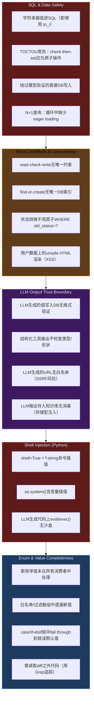

# L6-15：PR代码审查 —— AI帮你把关每一行代码的质量

> 🎯 **学 gstack 旗舰级代码审查工作流**：不是看两眼 diff 说"looks good"，而是从平台检测、范围漂移、计划完成度审计到关键 pass、专家军团、对抗审查的完整多阶段审查体系。
> ⏱️ **预计时间**：45 分钟

***

> [!quote]- 📖 原Skill精要
> **技能名称**：review
> **核心功能**：gstack 旗舰级登陆前 PR 审查。分析相对于 base 分支的 diff，检查 SQL 安全性、LLM 信任边界违规、条件副作用及其他结构性问题。多阶段审查管道：平台检测→范围漂移→计划完成度审计→双 pass 审查（CRITICAL + INFORMATIONAL）→专家军团并行审计→对抗审查→审查仪表盘持久化。
> **所属体系**：gstack 虚拟工程团队
> **协作关系**：审查仪表盘与 [[L6-25-发布上线管理|ship]] 集成，确保未审查代码不能发布

---

## 1. 课程概览

> 💡 **白话小课堂**：传统 code review 就像同事扫一眼你的 PR 说"looks good to me"——最多发现几个 typo。gstack review 是一个完整的工程判断系统：先检测你用的什么平台（GitHub/GitLab/原生 Git）、找到基准分支，然后像侦探一样检查"你建的是被要求建的吗？"（范围漂移检测）、"你建完了计划里要求的吗？"（计划完成度审计）、再逐行扫描 SQL 注入、竞态条件、LLM 信任边界违规等致命问题（CRITICAL pass），接着启动 7 个 AI 专家并行审查同一份 diff（Testing/Security/Performance 等）、后跟对抗审查（让另一个 AI 攻击你的代码找漏洞），最后自动修复机械性问题、批量询问需要人类判断的问题——并且把所有结果持久化，让 /ship 知道你审过了。

---

## 2. review 是什么——不是读 diff，是工程判断

```markdown
## review vs 传统代码审查

传统 code review：
  → 读 diff → 看有没有明显 bug → 写几句评论 → approve

gstack review：
  → 平台检测 → 范围漂移检测 → 计划完成度审计
  → 双 pass 审查（CRITICAL + INFORMATIONAL）
  → 专家军团并行审计（6+ 个专业领域）
  → Fix-First 修复（自动修 + 批量问）
  → 对抗性审查（Claude + Codex 独立攻击 diff）
  → 持久化结果（/ship 可以读取审查状态）

这不是"帮忙看代码"，这是工程判断系统。
```

***

## 3. 审查的入口：Step 0-1——检测与验证

```markdown
## Step 0: 平台与基准分支检测

review 是跨平台的：
  → GitHub：gh pr view → gh repo view
  → GitLab：glab mr view → glab repo view
  → 原生 Git：symbolic-ref / rev-parse origin/main → origin/master
  → 最终回退：main

检测出基准分支后，所有后续 git diff / git log / git fetch 都使用这个名字。

## Step 1: 分支检查
  1. git branch --show-current → 获取当前分支
  2. 如果在基准分支上 → "Nothing to review" 并停止
  3. git fetch origin <base> --quiet → git diff origin/<base> --stat
  4. 无 diff → 同上停止

这是审查的"门控"——没有变化就不浪费后续所有步骤。
```

***

## 4. Step 1.5：范围漂移——他们建了什么？

```markdown
## Scope Drift Detection

在审查代码质量之前，先检查：**他们建的是被要求建的吗？**

三个意图来源：
  1. TODOS.md（如果存在）
  2. PR 描述（gh pr view --json body）
  3. 提交信息（git log origin/<base>..HEAD --oneline）

评估矩阵：
  **SCOPE CREEP（范围漂移）**
  → 变更的文件与声明的意图无关
  → "When I was in there..." 式的蔓延变更
  → 扩大了爆炸半径的新功能或重构

  **MISSING REQUIREMENTS（缺失需求）**
  → TODOS.md/PR 描述中的需求未在 diff 中体现
  → 声明的需求的测试覆盖空白
  → 部分实现（开始但未完成）

输出格式：
  Scope Check: [CLEAN / DRIFT DETECTED / REQUIREMENTS MISSING]
  Intent: <1 行总结>
  Delivered: <diff 实际做了什么>
  [如有 drift：列出每个超出范围的变更]
  [如有 missing：列出每个未实现的需求]

这是信息性的——不阻止审查。继续下一步。
```

> ⚠️ **避坑指南**： 范围漂移是 code review 里最容易被忽略但最危险的问题。一个 PR 标着"修复结算 bug"，结果悄悄重构了积分计算模块。

***

## 5. 计划完成度审计——计划 vs 交付

```markdown
## Plan Completion Audit

review 会搜索计划文件（plan file），将计划中的每个可操作项与 diff 交叉对比：

### 可操作项提取
从计划中提取：
  → 复选框项（- [ ] ...）
  → 编号步骤（"1. Create ...", "2. Add ..."）
  → 文件级规范（"New file: path/to/file.ts"）
  → 测试需求（"Test that X", "Add test for Y"）
  → 数据模型变更（"Add column X to table Y"）

忽略：
  → 上下文/背景章节
  → TBD / "TODO: decide" 开放项
  → 明确推迟的项（Future: / Out of scope: / P2-P4）
  → CEO 审查决策章节

### 交叉对比分类
对每个提取的计划项，对照 diff：
  → DONE — diff 中有明确证据（引用具体文件）
  → PARTIAL — 有工作但未完成
  → NOT DONE — diff 中没有证据
  → CHANGED — 用不同方法实现了相同目标

保守 DONE，宽松 CHANGED。

### 缺失原因调查
对每个 PARTIAL 或 NOT DONE：
  → Scope cut（有意的移除）
  → Context exhaustion（中途停止）
  → Misunderstood requirement（建了但不匹配）
  → Blocked by dependency
  → Genuinely forgotten

无计划文件时回退到提交信息 + TODOS.md。
计划文件的缺口记录为 learnings（跨会话记忆）。
```

***

## 6. Step 4：双 Pass 审查——关键 + 信息

````markdown
## Pass 1 — CRITICAL（最高严重度）

> 🎨 **颜色含义**：红色系 = 最高严重度（SQL 注入/Shell 注入），橙色系 = 竞态条件，紫色系 = LLM 信任边界，蓝色系 = 枚举完整性检查。暗色背景是为 Obsidian 暗色主题优化的。



## Pass 2 — INFORMATIONAL（仍在审查，严重度较低）

  → Async/Sync 混用（事件循环阻塞）
  → 列/字段名安全（ORM 查询中的列名正确性）
  → LLM Prompt 问题（0 基列表、工具描述漂移）
  → 完整性空白（≤30 分钟就能完成的捷径实现）
  → 时间窗口安全（日期键查找假定了 24 小时覆盖）
  → 边界类型强制（Ruby→JSON→JS 的类型变化风险）
  → 视图/前端（内联 style、O(n*m) 查找）
  → 分发 & CI/CD（构建工具版本、产物平台覆盖）
````

***

## 7. Step 4.5-4.6：专家军团——并行专业审查

````markdown
## Review Army 架构

主审查者（Claude 主 Agent）处理关键 pass 后，
启动专家子 Agent 组成并行审查军团：

### Always-on（每个审查都运行，≥50 行变更）
  1. Testing — 缺失的负面路径测试、边缘情况、测试隔离
  2. Maintainability — 死代码、魔数、陈旧注释、DRY 违反

### 条件分发（由 scope 信号触发）
  3. Security — auth/bypass 模式、注入向量、加密误用
  4. Performance — N+1 查询、缺失索引、算法复杂度、打包大小
  5. Data Migration — 可逆性、数据丢失、锁时长、回填策略
  6. API Contract — 破坏性变更、版本化策略、错误响应一致性
  7. Design — 前端文件变更时的 AI slop 检测

### 自适应门控
  → 读取每个专家的历史命中率
  → 0 命中 / 10+ 分发 = 自动门控（跳过）
  → Security 和 Data Migration 永不被门控（保险策略）
  → 用户可用 --security / --performance / --all-specialists 强制

### 并行分发
  → 所有专家在一个消息中启动（多 Agent 工具调用）
  → 每个专家的 prompt 包含：清单 + 技术栈 + 过往 learnings
  → 每个专家输出 JSON 行（每条发现一个对象）
  → 聚合 + 指纹去重 + 置信度合并
  → 多专家确认的发现：置信度 +1（上限 10）
  → PR 质量评分 = max(0, 10 - (critical × 2 + informational × 0.5))
````

> 🔑 **核心秘诀**：专家军团的"自适应门控"是工程智慧的体现——如果 Security 专家跑了 10 次都零命中，不是说明它没用，而是你的项目安全做得不错。

***

## 8. 置信度校准——不是所有发现都是平等的

```markdown
## Confidence Calibration（1-10）

| 分数 | 含义 | 显示规则 |
|------|------|---------|
| 9-10 | 阅读具体代码验证。展示了具体 bug 或漏洞。 | 正常显示 |
| 7-8 | 高置信度模式匹配。很可能正确。 | 正常显示 |
| 5-6 | 中等。可能是误报。 | 显示但带"验证"警告 |
| 3-4 | 低置信度。模式可疑但可能没问题。 | 附录中抑制 |
| 1-2 | 推测。 | 仅在严重度为 P0 时报告 |

发现格式：[SEVERITY] (confidence: N/10) file:line — description

校准学习：
  → 如果置信度 < 7 的发现被用户确认为真实问题
  → 这是校准事件——记录为 learning
  → 未来审查中该模式将获得更高置信度
```

***

## 9. Step 5：Fix-First——每个发现都要行动

```markdown
## Fix-First 启发式

每个发现都要被处理——不只是关键发现。

### Step 5.0: 跨审查发现去重
  → 读取之前审查中用户 skip 的发现
  → 如果发现指纹匹配且相关代码未变更 → 抑制
  → 从不抑制 fixed 或 auto-fixed——它们可能回归

### Step 5a: 分类每个发现
  AUTO-FIX（Agent 不询问直接修复）：
    → 死代码 / 未用变量
    → N+1 查询（缺少 eager loading）
    → 魔数 → 命名常量
    → 缺少 LLM 输出验证
    → 版本/路径不匹配
    → 内联样式、O(n*m) 视图查找

  ASK（需要人的判断）：
    → 安全（auth、XSS、注入）
    → 竞态条件
    → 设计决策
    → 大型修复（>20 行）
    → 枚举完整性
    → 任何改变用户可见行为的修复

  经验法则：如果修正是机械的，高级工程师会毫不犹豫地应用 → AUTO-FIX
           如果理性工程师可能对修正有分歧 → ASK

### Step 5b: 自动修复所有 AUTO-FIX
  → 直接应用每个修复
  → 每个输出一行：[AUTO-FIXED] [file:line] 问题 → 做了什么

### Step 5c: 批量询问 ASK 项
  → 所有 ASK 项合并为一个 AskUserQuestion
  → 列出问题 + 推荐修复
  → 选项：A) 按推荐修复 / B) 跳过
  → ≤3 个 ASK 项时可单独询问

### Step 5d: 应用用户批准的修复
  → 只修复用户选 A 的项
```

***

## 10. Step 5.7：对抗审查——攻击你自己的 diff

```markdown
## Adversarial Review（始终运行，不论 diff 大小）

### Claude 对抗子 Agent（始终运行）
  → 通过 Agent 工具分发
  → 独立的新上下文——与结构化审查无偏见重叠
  → Prompt："像一个攻击者和混沌工程师一样思考"
  → 寻找：边缘情况、竞态、安全漏洞、资源泄漏、静默数据损坏
  → 输出分类：FIXABLE（知道怎么修）或 INVESTIGATE（需要人判断）
  → 结尾必须有：Recommendation: <action> because <one-line reason>

### Codex 对抗挑战（从不同模型获取独立意见）
  → 如果 Codex 可用且未被 legacy 配置禁用
  → codex exec → 运行 git diff origin/<base> → 攻击性审查
  → 5 分钟超时
  → 纯信息性——从不阻止 ship

### Codex 结构化审查（大型 diff，200+ 行）
  → DIFF_TOTAL >= 200 时触发
  → codex review --base <base>
  → 检查 [P1] 标记：找到 → GATE: FAIL
  → 门禁失败时使用 AskUserQuestion：
    A) 调查并修复 / B) 继续

### 跨模型综合
  高置信度（多来源一致）：[多个 pass 同意的发现]
  Claude 结构化独有、Claude 对抗独有、Codex 独有的发现分别列出
  多来源一致的高置信度发现优先修复
```

***

## 11. 持久化——/ship 知道你审过了

```markdown
## Step 5.8: 持久化审查结果

gstack-review-log 记录：
  → skill: "review"
  → status: "clean" / "issues_found"
  → issues_found, critical, informational（剩余未解决数）
  → quality_score（PR 质量评分）
  → specialists（每个专家的分发状态 + 发现统计）
  → findings（每个发现：指纹 + 严重度 + 行动）
  → commit: git rev-parse --short HEAD

这使 /ship 能识别到 Eng Review 已在此分支上运行。

## 交叉审查发现去重（为下次审查准备）
  → 之前审查中 skip 的发现被记录
  → 下次审查时自动抑制（如果代码未变更）
  → 防止对同一问题重复询问
```

***

## 12. 结构拆解：PR 代码审查 Skill 模板

```markdown
## 多阶段 PR 代码审查型 Skill 模板

### 核心特征
→ 管理对象 = 代码变更（PR/MR diff）的全面质量保证
→ 核心原则 = 工程判断系统（非读 diff 评论）+ Fix-First 行动导向 + 跨模型交叉验证
→ 关键设计 = 12 步审查管道、双 Pass 架构（CRITICAL/INFORMATIONAL）、
  专家军团并行审查、对抗审查、置信度校准、审查仪表盘持久化

### 通用结构

## 前置门控（Step 0-1.5）
- Step 0: 平台检测（GitHub/GitLab/原生 Git）+ 基准分支检测
- Step 1: 分支检查 → 无 diff → 停止
- Step 1.5: 范围漂移检测——SCOPE CREEP vs MISSING REQUIREMENTS
  三个意图来源（TODOS.md / PR 描述 / 提交信息）

## 计划完成度审计（Plan Completion Audit）
- 从计划文件提取可操作项 → DONE / PARTIAL / NOT DONE / CHANGED
- 缺失原因调查（Scope cut / Context exhaustion / Misunderstood / Blocked / Forgotten）
- 保守 DONE，宽松 CHANGED

## 双 Pass 审查（CRITICAL + INFORMATIONAL）
- Pass 1 CRITICAL：SQL & Data Safety / Race Conditions / LLM Trust Boundary / Shell Injection / Enum Completeness
- Pass 2 INFORMATIONAL：Async/Sync / Column Safety / LLM Prompt / Completeness Gaps / Time Window / Type Coercion / View / CI/CD

## 专家军团（Review Army）
- Always-on：Testing + Maintainability（≥50 行变更）
- Conditional：Security / Performance / Data Migration / API Contract / Design
- 自适应门控：0 命中 / 10+ 分发 → 自动跳过（Security/Data Migration 永不门控）

## Fix-First 修复（Step 5）
- 分类：AUTO-FIX（机械性）vs ASK（需人类判断）
- 批量处理：AUTO-FIX 直接修复 + ASK 合并询问
- 跨审查去重：skip 抑制、fixed 不抑制

## 对抗审查 + 持久化
- Claude 对抗子 Agent + Codex 对抗挑战（跨模型交叉验证）
- gstack-review-log JSONL 持久化 → /ship 门控读取
```

***

## 13. 电商 Skill 案例：review —— 审查电商结算模块 PR

> 🛒 **实战案例**：某电商平台支付模块的一次PR合并——工程师提交了 `feature/multi-coupon-checkout` 分支，描述为"支持多优惠券叠加+运费计算优化"，diff覆盖12个文件、+350/-180行。传统code review看到"逻辑清晰、代码整洁"就approve了。gstack review启动12步审查管道。

> - **Step 0-1 平台检测与范围检查**：Step 0检测GitHub PR #427，基准分支main。Step 1.5范围漂移检测——意图来源为PR描述"多优惠券+运费优化"；实际交付包括✅多优惠券叠加逻辑(6文件)、✅运费计算优化(3文件)，但也包括⚠️重构了用户积分计算(1文件——与另一PR #425冲突)、⚠️修改了支付回调签名验证(2文件——应独立审查)。Scope Check: DRIFT DETECTED。
> - **计划完成度审计**：计划文件要求6个可操作项。DONE——多优惠券数据模型(coupon_applications表)、叠加规则引擎、运费分段计算。PARTIAL——优惠券冲突提示UI（后端完成但前端仅基础展示）。NOT DONE——优惠券叠加单元测试（0个新增测试）、运费边界测试（超大重量/超远距离，0个新增测试）。缺失原因：优惠券测试是genuinely forgotten，运费边界测试是有意延后到下一PR。
> - **Pass 1 CRITICAL审查**：发现4个关键问题。(1)SQL并发——查询优惠券可用性未加FOR UPDATE，并发两个请求可能读到同一张优惠券都认为可用→修复：SELECT ... FOR UPDATE锁行。(2)竞态条件——优惠券used_count更新使用read-check-write模式，并发下两个请求读到同一个计数→修复：`UPDATE coupons SET used_count=used_count+1 WHERE id=? AND used_count<max_usage`原子操作。(3)支付回调状态更新——直接update订单状态→修复：`WHERE status='PENDING' SET status='PAID'`原子CAS。(4)订单金额计算顺序——优惠券折扣在订单总额之后应用导致金额基于原始价而非折后价→修复：重新排序计算流程。
> - **Pass 2 INFORMATIONAL审查**：3个信息性发现——优惠券100%折扣时订单金额为0（微信支付不允许0元支付请求→需特殊处理直接标记已支付）、运费0元（满99包邮）为代码硬编码但运营后台可配置→应从配置读取、优惠券计算使用同步方法在查询100+可用优惠券时耗时>50ms阻塞事件循环→建议异步批量计算。
> - **专家军团与对抗审查**：Security专家发现回调IP未做白名单验证（攻击可从任意IP发送伪造回调）；Performance专家发现库存扣减每个SKU单独执行Redis DECR（一个订单5个SKU=5次往返→应使用Pipeline批量）；Testing专家发现回调的负面路径测试完全缺失（签名无效/body为空/金额不符）；Red Team(FIXABLE)发现并发支付回调+库存扣减的死锁场景——回调1获取库存锁等订单锁，回调2获取订单锁等库存锁→修复：统一锁获取顺序（先库存后订单）。
> - **修复结果**：PR质量评分从初始3.5/10→第3轮审查后9.0/10。共发现CRITICAL 4个(并发安全为主)、INFORMATIONAL 3个、专家发现7个(含对抗审查2个)。修复后并发压测5000请求零超卖，回调幂等性回归全部通过。

> 🔑 **启示**：如果这个PR只做传统code review（扫一眼diff、看逻辑清晰就approve），4个CRITICAL并发安全问题会全部进入生产环境。后果：大促期间优惠券被超用、订单状态不一致、支付金额计算错误——修复成本从开发阶段的几小时变成线上事故的几天+资金损失。

***

## 14. 掌握检验

**Q1**：范围漂移检测中，"SCOPE CREEP"和"MISSING REQUIREMENTS"的核心区别是什么？
- A) SCOPE CREEP 是做了不该做的，MISSING REQUIREMENTS 是该做的没做
- B) SCOPE CREEP 是代码质量问题，MISSING REQUIREMENTS 是设计问题
- C) 它们是完全相同的概念
- D) SCOPE CREEP 是安全漏洞，MISSING REQUIREMENTS 是性能问题

**Q2**：在双 Pass 审查中，LLM Output Trust Boundary 为什么被归入 CRITICAL pass（而非 INFORMATIONAL）？
- A) 因为 AI 生成的内容总是错误的
- B) 因为 LLM 输出跨越信任边界写入数据库/执行代码/发请求时，一旦验证缺失就是安全漏洞
- C) 因为这是最常见的代码问题
- D) 因为 LLM 审查比其他专家更慢

**Q3**：Fix-First 启发式中 AUTO-FIX 和 ASK 的核心判断标准是"机械性"。请分析：为什么"死代码/未用变量"是 AUTO-FIX，而"竞态条件"是 ASK？这个分类的背后体现了什么工程安全原则？

**Q4**：在结算模块案例中，PR 描述了"多优惠券叠加 + 运费优化"但实际也修改了积分计算和支付回调。如果只做传统代码审查（只看 diff 不比对 PR 描述），这两个范围外变更有什么具体的风险？请从"与其他 PR 冲突"和"安全隔离"两个角度分析。

**Q5**：对抗审查（Adversarial Review）中 Claude 和 Codex 的角色区别是什么？为什么两个模型的"确认"（都发现同一问题）比单一模型的发现更有价值？

**Q6**：计划完成度审计中，为什么"保守 DONE，宽松 CHANGED"是一个重要的判断原则？如果一个计划项的分类被误判（实际 NOT DONE 但被标为 DONE），这对后续开发流程会造成什么连锁影响？

***

## 15. 答案

<details>
<summary>点击查看答案</summary>

**Q1**：**A** —— SCOPE CREEP 是"当我在里面顺手改了别的"式的蔓延变更（做了不该做的），MISSING REQUIREMENTS 是声明的需求在 diff 中没有体现（该做的没做）。

**Q2**：**B** —— LLM 输出具有不可预测性和非确定性。

**Q3**：死代码/未用变量是"机械正确"的修复——删除它们永远不会错（编译器/解析器已经证明了它们无用），不需要业务判断。竞态条件是"上下文相关"的修复——正确的修复方式取决于具体的并发语义（该用乐观锁还是悲观锁？该用分布式锁还是数据库锁？），错误的"修复"可能引入更严重的死锁或数据不一致。这体现了核心安全原则：机械操作的低风险可以自动化，语义操作的高风险需要人类判断。

**Q4**：与其他 PR 冲突——积分计算也在另一个 PR #425 中被修改，两个 PR 若同时合入 main，合并冲突可能被粗暴解决（选一边删另一边），导致其中一方的功能丢失。安全隔离——支付回调涉及资金安全，任何修改都应独立审查。如果支付回改变更混在"多优惠券叠加"PR 中，审查者的注意力会被优惠券逻辑分散，安全相关变更可能被当作"顺手小改"被轻视，遗漏安全漏洞。

**Q5**：Claude 对抗子 Agent 是"系统内对抗"——在同一上下文中有完整代码视图，从攻击者/混沌工程师角度寻找逻辑漏洞。Codex 是从"不同模型"的独立视角——不同训练数据和方法意味着不同的直觉和盲区。两个模型都确认的问题意味着独立验证——排除了"某个模型特定的盲区"的可能性，降低了确认偏误。单一模型可能忽略自己"不擅长发现"的问题类型，两个模型同时发现则高置信度。

**Q6**："保守 DONE"意味着只在有明确证据时标记完成（如文件确实在 diff 中创建/修改），防止"看起来好像完成了但因为乐观判断而遗漏"。"宽松 CHANGED"意味着即使实现方式不同，只要目标达成也认可——避免对实现细节的过度约束。如果误判：一个 NOT DONE 被标为 DONE → 缺失的测试不会在后续流程中被发现 → Bug 到生产环境才暴露 → 返工成本是开发阶段的 10-100 倍。这个原则保护的是整个管道的信任基础。

（5/6 通过）
</details>

***

## 延伸阅读
- [[L6-16-专家审查军团|专家审查军团 —— 7个AI专家同时审查你的代码]]
- [[L6-17-审查清单体系|审查清单体系 —— 让代码审查像飞行员起飞前检查一样可靠]]
- [[L6-14-设计系统哲学|设计系统哲学 —— 理解为什么"好看"不是拍脑袋决定的]]
