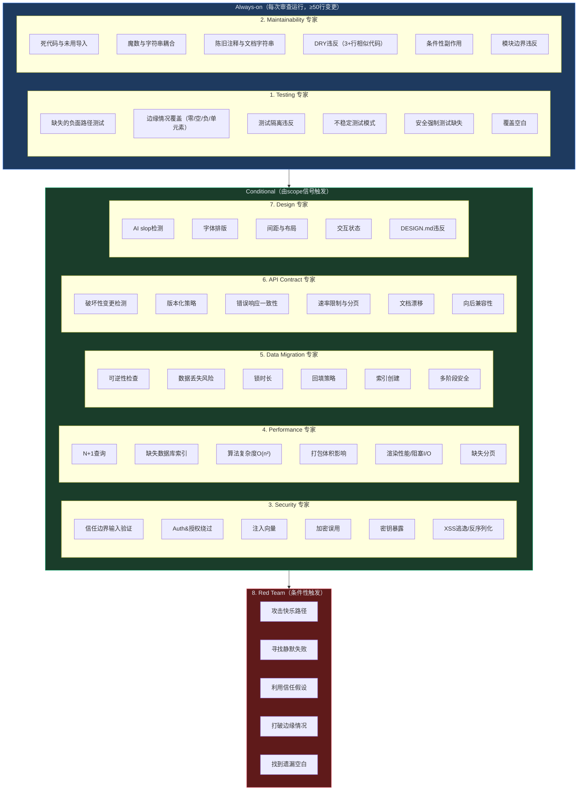

# L6-16：专家审查军团 —— 7个AI专家同时审查你的代码

> 🎯 **学 gstack 的并行专家审查军团**：不是一个人看 diff，而是 7 个专业领域的 AI 子 Agent 并行审计——从测试覆盖到安全漏洞到 API 契约变更，每个专家只看自己最擅长的事，然后指纹去重合并结果。
> ⏱️ **预计时间**：35 分钟

***

> [!quote]- 📖 原Skill精要
> **技能名称**：review-specialists（[[L6-15-PR代码审查|review]] 的子系统）
> **核心功能**：gstack review 的并行专家军团子系统。基于 scope 检测自动选择并并行派发 7 个专业子 Agent：测试、可维护性、安全、性能、数据迁移、API 契约、设计。每位专家读取领域专属检查清单，独立审查 diff，输出结构化发现。支持自适应门控（命中率低则自动跳过）和跨专家交叉确认。
> **所属体系**：gstack 虚拟工程团队
> **协作关系**：是 [[L6-15-PR代码审查|review]] 的 Step 4.5，专家发现与关键 pass 发现合并后进入 Fix-First 修复循环

---

## 1. 课程概览

> 💡 **白话小课堂**：你可以把一个 AI 想象成一个全科医生——什么都能看一点，但深度有限。一个审查者不可能同时深入思考 SQL 注入（需要安全专家思维）、评估 API 向后兼容性（需要 API 设计师视角）、检测缺失的数据库索引（需要 DBA 经验）、判断前端打包体积影响（需要性能工程师直觉）。gstack 的解决方案不是让一个 AI 同时成为所有专家，而是并行启动 7 个专门的子 Agent——每个只读自己的专业清单、独立审查同一份 diff、互不污染——然后指纹去重合并发现，多个专家都确认的问题获得置信度加成。更妙的是自适应门控：如果一个专家跑了 10 次零命中，就自动跳过（除了 Security 和 Data Migration——它们是保险策略，永不被门控）。

---

## 2. 为什么需要专家系统？

```markdown
## 单人审查的认知局限

一个审查者不可能同时：
  → 深入思考 SQL 注入（需要安全专家思维）
  → 评估 API 向后兼容性（需要 API 设计师视角）
  → 检测缺失的数据库索引（需要 DBA 经验）
  → 判断前端打包体积影响（需要性能工程师直觉）
  → 发现测试隔离问题（需要测试架构师眼光）

gstack 的解决方案：
  → 不要求一个 Agent 同时是所有专家
  → 并行启动多个专业的子 Agent
  → 每个子 Agent 只读自己的专业清单
  → 独立审查同一个 diff——互不污染
  → 指纹去重合并发现
  → 多专家确认的发现获得置信度加成

这不是"让 AI 审查代码"，这是"组建一个虚拟的 AI 审查委员会"。
```

***

## 3. 七大专家 + 一个红队

````markdown
## 专家军团编制


````

***

## 4. 自适应门控——不浪费审查预算

````markdown
## 为什么需要门控？

如果每次都运行所有专家：
  → Security 专家在纯前端 CSS 变更上跑 = 浪费
  → 测试专家在无测试的仓库跑了 100 次零发现 = 浪费
  → 技能调用变得更慢但产出不变

自适应门控的两层过滤：

### Layer 1: Scope 门控（静态）
  → gstack-diff-scope 分析 diff 中变更的文件
  → 只分发与 diff 实际触及的领域相关的专家
  → 例：无迁移文件的 diff → 不分发 Data Migration 专家

### Layer 2: Hit Rate 门控（动态）
  → gstack-specialist-stats 读取每个专家的历史命中率
  → 0 发现 / 10+ 次分发 → [GATE_CANDIDATE]
  → 标记为门控候选的专家自动跳过
  → 例外：Security 和 Data Migration 是保险策略——永不被门控
  → 例外：[NEVER_GATE] 标记的专家始终运行

### 用户强制
  → --security / --performance / --testing / --all-specialists
  → 用户显式指定的专家忽略所有门控
````

> ⚠️ **避坑指南**： Security 和 Data Migration 永不被门控——即使它们跑了 100 次零发现，第 101 次也照样跑。因为安全漏洞和数据丢失是不可逆的，一次漏掉就可能致命。

***

## 5. 并行分发与结果合并

```markdown
## 分发协议

所有选中的专家在**一个消息**中启动：
  → 多个 Agent 工具调用
  → 每个子 Agent 有独立的上下文（无先前审查偏见）
  → 每个子 Agent 的 prompt 包含：
    1. 专家清单内容（已读入的文件）
    2. 技术栈上下文（Ruby / Node / Python / Go / Rust）
    3. 该领域的过往 learnings
    4. 输出格式指令（JSON 行）

## 输出格式

每个专家输出每行一个 JSON 对象：
{
  "severity": "CRITICAL|INFORMATIONAL",
  "confidence": N,
  "path": "file",
  "line": N,
  "category": "testing|security|performance|...",
  "summary": "...",
  "fix": "...",
  "fingerprint": "path:line:category",
  "specialist": "testing|security|..."
}
可选：test_stub（测试框架骨架代码）

零发现时输出：NO FINDINGS

## 指纹去重

合并所有专家的发现后：
  → 按指纹分组（path:line:category）
  → 同指纹保留置信度最高的
  → 同指纹的多专家发现 → 标记 MULTI-SPECIALIST CONFIRMED
  → 多专家确认的发现置信度 +1（上限 10）

## 置信度门控

  → 7+ 置信度：正常显示
  → 5-6 置信度：显示但带"验证"警告
  → 3-4 置信度：移至附录
  → 1-2 置信度：完全抑制
```

***

## 6. PR 质量评分

```markdown
## 计算方法

quality_score = max(0, 10 - (critical_count × 2 + informational_count × 0.5))

  → 0 个发现 → 10/10
  → 1 个 critical → 8/10
  → 3 个 critical + 5 个 informational → 10 - (6 + 2.5) = 1.5/10
  → 上限 10（即使公式算出更高）

## 评分的含义

  → 9-10：优秀——几乎无问题
  → 7-8：良好——少量信息性问题，零关键问题
  → 5-6：可接受——有一些问题需要关注
  → 3-4：需要改进——多个关键或大量信息性问题
  → 1-2：差——系统性质量问题
  → 0：严重——需要重建或重大返工

评分随审查结果持久化——/ship 可以读取它作为合入决策的输入。
```

***

## 7. Red Team——找到别人漏掉的

```markdown
## Red Team 的独特定位

Red Team 不是另一个专家——它是"专家的对手方"：
  → 在所有专家完成后运行
  → 能看到其他专家的发现（知道已经抓到了什么）
  → 任务是找遗漏的
  → 不是查清单——是攻击性分析

## 五个攻击向量

  1. 攻击快乐路径
     → 10x 负载下系统表现如何？
     → 两个请求同时命中同一资源？
     → 数据库慢（5s+）时？外部服务返回垃圾？

  2. 寻找静默失败
     → 吞掉异常只记日志的错误处理
     → 可部分完成的操作（5 个中 3 个处理完就崩溃）
     → 无告警的失败后台任务

  3. 利用信任假设
     → 前端验证了但后端没验证的数据
     → 无认证的内部 API（"只有我们自己的代码调用这个"）
     → 假定存在但未验证的配置值

  4. 打破边缘情况
     → 最大输入尺寸？
     → 零元素、空字符串、null？
     → 第一次运行（无已有数据）？
     → 100ms 内连点两次按钮？

  5. 找专家之间的空白
     → 安全 + 性能 = ？→ 资源耗尽的 DoS
     → API + 数据迁移 = ？→ 迁移期间 API 返回不一致
     → 跨类别的集成边界问题
```

> 🔑 **核心秘诀**：Red Team 之所以能发现其他专家漏掉的东西，是因为它反着思考。

***

## 8. 结构拆解：专家审查军团 Skill 模板

```markdown
## 并行专家审查军团型 Skill 模板

### 核心特征
→ 管理对象 = 代码 diff 的深度多维度审查（非单人审查，是虚拟审查委员会）
→ 核心原则 = 专业分工（每个专家只看自己最擅长的事）+ 并行独立（互不污染）+ 自适应门控（不浪费审查预算）
→ 关键设计 = 7 专家 + 1 红队编制、双层门控（Scope + Hit Rate）、
  JSON 行输出 + 指纹去重 + 多专家置信度加成、PR 质量评分

### 通用结构

## Expert Army Roster（专家军团编制）
- Always-on（≥50 行变更）：Testing（6 维）+ Maintainability（6 维）
- Conditional（scope 触发）：Security / Performance / Data Migration / API Contract / Design
- Red Team（条件触发）：在所有专家完成后运行，找遗漏

## Adaptive Gating（双层自适应门控）
- Layer 1 Scope 门控：分析 diff 文件范围 → 只分发相关专家
- Layer 2 Hit Rate 门控：0 命中 / 10+ 分发 → 自动跳过
- 不可门控保险策略：Security + Data Migration（永不被跳）
- 用户强制覆盖：--security / --performance / --all-specialists

## Parallel Dispatch & Merge（并行分发与合并）
- 单消息启动所有选定专家（独立上下文）
- 每个专家 prompt：清单 + 技术栈 + learnings + 输出格式
- JSON 行输出（fingerprint: path:line:category）
- 指纹去重 → 多专家确认（MULTI-SPECIALIST CONFIRMED → 置信度 +1）
- 置信度门控：7+ 正常 / 5-6 警告 / 3-4 附录 / 1-2 抑制

## PR Quality Score（PR 质量评分）
- 公式：max(0, 10 - (critical×2 + informational×0.5))
- critical 权重是 informational 的 4 倍（安全优先）
- 评分 9-10 优秀 → 0 严重

## Red Team Attack Vectors（Red Team 五攻击向量）
- 攻击快乐路径 / 寻找静默失败 / 利用信任假设 / 打破边缘情况 / 找专家间空白
```

***

## 9. 电商 Skill 案例：专家军团审查——支付 + 库存模块

> 🛒 **实战案例**：某电商App发版前（v3.8.0），一个涉及支付回调和库存扣减的大PR（18个文件，+520/-340行）需要最终审查。主审查Claude 4已完成双Pass审查（发现3个CRITICAL），CTO要求启动7专家联合审查——这是发版前的最后一道质量闸门。

> - **Scope信号分析**：SCOPE_BACKEND=true(Node.js+TypeScript)、SCOPE_AUTH=true(支付回调签名验证)、SCOPE_MIGRATIONS=true(新增coupon_applications表)、SCOPE_API=true(回调响应格式变更)、SCOPE_FRONTEND=false。自适应门控决策：Testing和Maintainability(always-on)、Security(有auth)、Performance(有backend)、Data Migration(有migrations)、API Contract(有API变更)、Design(跳过，无前端)、Red Team(diff>200行)。
> - **Testing专家**：CRITICAL——支付回调3个负面路径测试完全缺失（签名无效时/body为空时/金额与订单不符时）。INFORMATIONAL——测试fixture使用了真实手机号（隐私泄露风险）。发现4个(CRITICAL 1, INFORMATIONAL 3)。
> - **Maintainability专家**：支付回调处理函数287行圈复杂度34（建议拆为parse→validate→process→respond四步）；魔数3600在4个文件重复（应定义ONE_HOUR常量）；3个函数含相同try-catch-log模式（应提取withErrorHandler()）。发现3个(全INFORMATIONAL)。
> - **Security专家**：CRITICAL——签名验证使用SHA256而非微信要求的HMAC-SHA256（SHA256易受长度扩展攻击）；回调IP未做白名单验证（攻击者可伪造回调）；HIGH——nonce检查在内存Map（服务重启丢失导致5分钟重放攻击窗口）。发现3个(CRITICAL 2, HIGH 1)。
> - **Performance专家**：HIGH——库存扣减中每个SKU单独执行Redis DECR（一个订单5个SKU=5次Redis往返=~25ms延迟）。修复：使用Redis Lua脚本批量原子扣减，5个SKU一次往返。INFORMATIONAL——支付回调幂等检查每次都查DB无缓存→建议Redis缓存已处理回调ID(TTL 24h)。
> - **Data Migration专家**：CRITICAL——coupon_applications表迁移无回滚脚本（迁移失败无法恢复→必须提供DOWN迁移）。INFORMATIONAL——大表新增外键约束未使用CONCURRENTLY（会锁表影响线上订单创建→建议先加索引再加约束两阶段迁移）。
> - **API Contract专家**：CRITICAL——支付回调响应格式从XML改为JSON，破坏性变更！旧版客户端发送XML并期望XML响应→需要版本化或Accept header兼容。INFORMATIONAL——新增字段payment_method_detail未出现在API文档中（文档漂移）。
> - **Red Team(对抗)**：FIXABLE——并发支付回调+库存扣减的死锁场景（回调1：获取库存锁等订单锁；回调2：获取订单锁等库存锁→死锁）。修复：统一锁获取顺序为"先库存后订单"。FIXABLE——库存扣减成功后支付回调失败导致库存未释放→引入Saga补偿逻辑。
> - **多专家交叉确认**：nonce内存存储问题被Security专家(CRITICAL)和Red Team(FIXABLE)独立从两个角度确认→置信度从9/10升至10/10。指纹去重后最终发现数：CRITICAL 4个、INFORMATIONAL 5个、FIXABLE 2个。

> **发版决策**：7专家共发现11个问题（含2个CRITICAL被多专家确认）。CTO判断——CRITICAL全部修复后可发版，INFORMATIONAL中的魔数常量和函数拆分纳入下个迭代。3天后所有CRITICAL修复+回归测试通过，v3.8.0发版无安全事故。

> 🔑 **启示**：单一审查者（哪怕是最强的AI模型）天然有视野盲区——擅长签名的Security专家可能忽略性能，擅长性能的专家可能忽略数据迁移。7专家军团的价值在于把"一个人的仔细看"变成"七个人的各看各专长"——覆盖率从单人60-70%提升到军团90%+。

跨专家发现的互补：
  → Testing: 缺负面测试 → Security: 签名算法错误
    → 耦合发现：如果签名算法本来就错了，负面测试也测不出来
  → Performance: Redis 批量扣减 → Red Team: 死锁
    → 关联：批量扣减如果包含死锁修复，性能优化才有意义
```

### PR 质量评分

```
CRITICAL 发现: 4 个（Security×1, Data Migration×1, API Contract×1, Testing×1
  注：Security 的 2 个 CRITICAL 中 1 个与 Red Team 去重）
INFORMATIONAL 发现: 8 个
HIGH 发现: 1 个（归入 INFORMATIONAL 计算）

quality_score = max(0, 10 - (4×2 + 9×0.5))
              = max(0, 10 - (8 + 4.5))
              = max(0, 10 - 12.5)
              = max(0, -2.5)
              = 0/10 🚩

评定：严重——存在支付安全漏洞 + 数据库迁移无回滚 + API 破坏性变更
      这个 PR 必须先修复 CRITICAL 再考虑合入
```

### 专家自适应门控的学习

```
本次审查后更新专家命中率：

Security: 2 CRITICAL + 1 HIGH → 高价值，保持 always-visible
Testing: 1 CRITICAL + 3 INFORMATIONAL → 高价值
Data Migration: 1 CRITICAL + 1 INFORMATIONAL → 高价值
→ 所有专家均有有效发现 → 下次类似 scope 继续全部分发

/learn "支付回调审查必须触发 Security + API Contract + Red Team 三个专家" --type operational
```
```

***

## 10. 掌握检验

**Q1**：专家军团中，哪些专家是 Always-on（每次审查都运行）？
- A) 全部 7 个专家
- B) Testing 和 Maintainability
- C) Security 和 Data Migration
- D) API Contract 和 Design

**Q2**：自适应门控中，Hit Rate 门控的逻辑是什么？
- A) 命中率高的专家被跳过
- B) 0 命中 / 10+ 次分发的专家自动被标记为门控候选并跳过
- C) 所有专家都始终运行
- D) 只有用户选择的专家运行

**Q3**：PR 质量评分公式 `max(0, 10 - (critical × 2 + informational × 0.5))` 中，为什么 informational 发现的权重是 0.5 而不是 1？这个权重差异体现了什么工程价值观？

**Q4**：Red Team 的 5 个攻击向量中，"寻找静默失败"和"利用信任假设"有什么本质区别？请各举一个在电商系统中可能发生的例子。

**Q5**：在支付+库存模块案例中，Testing 专家发现"支付回调的负面路径测试缺失"，而 Security 专家发现"签名算法使用 SHA256 而非 HMAC-SHA256"。这两个发现之间有什么耦合关系？为什么 single-expert 审查可能只发现其中一个而忽视另一个？

**Q6**：如果 Performance 专家多次在同类 diff 中零命中，说明什么？应该直接门控掉 Performance 专家吗？请从"保险策略 vs 效率权衡"的角度分析。

***

## 11. 答案

<details>
<summary>点击查看答案</summary>

**Q1**：**B** —— Testing 和 Maintainability 是 always-on（每个审查都运行，≥50 行变更）。

**Q2**：**B** —— 命中率门控基于历史数据：某个专家在 10+ 次分发中零发现 → 标记为 GATE_CANDIDATE → 自动跳过。

**Q3**：informational 发现影响质量但不立即威胁系统（如魔数、陈旧注释），critical 发现可导致数据损坏、安全漏洞或服务中断。0.5 vs 2 的权重差异是 4 倍——这体现了"安全优先"的工程价值观：一个可能导致线上故障的并发安全问题，其严重性是 4 个代码风格问题无法比拟的。权重设计确保 critical 发现真正主宰评分而非被大量 informational 噪音稀释。

**Q4**：静默失败——系统吞掉错误后继续运行但状态不一致。例：库存扣减成功但后续下单失败，事务回滚未正确处理库存补偿，系统返回"下单失败"但库存已少了一件——静默损失了库存。利用信任假设——认为本该验证的数据是干净的。例：前端发来的价格字段被直接写入数据库，因为"前端是我们自己的代码"——但任何人用 curl 就可以发任意价格。

**Q5**：耦合关系：①如果签名算法本身是错的（SHA256 而非 HMAC-SHA256），即使写了负面测试（测试无效签名），测试用的是错误算法生成的"错误无效签名"，没有测出真正的签名问题。②Testing 专家检查"测试存在性"，Security 专家检查"算法正确性"——两个维度不可互相替代。耦合发现意味着：Testing 说要加测试，Security 说要改算法——修复的顺序应该是先改算法，再基于正确算法写测试，反之则测试作废。

**Q6**：零命中可能说明两个不同的情况：①项目的性能做得非常好——这是好消息，Performance 专家的"低命中率"实际上是最佳状态。②Performance 专家的检查清单对这个技术栈不够精准——需要更新清单而非门控专家。不应直接门控：因为性能问题通常是"长时间潜伏后一次性爆发"的类型（不像安全问题是"每次请求都可能触发"）。即使 10 次零命中，第 11 次可能发现一个 QPS 暴涨时的 N+1 查询——一次发现的价值可能远超前 10 次零命中的成本。性能应设置更高的门控阈值（如 50 次零命中）而非 10 次。

（5/6 通过）
</details>

***

## 延伸阅读
- [[L6-15-PR代码审查|PR代码审查 —— AI帮你把关每一行代码的质量]]
- [[L6-17-审查清单体系|审查清单体系 —— 让代码审查像飞行员起飞前检查一样可靠]]
- [[L6-10-设计审计与修复|设计审计与修复 —— 像X光一样扫描你产品的UI问题]]
