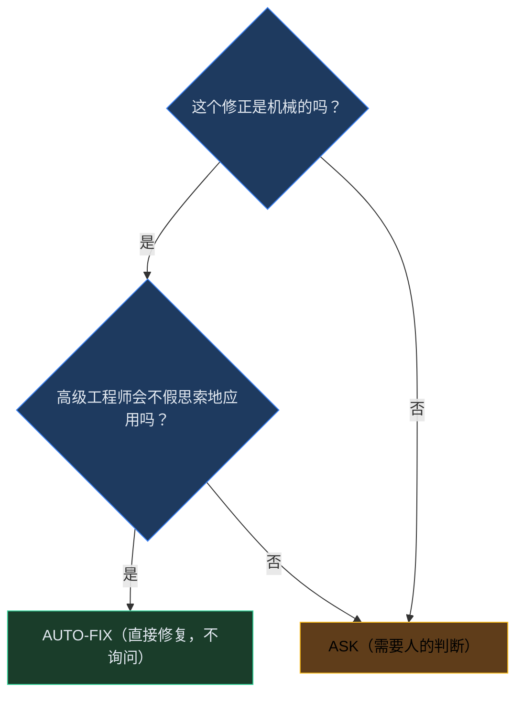

# L6-17：审查清单体系 —— 让代码审查像飞行员起飞前检查一样可靠

> 🎯 **学 gstack 的结构化审查清单设计**：不是"看看有什么问题"的自由形式，而是双 pass 分类（CRITICAL/INFORMATIONAL）、Fix-First 启发式、抑制规则和严重度分类——让审查可预测、可重复、可改进。
> ⏱️ **预计时间**：30 分钟

***

> [!quote]- 📖 原Skill精要
> **技能名称**：review-checklist（[[L6-15-PR代码审查|review]] 的子系统）
> **核心功能**：gstack review 的结构化检查清单系统。双 pass 分类（CRITICAL + INFORMATIONAL）覆盖 SQL 注入、信任边界、并发安全等领域。Fix-First 启发式决定每个发现的处理方式（AUTO-FIX vs ASK），抑制规则避免重复标记，严重度分类让审查可预测、可重复、可改进。
> **所属体系**：gstack 虚拟工程团队
> **协作关系**：是 [[L6-15-PR代码审查|review]] 的 Step 2-3，所有审查发现均通过清单分类和 Fix-First 启发式处理

---

## 1. 课程概览

> 💡 **白话小课堂**：飞行员起飞前要对照检查清单逐项确认——不是因为他们不专业，恰恰相反，正是因为太专业才知道人的记忆不可靠。没有清单的代码审查取决于审查者当时的状态（累不累、熟不熟悉代码），每次覆盖的维度都不一样，容易漏掉不熟悉的类别（比如 shell 注入）。gstack 的审查清单哲学是：你是专家——清单帮你记住所有要查的东西；不是逐项打勾的机械操作，而是系统性的提醒系统。清单本身有两个核心设计：双 Pass 架构（先集中精力查 CRITICAL、再扫 INFORMATIONAL）利用了认知心理学原理；抑制规则（DO NOT flag 列表）可能比标记规则更重要——因为噪音会淹没有信号。

---

## 2. 清单为什么重要？

```markdown
## 清单 = 审查质量的底线

没有清单的审查：
  → 取决于审查者当时的状态（累不累、熟不熟悉代码）
  → 每次审查覆盖的维度不一样
  → 容易漏掉不熟悉的类别（比如 shell 注入）
  → 无法衡量审查的完整性
  → 经验不可累积和传承

有清单的审查：
  → 每个维度都经过系统检查
  → 不依赖审查者的"感觉"
  → 遗漏率大幅下降
  → 清单本身可以持续改进（添加新发现模式）
  → 新人也能做到 80% 的审查覆盖率

gstack 的清单哲学：
  → 你是专家——清单帮你记住所有要查的东西
  → 不是逐项打勾的机械操作，而是系统性的提醒系统
  → DO NOT flag 部分和 DO flag 部分同等重要
```

***

## 3. 双 Pass 架构：CRITICAL → INFORMATIONAL

```markdown
## 为什么是两次 pass？

一次 pass 的问题：
  → 人的注意力是有限的——你会对"差不多"的东西疲劳
  → 到第 20 个检查项时，你的标准已经漂移了
  → 关键问题淹没在信息性问题中

双 pass 解决这个问题：
  → Pass 1（CRITICAL）：只关注最高严重度的问题
    - 精力充沛时做最重要的判断
    - 只检查 5 个类别
  → Pass 2（INFORMATIONAL）：剩余的信息性类别
    - 在关键 pass 做完后，用较低的认知负载扫描其余问题

## 类别划分的逻辑

CRITICAL = 会导致数据损坏、安全漏洞、服务中断的问题
  SQL & Data Safety、Race Conditions、LLM Trust Boundary、
  Shell Injection、Enum Completeness

INFORMATIONAL = 影响质量但不立即威胁系统的问题
  Async/Sync Mixing、Column Name Safety、LLM Prompt Issues、
  Completeness Gaps、Time Window Safety、Type Coercion、
  View/Frontend、Distribution & CI/CD

SPECIALIST（子 Agent 处理） = 需要专门领域知识的深度检查
  Testing、Maintainability、Security、Performance、
  Data Migration、API Contract、Red Team
```

> 🔑 **核心秘诀**：双 Pass 的设计利用了认知心理学原理——人的注意力是最稀缺的资源。

***

## 4. Pass 1 深度解读——五个关键类别

```markdown
## SQL & Data Safety

核心原则：永远不要让用户输入成为 SQL 语法的一部分。

常见错误模式：
  → "WHERE id = #{params[:id]}" （即使是 .to_i 也不行）
  → Model.where("status = '#{input}'") （字符串插值）
  → Model.connection.execute("SELECT ... #{interpolated}")
  → Model.update_column(:status, value) （跳过验证）

正确做法：
  → 参数化查询（Rails: sanitize_sql_array / Arel）
  → WHERE 子句使用数组形式（Rails: Model.where("status = ?", value)）
  → 使用 ORM 的内置方法，不用 raw SQL

## Race Conditions & Concurrency

核心原则：任何"读取 → 判断 → 写入"的模式在并发下都会出问题。

关键发现模式：
  → hash = compute_hash(...); Model.where(hash: hash).first || Model.create!(hash: hash)
    → 缺失：唯一索引 + 重复键错误处理
  → if record.status == 'draft'; record.update!(status: 'published')
    → 缺失：原子 WHERE 更新（record.update! 不如 Model.where(id: id, status: 'draft').update_all） 
  → find-or-create 无 DB 唯一约束

## LLM Output Trust Boundary

核心原则：LLM 的输出是不可信的——必须像对待用户输入一样对待 LLM 输出。

跨越边界时验证：
  → LLM → 数据库写入（格式验证、类型检查）
  → LLM → 邮件/通知（format 验证、长度限制）
  → LLM → URL fetch（白名单 hostname、SSRF 防护）
  → LLM → 知识库/向量 DB（消毒、注入防护）

## Shell Injection (Python)

核心原则：永远不要用 shell=True + 用户/LLM 数据拼接命令字符串。

检查模式：
  → subprocess.run(f"cmd {user_input}", shell=True)
  → os.system(f"cmd {var}")
  → 正确做法：subprocess.run(["cmd", arg1, arg2])

## Enum & Value Completeness

核心原则：新增一个枚举值 = 必须追踪所有消费这个枚举的地方。

操作步骤：
  1. 用 Grep 找到所有引用兄弟值的地方
  2. Read 每个匹配的文件
  3. 检查 switch/case、if/elsif 链、白名单数组
  4. 新值是否在任何消费者中被遗漏？
  5. 这是唯一需要读取 diff 之外的代码的审查类别
```

***

## 5. Fix-First 启发式——每一个发现都要行动

````markdown
## 不是"报告问题"，是"修复问题"

审查清单的目的不是生成报告——是改善代码。

## 分类决策树



## AUTO-FIX 条件（满足任一即可）

  ✓ 死代码 / 未用变量 / 未用导入
  ✓ N+1 查询（缺少 eager loading）——将 .includes 加到查询
  ✓ 陈旧注释与代码矛盾
  ✓ 魔数 → 命名常量
  ✓ 缺少 LLM 输出验证——添加格式守卫
  ✓ 版本/路径不匹配
  ✓ 变量赋值后从未读取
  ✓ 内联样式、O(n*m) 视图查找

## ASK 条件（满足任一即可）

  ✗ 安全（auth、XSS、注入）
  ✗ 竞态条件
  ✗ 设计决策
  ✗ 大型修复（>20 行代码变更）
  ✗ 枚举完整性（语义判断）
  ✗ 删除功能（需要确认意图）
  ✗ 改变用户可见行为的任何修复

## 经验法则

如果修正可以写成一条规则"把 X 改成 Y"且永远不会错 → AUTO-FIX
如果修正在不同上下文中可能是不同的做法 → ASK

Critical 发现倾向于 ASK（固有风险更高）
Informational 发现倾向于 AUTO-FIX（更机械）
````

***

## 6. 抑制规则——什么东西不要标记

````markdown
## DO NOT flag 的重要性和 DO flag 一样重要

过度标记的问题：
  → 噪音淹没有信号——审查者疲劳
  → 打击开发者信心（"又是这些没用的 flag"）
  → 增加审查时间却不提高质量
  → 标记无意义的问题降低整体信任度

## 抑制列表

不标记：
  → "X 与 Y 重复"——当冗余无害且提高可读性时
    （如 present? 与 length > 20 冗余但作为文档存在）
  → "加个注释解释为什么选这个阈值/常量"——阈值在调优中变化，
    注释会过时
  → "这个断言可以更严格"——当断言已经覆盖行为时
  → 建议纯一致性变更（"把这段包在条件里以匹配另一个常量的防护方式"）
  → "正则不处理边缘情况 X"——当输入受约束且 X 在实践中不会出现时
  → "测试一次测了多个守卫"——测试不需要隔离每个守卫
  → Eval 阈值变更——这些是经验调优的，经常变化
  → 无害的 no-ops（如对数组中不存在的元素 .reject）
  → 你的审查 diff 中已经处理过的任何事——完整读 diff 再评论

## 设计清单的特有抑制

  → 第三方/vendor CSS 文件
  → CSS reset 或 normalize 样式表
  → 测试 fixture 文件
  → 生成的/压缩的 CSS
  → DESIGN.md 中明确声明为有意的模式
````

> ⚠️ **避坑指南**： 抑制规则可能比标记规则更重要。如果每次审查都标记 12 个问题但 34% 是误报，工程师就学会忽略所有标记。

***

## 7. 设计清单——特殊的前端审查

```markdown
## 设计清单是代码审查的一部分

design-checklist.md 被 review 中的 Design 专家使用：

### AI Slop 检测（最高优先级）
六个 AI 生成 UI 的特征信号：
  1. 紫色/蓝紫渐变背景
  2. 3 列功能网格（彩色圆形图标 + 粗标题 + 2 行描述 × 3）
  3. 彩色圆形图标作为区块装饰
  4. 居中一切（>60% 的文本容器用 text-align: center）
  5. 统一的泡泡圆角（>80% 元素用相同 ≥16px 的 radius）
  6. 通用 Hero 文案（"Welcome to X"、"Unlock the power of..."）

### 其他类别
  字体排版、间距与布局、交互状态、DESIGN.md 违反

### 置信度分层
  → [HIGH]：通过 grep/模式匹配可靠检测。确定性的发现。
  → [MEDIUM]：通过模式聚合或启发式检测。标记但要预期噪音。
  → [LOW]：需要理解视觉意图。呈现为"可能的——验证或运行 /design-review"

### AUTO-FIX vs ASK（设计上下文）
  AUTO-FIX（仅机械 CSS 修复——HIGH 置信度且无设计判断）：
    → outline: none 无替代 → outline: revert 或 focus-visible 环
    → 新 CSS 中的 !important → 删除并修复 specificity
    → body 文本 font-size < 16px → 升至 16px
  ASK（其余一切——需要设计判断）
```

***

## 8. 清单的演化——它是活的

```markdown
## 清单不是一成不变的

清单应该持续演化：

### 何时添加新类别
  → 在审查中反复发现某个模式被漏掉
  → 新增了一种之前没考虑过的漏洞类型
  → 一种新的 AI 生成反模式（slop 模式）出现

### 何时移除或调整
  → 某类发现总是误报（低信号、高噪音）
  → 框架/语言更新让某个模式不再适用
  → 抑制规则中描述的情况变得普遍

### 学习的闭环
  → 每次审查都是学习机会
  → 如果用户对某类标记说"这不是问题"→ 记录为 learning
  → 如果漏掉了某个严重问题 → 分析为什么漏掉 → 更新清单
  → 审查清单本身是知识积累的容器
```

***

## 9. 结构拆解：审查清单体系 Skill 模板

```markdown
## 审查清单体系型 Skill 模板

### 核心特征
→ 管理对象 = 代码审查的检查项系统——审查的"底线"和"记忆辅助"
→ 核心原则 = 双 Pass 分离（CRITICAL vs INFORMATIONAL 注意力分配）+ Fix-First 行动导向 + 抑制优先（降噪比增项更重要）
→ 关键设计 = 5 类 CRITICAL 检查项、8 类 INFORMATIONAL 检查项、
  AUTO-FIX vs ASK 决策树、抑制规则体系、清单演化机制

### 通用结构

## Dual-Pass Architecture（双 Pass 架构）
- Pass 1 CRITICAL（5 类，精力充沛时检查）：
  SQL & Data Safety / Race Conditions / LLM Trust Boundary / Shell Injection / Enum Completeness
- Pass 2 INFORMATIONAL（8 类，低认知负载扫描）：
  Async/Sync / Column Safety / LLM Prompt / Completeness Gaps / Time Window / Type Coercion / View / CI/CD
- 设计原理：人的注意力是最稀缺的资源——关键问题不在信息噪音中稀释

## Fix-First Decision Tree（Fix-First 决策树）
- 两条判断链：机械的吗？→ 高级工程师会不假思索应用吗？
- AUTO-FIX：死代码、N+1 查询、魔数→常量、缺少 LLM 验证、版本不匹配、内联样式
- ASK：安全、竞态、设计决策、>20 行修复、枚举完整性、改变用户行为
- 经验法则：能写成"把 X 改成 Y"永不错 → AUTO-FIX；上下文相关 → ASK

## Suppression Rules（抑制规则体系）
- DO NOT flag 和 DO flag 同等重要
- 抑制：有害冗余（文档性代码）、调优阈值、受约束输入的边缘情况、无害 no-ops
- 设计特有抑制：第三方 CSS、reset/normalize、测试 fixture、生成/压缩 CSS
- 噪声率控制目标：< 10%（误报超过 30% 时工程师学会忽略所有标记）

## Checklist Evolution（清单演化机制）
- 添加：反复漏掉的模式、新漏洞类型、新 AI slop 模式
- 移除：低信号高噪音类别、框架更新后不再适用
- 学习闭环：用户说"不是问题"→ learning、漏掉严重问题 → 分析 → 更新
```

***

## 10. 电商 Skill 案例：为电商平台定制审查清单

> 🛒 **实战案例**：某电商后台管理系统发版频繁（每两周一次），但质量波动大——过去12个月线上故障32次，其中60%属于同类问题反复出现。通用代码审查清单（gstack默认清单）每次PR标记12.3个问题，但4.2个是误报（噪音率34%），工程师开始"清单疲劳"——对审查结果选择性忽略，包括真正的CRITICAL发现。

> review-checklist从历史事故中提取模式并定制专属清单：
> - **历史模式挖掘**（retro分析12个月故障数据）：TOP 5反复模式——(1)**支付金额单位错误**8次占17%：微信/支付宝金额以"分"为单位（100元=10000分），但代码在不同模块间传参时单位混淆（某次100元商品→传给微信100分=扣了1元）。新增清单项：所有金额字段必须带单位后缀（`amount_fen`/`amount_yuan`），API边界强制加单位转换断言。(2)**库存扣减竞态**7次占15%：read-check-write模式在并发下超卖——同一问题出现了7次。新增清单项：任何"读→判断→写"模式必须有原子操作或唯一约束兜底，find-or-create必须检查UNIQUE索引。**(3)支付回调幂等性缺失**5次占11%：回调重试导致同一订单发货两次或重复退款。新增清单项：回调处理必须基于out_trade_no做幂等，且回调失败必须有主动查询兜底。(4)**优惠券并发**4次占8.5%：同一张券被多个请求同时使用→修复模式固化为`UPDATE coupons SET used_count=used_count+1 WHERE id=? AND used_count<max_usage`原子操作。(5)**数据库迁移锁表**4次占8.5%：大表加列→全表锁→下单不可用。新增清单项：生产环境大表ALTER必须CONCURRENTLY或分阶段迁移。
> - **电商专属CRITICAL清单**（增量12项）：支付安全——金额单位一致性(分/元)在所有API边界检查、回调签名使用HMAC-SHA256非SHA256、回调IP白名单验证、回调幂等基于out_trade_no唯一约束。库存并发——Redis DECR/Lua脚本原子扣减、优惠券原子UPDATE、订单状态原子CAS `WHERE status='PENDING'`。数据完整性——支付金额从服务端读取(前端仅展示对比)、退款金额≤原支付金额验证、订单金额计算顺序(先优惠券→再运费→再支付)。
> - **抑制规则(DO NOT flag)**（电商行业标准做法）：订单号使用Snowflake ID（时间有序是设计意图非反模式）、价格使用整数存储分而非浮点元（电商最佳实践，不是魔数）、SKU表使用EAV模式（电商属性管理的标准做法）、物流状态使用字符串枚举（对接不同物流公司状态码的必然选择）、微信API v3回调body解密代码（看似复杂重复但是微信硬性要求，不标记DRY违反）、库存预占超时释放的定时轮询任务（电商标准做法，不标记"应用事件驱动替代"）。

> **定制后效果**（运行3个月数据）：每次审查平均标记从12.3降到7.1个（-42%），但误报率从34%降到7%（4.2→0.5个误报/次），真实问题发现率提升18%（因为工程师不再"清单疲劳"，开始认真看每个标记）。曾经被通用清单标记为"魔数"的`price=9900`（表示¥99.00，分单位），现在被抑制规则保护——在电商代码审查中"看到9900不是魔数，是99元"。

> 🔑 **启示**：审查清单的"从通用到专属"演化不是增加条目——是增加准确度。通用清单的34%噪音率意味着三分之一的标记工程师都不该浪费精力去看。抑制规则不是"放水"，是用行业知识编码化的方式告诉AI"这不是问题，这是行业标准"。
  → 不加抑制规则 = 每次审查都要解释"为什么要用分不用元"
  → 加了抑制规则 = 清单理解了行业上下文
```

### 清单的演化机制

```
v1.0（Day 1）：gstack 通用清单
v1.1（Month 1）：+ 支付金额单位检查（首次线上故障后）
v1.2（Month 2）：+ 回调幂等性检查 + 主动查询兜底
v1.3（Month 4）：+ 优惠券并发检查
v2.0（Month 6）：+ 抑制规则（电商行业惯例）
v2.1（Month 8）：+ 秒杀防超卖 + Redis Lua 脚本原子性
v2.2（Month 10）：调整为双 11 大促模式（阈值更严格）
v2.3（Month 12）：当前版本

每次线上故障 → 分析是否可以被审查清单捕获
  → 如果能 → 更新清单
  → 如果不能 → 创造新的检查类别
```
```

***

## 11. 掌握检验

**Q1**：双 Pass 架构中，Pass 1（CRITICAL）只检查 5 个类别。以下哪个不是这 5 个类别之一？
- A) SQL & Data Safety
- B) Race Conditions & Concurrency
- C) Code Style & Formatting
- D) Enum & Value Completeness

**Q2**："LLM 输出信任边界"检查的核心原则是什么？
- A) LLM 生成的代码应该禁用
- B) LLM 的输出必须像对待用户输入一样——在跨越边界时验证
- C) LLM 生成内容只需要在数据库写入时检查
- D) 信任 LLM 的输出不需要任何验证

**Q3**：抑制规则中，"不标记有害的冗余"（如 `present?` 与 `length > 20` 同时存在）的工程理由是什么？如果标记这类冗余会导致什么连锁反应？

**Q4**：在电商平台案例中，通用审查清单会将"支付金额用整数存储（分）"标记为魔数，而定制清单加入了抑制规则。请分析：审查清单从"通用"演化到"专属"的过程中，抑制规则扮演了什么角色？它与"行业知识编码化"是什么关系？

**Q5**：AI Slop 检测中，为什么"居中一切"（>60% 文本容器 text-align: center）被列为独立特征？请从视觉设计和 AI 生成模式两个角度分析——为什么 AI 默认倾向于居中对齐？

**Q6**：你是团队的技术负责人，一个新人建议"把审查清单扩展到 200 项以覆盖所有可能性"。请用抑制规则和双 Pass 架构的设计哲学，写一个不超过 4 句话的反驳。

***

## 12. 答案

<details>
<summary>点击查看答案</summary>

**Q1**：**C** —— Pass 1 (CRITICAL) 的 5 个类别是：SQL & Data Safety、Race Conditions、LLM Trust Boundary、Shell Injection、Enum Completeness。

**Q2**：**B** —— LLM 的输出是非确定性的，不可预测——今天生成的 JSON 明天可能是不同的格式。

**Q3**：标记此类冗余会驱逐"防御性编程"——`present?` 是意图表达（"此字段不应为空"），即使数据库约束也能保证，代码层面的检查作为文档存在。如果每次这种"有益冗余"都被 AI 标记，工程师会学到"不要写意图明确的代码"以免被审查噪音骚扰——这反效果比漏标记更严重。连锁反应：代码变得隐晦不可读 → 新人看不懂 → 需要更多注释 → 但注释也会被标记为"不是代码"。

**Q4**：抑制规则是将"行业知识"编码化为可执行的机器规则的机制。通用清单来自"一般编程最佳实践"（如"不要用魔数"），但电商领域的"价格用分存储"不是魔数——是行业标准。抑制规则就是"通用知识的例外"——它告诉审查系统：在这个上下文里，这条通用规则不适用。从通用到专属的演化就是不断积累抑制规则的过程——每次积累都是在把"我们的行业和别的行业不一样的地方"写进规则系统。

**Q5**：视觉设计角度——居中对齐在短文本有"仪式感"但长文本居中对齐严重损害可读性（每行起点不同，眼球须重新定位），而 AI 生成页面大量使用长文本居中（如功能描述、About 文案）。AI 生成模式角度——居中对齐是"最安全的选择"（不会因为左对齐/右对齐选错而被批评），训练数据中的模板页面（尤其是 Landing Page）大量使用居中布局，AI 学到了"居中 = 安全默认"。共同导致 AI 生成页面中 >60% 的文本容器是居中的——而人类设计师知道长文本必须左对齐。

**Q6**：参考反驳："200 项清单不是更完整的审查，而是更低信号比的噪音。双 Pass 架构已经把认知负载最优分配——5 个关键类别在精力最集中时检查。抑制规则告诉我们，增加检查项如果不配套增加抑制规则，意味着增加误报——每次误报都在削弱整个清单系统的可信度。清单的价值不在于覆盖所有可能性，而在于只覆盖可能性高、影响高的项——剩下的交给专家军团的独立上下文判断。"

（5/6 通过）
</details>

***

## 延伸阅读
- [[L6-15-PR代码审查|PR代码审查 —— AI帮你把关每一行代码的质量]]
- [[L6-16-专家审查军团|专家审查军团 —— 7个AI专家同时审查你的代码]]
- [[L6-18-审查仪表盘|审查仪表盘 —— 一眼看清你的代码质量在变好还是变差]]
