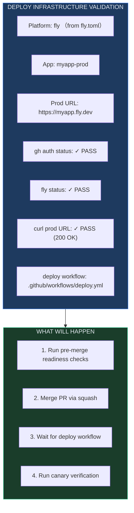

# L6-26：自动部署落地 —— 代码写完了，一键飞到服务器上

> 🎯 **学 gstack 的"合入→等待→验证"完整部署工作流**：接手 /ship 创建的 PR，检测部署基础设施（Fly/Render/Vercel/Heroku），运行合入前就绪检查（审查新鲜度、测试、文档），合入 PR 并等待 CI/CD 部署，最后通过 canary 验证生产环境健康——让"合入代码到生产"从焦虑变为自动化。
> ⏱️ **预计时间**：40 分钟

***

> [!quote]- 📖 原Skill精要
> **技能名称**：land-and-deploy
> **核心功能**：合入并部署工作流。合入 PR、等待 CI 和部署、通过金丝雀检查验证生产环境健康。在 [[L6-25-发布上线管理|ship]] 创建 PR 后接管。合入前检查：审查新鲜度、测试通过、文档一致性。让"合入代码到生产"从焦虑变为自动化。
> **所属体系**：gstack 虚拟工程团队
> **协作关系**：PR 合入后触发 [[L6-27-金丝雀监控|canary]] 进行部署后健康监控

## §1 课程概览

land-and-deploy 是 /ship 的下半场——它接手已创建的 PR，完成"合入→等待→验证"的完整部署闭环。核心流程分为六个阶段：部署基础设施自动检测（Fly/Render/Vercel/Netlify/Heroku）、合入前就绪检查（审查新鲜度 + 测试结果 + 文档准确性）、三种合入策略（auto-merge/direct merge/merge queue）、四种部署等待策略（GitHub Actions/平台 CLI/自动部署平台/无部署）、canary 生产验证（按 diff scope 调整深度：DOCS/BACKEND/FRONTEND/Mixed）、以及结构化 Deploy Report 归档。关键设计包括审查新鲜度的 STALE 判定（审查后 4+ commits 或含 fix/refactor/rewrite 提交）、staging-first 选项、以及失败时的 git revert 回退路径。

> [!tip] 白话小课堂
> 如果你用过 `gh pr merge`，你可能会想"这不就是合个 PR 吗，至于搞这么复杂？"关键区别在于——`gh pr merge` 只关心"代码是不是进了 main 分支"，而 land-and-deploy 关心"代码是不是在生产环境正常工作了"。它帮你合入、等部署、验证健康，一条龙服务。

## §2 land-and-deploy 的定位——从 PR 到生产

```markdown
## /ship 创建 PR，/land-and-deploy 送它去生产

分工逻辑：
  /ship      → 创建 PR → 确保质量 → 准备合入
  /land-and-deploy → 合入 PR → 等待部署 → 验证生产

两者之间 = 人类审查者的窗口。这不是设计缺陷——是人类判断的预留空间。

## land-and-deploy 的核心承诺
  → 合入前运行全面就绪检查（审查、测试、文档）
  → 智能检测部署平台（Fly/Render/Vercel/Netlify/Heroku）
  → 自动选择合入方式（auto-merge / squash / merge queue）
  → 等待部署完成（轮询 CI、平台状态）
  → 生产健康验证（console errors、perf、screenshot）
  → 失败时提供回退路径（revert + 解释）
```

> 💡 **白话小课堂**： 如果你用过 `gh pr merge`，你可能会想"这不就是合个 PR 吗，至于搞这么复杂？"关键区别在于——`gh pr merge` 只关心"代码是不是进了 main 分支"，而 land-and-deploy 关心"代码是不是在生产环境正常工作了"。

## §3 部署基础设施检测——知道往哪里部署

````markdown
## 平台自动检测

land-and-deploy 在第一次运行时（FIRST_RUN）会自动检测部署平台：

### 检测顺序
  1. CLAUDE.md 中的持久化配置（已运行过 /setup-deploy）
  2. 项目配置文件（fly.toml / render.yaml / vercel.json / Procfile）
  3. GitHub Actions workflow 文件（包含 deploy/release/cd 关键词）

### 支持的平台
  → Fly.io: fly.toml → fly status --app
  → Render: render.yaml → curl 轮询生产 URL
  → Vercel: vercel.json / .vercel → 自动部署, 60s 等待
  → Netlify: netlify.toml → 自动部署
  → Heroku: Procfile → heroku releases
  → 自定义: CLAUDE.md 中的 Deploy Configuration 章节

## 首次运行 vs 后续运行
  → FIRST_RUN: 显示完整基础设施验证表格, 解释每个步骤, 征求确认
  → CONFIRMED: 跳过 dry-run, 直接进入就绪检查（效率模式）
  → CONFIG_CHANGED: 部署配置有变化 → 重新运行 dry-run

## 基础设施验证表（首次运行）


````

***

## §4 合入前就绪检查——最后一道防线

````markdown
## Step 3.5: Pre-Merge Readiness Gate

这是不可逆操作前的最后检查。合入不能用 revert commit 之外的方式撤销。

### 3.5a: 审查新鲜度检查
  → 读取 gstack-review-read 获取审查历史
  → 对比审查时的 commit 和当前 HEAD
  → 0 commits since → CURRENT（最新）
  → 1-3 commits → RECENT（黄色警告，如果触及代码）
  → 4+ commits → STALE（红色——审查可能不反映当前代码）
  → 无审查 → NOT RUN

关键检查：审查后是否有包含 "fix"/"refactor"/"rewrite" 的提交？
如果有 → 即使只有 2 个 commit 也标记为 STALE

### 3.5a-bis: 内联合入前审查（如果审查陈旧）
  → 提供 3 个选项：
    A) 快速检查（~2min，扫描 SQL/竞态/安全）
    B) 全量 /review（~10min，完整分析）
    C) 跳过（用户自负风险）

### 3.5b: 测试结果
  → 运行免费测试（bun test / npm test 等）
  → 检查最近的 E2E 结果（今天内运行的）
  → 检查 LLM 评估结果
  → 任何失败 = BLOCKER

### 3.5c: PR 描述准确性
  → 对比 PR body 与实际 commit 内容
  → 缺失功能 + 过时描述 + 版本不匹配 = WARNING

### 3.5d: 文档更新检查
  → CHANGELOG.md 和 VERSION 是否已更新？
  → 有新功能但文档未更新 = WARNING
````

> ⚠️ **避坑指南**： 审查新鲜度检查中最容易被忽略的是"审查后是否有 fix/refactor/rewrite 提交"。你可能会想"审查完了我就改了一个小 bug，不用重新审了吧"——但恰恰是审查后的"小修改"最容易引入新问题。

***

## §5 合入策略——三种路径

```markdown
## 路径 1: Auto-merge（优先尝试）
  → gh pr merge --auto --delete-branch
  → 尊重 repo 的合并设置（squash/merge/rebase）
  → 如果 repo 有 merge queue → PR 进入队列
  → merge queue 会在最终合并前再跑一次 CI（额外安全检查）

## 路径 2: Direct merge（auto-merge 不可用时）
  → gh pr merge --squash --delete-branch
  → 直接合并，删除分支

## 路径 3: Merge queue 等待
  → PR 进入 merge queue 后轮询状态
  → 每 30s 检查一次，最长等 30 分钟
  → 如果被移出队列 → CI 可能在最终检查中失败
  → 超时 → 建议检查 GitHub Actions

## 合入后检测
  → 检测是否有 deploy workflow 被触发
  → 记录 merge commit SHA
  → 记录合入耗时（用于 deploy report）
```

***

## §6 部署等待——智能轮询策略

```markdown
## 四种部署等待策略

### 策略 A: GitHub Actions deploy workflow
  → 找到 merge commit 触发的 workflow run
  → 轮询 status + conclusion
  → 每 30s 一次, 最长 20 分钟
  → 每 2 分钟报告进度

### 策略 B: 平台 CLI（Fly.io / Heroku）
  → Fly: fly status --app → 检查 Machines started
  → Heroku: heroku releases --app -n 1 → 检查最新 release

### 策略 C: 自动部署平台（Vercel / Netlify）
  → 合并后自动触发部署
  → 等待 60s 让 CDN 传播
  → 然后直接进入 canary 验证

### 策略 D: 无部署（库/CLI 项目）
  → SCOPE_DOCS only → 跳过验证
  → 非 web 项目 → 确认无需部署

## Staging 优先选项
  → 如果检测到 staging 环境 → 提供 staging-first 选项
  → A) staging 先验证 → 然后 production（Completeness: 10/10）
  → B) 直接 production
  → C) 只部署 staging
```

***

## §7 Canary 生产验证——证据驱动的健康判断

```markdown
## 按 diff scope 调整验证深度

| Diff Scope | Canary Depth |
|------------|-------------|
| DOCS only | 跳过（Step 5 已完成）|
| CONFIG only | Smoke: goto + 200 检查 |
| BACKEND only | Console errors + perf |
| FRONTEND | 全量: console + perf + screenshot |
| Mixed | 全量 canary |

## 全量 Canary 序列
  1. $B goto <url> → 页面加载（200, 不是错误页）
  2. $B console --errors → 控制台错误（Error/Uncaught/TypeError/ReferenceError）
  3. $B perf → 加载时间 < 10s
  4. $B text → 页面有真实内容（不空白）
  5. $B snapshot -i -a -o "deploy-report.png" → 截图归档

## 失败时的回退路径
  → A) 这是正常的（CDN 预热中）
  → B) 回退合入 → git revert <merge-sha> → 创建 revert PR
  → C) 让我进一步调查
```

> 🔑 **核心秘诀**：canary 验证深度根据 diff scope 调整，这个设计背后有重要的工程判断——DOCS only 的 PR 不需要检查控制台错误，因为文档改动不可能引入 JS 异常。

***

## §8 Deploy Report——完整审计追踪

```markdown
## 报告结构

```
LAND & DEPLOY REPORT
═════════════════════
PR:           #42 — Add checkout flow
Branch:       feat/checkout → main
Merged:       2026-05-03T15:30:00Z (squash)
Merge path:   auto-merge

Timing:
  CI wait:    2m 15s
  Queue:      0s (direct merge)
  Deploy:     3m 45s
  Canary:     15s
  Total:      6m 15s

Verification: HEALTHY
  Scope:      FRONTEND + BACKEND
  Console:    clean
  Load time:  2.3s
  Screenshot: .gstack/deploy-reports/2026-05-03-pr42-deploy.png

VERDICT: DEPLOYED AND VERIFIED
```

## 持久化
  → 报告保存到 .gstack/deploy-reports/
  → JSONL 条目写入 review dashboard
  → 包含 timing/metadata/verdict
```

***

## §9 电商 Skill 案例：电商平台部署流水线

> 🛒 **实战案例**：某电商SaaS平台的后端服务（Node.js+PostgreSQL，日均API调用200万次），每次功能发布需要经过测试→预发→灰度→全量四个阶段。传统流程依赖工程师手动在三个环境间推进，人力消耗大且容易跳过步骤（“预发测过了，直接上生产吧”）。用land-and-deploy将四层部署流水线自动化，测试→预发→灰度(5%流量)→全量一步不跳。

> - **Step 1.5基础设施检测**：首次运行自动检测——Platform: AWS ECS (from ecs-service.json)、App: shop-api-prod、Prod URL: https://api.myshop.com、Staging URL: https://api-staging.myshop.com、Canary Target: 5%流量5分钟。持久化到CLAUDE.md避免重复检测。
> - **Step 3.5合入前就绪检查**：审查新鲜度CURRENT（3分钟前刚review完成）、测试结果213/213 passed、E2E 18/18 passed（含微信支付回调集成测试）、CHANGELOG已更新。三重检查全部绿灯→合入。
> - **Step 5a Staging-First验证**：先部署到staging环境→`/canary`自动运行5分钟健康检查（`GET /health` 200 OK/DB connected、`GET /api/products` 200 OK/3842 products、`GET /api/orders` 200 OK/P99 180ms）→ Console 0 errors→ Staging验证通过→才允许推进生产。
> - **Step 6-7 生产金丝雀+全量**：部署到生产环境→初始5%流量金丝雀5分钟→关键指标监控——购物车API P99响应时间基线120ms→金丝雀期间125ms(+4%，正常范围内)、支付回调成功率基线99.97%→金丝雀期间99.96%(-0.01%，正常)、库存扣减最终一致性延迟基线2.3s→金丝雀期间2.5s(+9%，正常)。5分钟金丝雀全部绿灯→自动扩大到50%流量观察5分钟→继续绿灯→全量100%。
> - **电商特有验证点**：API版本兼容性检查（Shopify API version 2024-07 vs 2024-10的breaking changes检测）、Webhook签名验证在部署后仍然有效（`/health`端点专门测试webhook签名）、数据库迁移对orders表的锁时长（staging环境提前测试锁表时间=3.2秒<安全阈值5秒）、库存扣减API的并发安全（`/qa` race condition检测覆盖）。

> 🔑 **启示**：部署流水线自动化最难的不是“让机器执行部署”——而是“确保人类无法跳过必要步骤”。Staging-First强制（不合入staging不能上生产）、金丝雀自动监控（5分钟绿灯不够自动延时观察）、异常自动回退（金丝雀中发现异常→自动回滚并通知CTO）——三道门禁确保“快”不以“安全”为代价。

> [!info] 参考来源
> 此案例模式参考了多个电商SaaS平台的CI/CD最佳实践，包括 Shopify App Template 的 GitHub Actions 部署配置和 AWS ECS 滚动部署策略。

## §10 结构拆解

```markdown
## land-and-deploy 结构模板

### 核心特征
- **管理对象**: PR 从合入到生产验证的完整部署生命周期
- **核心原则**: 不可逆操作前的最后防线——审查新鲜度 + 测试通过 + 文档一致的合入前就绪检查
- **关键设计**: 按 diff scope 调整 canary 深度 + 三种合入策略自适应 + 四种部署等待策略智能匹配

### 通用结构
- **基础设施检测层**: CLAUDE.md 持久化配置 → 项目配置文件（fly.toml/render.yaml/vercel.json）→ GitHub Actions workflow → 首次运行 dry-run 验证
- **合入前就绪层**: 审查新鲜度（CURRENT/RECENT/STALE）→ 测试结果验证 → PR 描述准确性 → 文档更新检查
- **合入执行层**: Auto-merge（优先）→ Direct merge（回退）→ Merge queue 等待（轮询 30s/次）
- **部署等待层**: GitHub Actions workflow 轮询 / 平台 CLI 状态检查 / 自动部署平台 CDN 等待 / 无部署跳过
- **生产验证层**: 按 scope（DOCS/CONFIG/BACKEND/FRONTEND/Mixed）调整 canary 深度 → 失败回退路径（revert）
- **报告归档层**: Deploy Report（PR + Branch + Timing + Verification + Verdict）→ .gstack/deploy-reports/ 持久化
```

***

## §11 掌握检验

**Q1**：审查新鲜度检查中，"审查后有 4+ commits"被标记为什么状态？
- A) CURRENT
- B) RECENT
- C) STALE
- D) NOT RUN

**Q2**：Canary 验证深度根据 diff scope 调整——纯 DOCS only 的变更如何处理？
- A) 运行全量 canary 确保文档部署正常
- B) 跳过 canary 验证（文档改动不可能引入 JS 异常或性能问题）
- C) 只检查控制台错误
- D) 只检查页面加载时间

**Q3**：合入前就绪检查中，为什么"审查后有包含 fix/refactor/rewrite 的提交"即使只有 2 个 commit 也标记为 STALE？请分析"审查后的小修改"为什么反而更危险。

**Q4**：land-and-deploy 的四种部署等待策略（GitHub Actions / 平台 CLI / 自动部署平台 / 无部署）的检测顺序是什么？如果项目同时有 fly.toml 和 GitHub Actions deploy workflow，land-and-deploy 优先使用哪个策略？

**Q5**：land-and-deploy 与 /ship 之间存在"人类审查者的窗口"。但 land-and-deploy 本身也有审查新鲜度检查。如果这个窗口被缩短到 0（自动合入），会有什么具体的风险？请从"审查者尚未 context-switch"的角度分析。

**Q6**：Staging-first 选项提供了完整度 10/10 的部署路径。什么情况下应该跳过 staging 直接 production？这种跳过的决策应该基于什么数据而非直觉？

***

## §12 答案

<details>
<summary>点击查看答案</summary>

**Q1**：**C** —— 4+ commits since review = STALE（审查可能不反映当前代码）。

**Q2**：**B** —— DOCS only 的变更跳过 canary 验证。

**Q3**："审查后的小修改"危险原因：①审查者已经离开了上下文（他们的注意力已转移到其他任务），修改提交后审查者大概率不会再次完整审查整个 PR——形成"审查盲区"。②修改通常没有经过测试（"就改了一行嘛，不用跑测试了"），但恰恰是一行的修改（如把 `>` 改成 `>=`）引入的边缘情况 bug 最隐蔽。③CI 可能在这些小 commit 上没触发或不完整——"快捷推送"绕过了完整的 CI 流程。这就是为什么即使 2 个 commit，只要内容涉及实际代码修改，也必须重新审查。

**Q4**：检测顺序是：CLAUDE.md 持久化配置 > 项目配置文件 > GitHub Actions workflow。如果同时存在 fly.toml 和 deploy workflow，优先使用 CLAUDE.md 中持久化的配置（因为那是用户在 /setup-deploy 中明确选择和确认过的）。如果 CLAUDE.md 中没有，则检测项目配置文件优先于 workflow 文件——因为配置文件是部署平台的原生声明，比 workflow 中的间接引用更可靠。

**Q5**：如果窗口缩短到 0（/ship 创建后立即自动 /land-and-deploy），风险：审查者刚完成审查，可能正处于"审完了、注意力转移了"的状态。如果这个时候自动合入，审查者在审查中提出的"建议性"评论（非 blocking）可能还没来得及被开发者考虑就被绕过了。此外，多个审查者可能在不同时间完成审查——自动合入剥夺了最后一个审查者"我需要再确认一下"的机会。窗口的存在不是技术限制，是协作节奏的缓冲区。

**Q6**：跳过 staging 直接 production 的场景：①纯粹的配置变更（环境变量、feature flag）——这些在 staging 上的值与 production 不同，staging 验证没有给出 production 的准确信息；②紧急 hotfix 的时间压力——但必须满足：hotfix 的 diff 范围极小（<20 行），有充分的人工审查，有明确的回退方案。决策依据：diff scope（越小越可接受直接 production）+ 历史部署成功率（最近 10 次部署全部健康的项目更可信）+ 回退成本（已有成熟回退方案的项目可承担更大风险）。不是直觉——是数据。

（5/6 通过）
</details>

***

## 延伸阅读
- **下一步**：[[L6-27-金丝雀监控|金丝雀监控]] —— 部署后的持续监控循环，确保"持续健康"而非仅仅"现在健康"
- [[L6-25-发布上线管理|发布上线管理]] —— /ship 先创建 PR，land-and-deploy 接手合入
- [[L6-15-PR代码审查|PR代码审查]] —— 审查新鲜度检查的输入源
