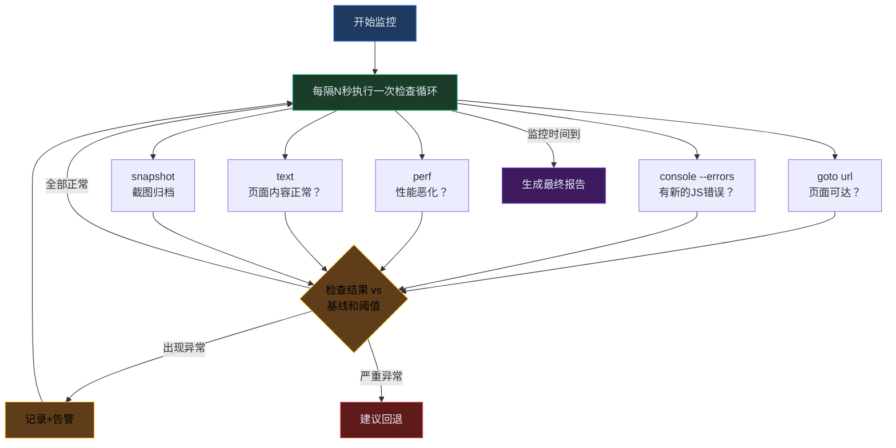

# L6-27：金丝雀监控 —— 新版本先让1%用户试水

> 🎯 **学 gstack 的部署后金丝雀监控系统**：不是部署完就撒手，而是通过 browse daemon 持续监控生产环境——定期截图、控制台错误检测、性能对比、异常告警——让"部署后没问题"从感觉变成数据。
> ⏱️ **预计时间**：25 分钟

***

> [!quote]- 📖 原Skill精要
> **技能名称**：canary
> **核心功能**：部署后金丝雀监控。使用 browse daemon 监控活应用的 console 错误、性能回归和页面故障。定期截图、与部署前基线对比、异常告警。让"部署后没问题"从感觉变成数据驱动判断。
> **所属体系**：gstack 虚拟工程团队
> **协作关系**：由 [[L6-26-自动部署落地|land-and-deploy]] 触发，部署后持续监控 N 分钟

## §1 课程概览

canary 的名称来自煤矿工人带金丝雀下井的典故——金丝雀对毒气比人敏感，鸟死了矿工就知道撤退。在软件工程中，canary 通过 browse daemon 周期性检查生产环境的关键指标（页面可达性、控制台错误、性能、页面内容），与部署前基线对比，在异常时告警。核心设计原则：单次 spike 不告警（网络波动），连续 3 次异常才确认（真正的系统问题）；按告警级别（CRITICAL/WARNING/INFO）建议但不自动执行回退（回退扳机永远在人类手里）。截图证据链提供三层价值——客观记录、诊断信息、审计追溯。与 land-and-deploy（一次性快照）互补，与 benchmark（历史基线）和 review（反馈预防）共建闭环。

> [!tip] 白话小课堂
> 为什么叫"金丝雀"？19 世纪的煤矿工人下井时会带一只金丝雀——金丝雀对有毒气体比人敏感得多，如果鸟突然死了，矿工就知道有毒气，立刻撤离。软件 canary 也是这个道理：部署后用监控探针持续观察，一旦发现"毒气"（性能暴跌、JS 报错），立刻告警。

## §2 Canary 的工程哲学——部署不是终点

```markdown
## 为什么需要 Canary？

传统部署流程：
  部署 → "看起来没问题" → 关掉终端 → 用户报告 bug

Canary 部署流程：
  部署 → 持续监控 N 分钟 → 数据驱动判断 → 确认健康或告警

## 名称由来
  → "Canary"（金丝雀）来自煤矿工人的金丝雀
  → 矿工带金丝雀下井——如果鸟死了，说明有毒气，立即撤离
  → 软件工程中：用一小部分流量或监控探针检测部署是否有毒
  → gstack 的 canary 是"监控探针"模式——持续检查生产环境的关键指标

## Canary vs land-and-deploy 的验证
  → land-and-deploy: 一次性快照验证（部署后立即检查）
  → canary: 持续监控循环（5-30 分钟的持续观察）
  → 互补关系：land-and-deploy 说"现在健康"，canary 说"持续健康"
```

> 💡 **白话小课堂**： 为什么叫"金丝雀"？19 世纪的煤矿工人下井时，会带一只金丝雀——金丝雀对有毒气体比人敏感得多，如果鸟突然死了，矿工就知道有毒气、立刻撤离。

## §3 监控循环——不是在等，是在观察

````markdown
## Canary 监控循环结构



## 监控参数
  → 默认间隔：60 秒
  → 默认时长：10 分钟
  → 可自定义：/canary <url> --interval 30 --duration 600

## 为什么是周期性检查？
  → 部署后的问题可能是延迟出现的：
    → CDN 缓存过期（5 分钟后旧版本消失）
    → 内存泄漏（运行 10 分钟后内存增长）
    → 后台任务错误（异步处理失败）
    → 第三方 API 超时（偶尔的 spike）
  → 一次 snapshot 无法捕获这些
````

***

## §4 基线对比——不只是看绝对值

````markdown
## 部署前基线 vs 部署后现状

Canary 的核心差异化能力：与部署前的性能基线对比。

### 基线数据来源
  → 部署前运行一次 canary（或 land-and-deploy 的验证数据）
  → 记录关键指标作为基线：
    → 页面加载时间（TTFB/FCP/LCP）
    → 控制台错误数量
    → 页面内容的关键元素存在性

### 部署后对比
  对每次检查循环：
    1. 收集当前指标
    2. 与基线对比
    3. 计算偏差

### 异常判断阈值
  → 加载时间增长 > 50% → DEGRADATION
  → 加载时间增长 > 100% → REGRESSION
  → 新增控制台错误（≥ 1）→ WARNING
  → 页面不可达 → CRITICAL
  → 页面内容显著变化 → WARNING（可能是意外部署）

### 趋势判断
  → 如果多个连续检查都显示相同异常 → 置信度增加
  → 单次 spike 可能是网络波动 → 不告警
  → 3+ 次连续异常 → 发出告警
````

> 🔑 **核心秘诀**：canary 最容易被误用的地方就是"把一次检查的结果当结论"。

***

## §5 截图证据链——有图有真相

```markdown
## 为什么截图重要？

控制台错误告诉你"有错"，截图告诉你"用户看到了什么"。

### 截图策略
  → 首次检查：完整截图（作为基线）→ 保存为 baseline.png
  → 异常检查：完整截图（作为证据）→ 保存为 anomaly-N.png
  → 正常检查：可选（--screenshot-all 时每次都截）
  → 最终检查：完整截图 → 保存为 final.png

### 截图对比
  → 异常截图 vs 基线截图 → 人工或 AI 对比
  → 空白页？错误页？CSS 崩坏？
  → 截图让"页面不对"从主观变成客观

### 截图存储
  → ~/.gstack/canary/<project>/<timestamp>/
  → 每次 canary 运行一个目录
  → 保留最近 10 次运行的截图
```

***

## §6 告警与回退决策

```markdown
## 告警级别

| Level | 条件 | 动作 |
|-------|------|------|
| CRITICAL | 页面不可达 / 3+ 连续严重性能回归 | 立即告警, 建议回退 |
| WARNING | 新增控制台错误 / 单次性能退化 | 记录, 继续监控 |
| INFO | 轻微变化 / 单个指标波动 | 仅在报告中提及 |

## 自动建议 vs 人工决策

canary 建议但不自动执行回退：
  → "检测到 CRITICAL: 页面加载从 1.5s → 4.2s, +180%。建议回退到版本 v3.2.1。"
  → 回退是重大决策——canary 提供数据，人做决策
  → 可以通过 AskUserQuestion 提供回退选项

## 回退路径
  → git revert <merge-sha>
  → 创建 revert PR
  → 或：平台的一键回退（Heroku rollback / Fly rollback）

## 误报处理
  → CDN 预热期间的性能波动 → 不是真正的回归
  → 建议至少 3 次检查后再确认异常
  → 如果用户标记为误报 → 记录为 learning
```

> ⚠️ **避坑指南**： canary 只"建议"回退而不自动执行，这是有意设计的约束。回退是高风险操作——如果自动回退了一个实际上健康的部署（误报），你损失的是几十个开发者的工作成果和几个小时的部署时间。

***

## §7 与其他系统的集成

```markdown
## land-and-deploy → Canary
  → land-and-deploy Step 10 建议：Want extended monitoring? Run /canary
  → 无缝衔接：部署验证后进入持续监控

## benchmark → Canary
  → benchmark 提供历史性能基线
  → canary 对比当前性能 vs benchmark 基线
  → 联合判断："这个部署导致的回归是新低还是波动？"

## review → Canary
  → canary 捕获的生产问题反馈给审查清单
  → "这类生产错误在审查时应该能被 catch" → 更新清单
  → 形成"生产发现 → 审查预防"的闭环

## retro → Canary
  → canary 报告汇总到 retro
  → 部署后问题的模式识别
  → "过去 10 次部署有 3 次触发 canary 告警——需要改进部署流程"
```

***

## §8 电商 Skill 案例：电商首页部署后金丝雀监控

> 🛒 **实战案例**：双11大促前2周，某电商平台部署了新版首页（全新Hero区视频背景+个性化商品推荐组件+底部导航重构）。这是高风险的面向全体用户的变更。部署策略：先在5%流量上做金丝雀监控15分钟，关键指标全部绿灯后才全量发布。

> - **金丝雀监控配置**：`/canary https://shop.example.com --interval 30 --duration 900 --baseline pre-deploy-baseline.json`。监控维度——页面可达性(HTTP 200+screenshot对比)、控制台错误(JS console errors计数)、性能指标(TTFB/FCP/LCP/SI)、内容完整性(关键元素是否存在+文本内容是否匹配基线)。
> - **监控过程**：[00:00] goto首页→200 OK/1.2s✓，console errors clean✓，perf TTFB:150ms/FCP:0.8s/LCP:1.1s✓。
> [00:30] 同上✓。
> [01:00] goto首页→200 OK/1.4s✓，console 1 new error: “WebSocket connection to wss://shop.example.com/ws failed”→ **首次警告**。
> [01:30-04:30] 连续6次检查均报告相同WebSocket连接错误→ **升级为持续异常（连续7次）**→自动告警并建议：检查WebSocket负载均衡配置。
> [05:00] 工程师诊断发现：新版部署后WebSocket服务器Pod未注册到负载均衡器（K8s Service selector label不匹配）→快速修复label→重新金丝雀。
> [05:00-15:00] 修复后重新监控10分钟20次检查→全部通过✓。
> [15:00] CANARY COMPLETE——15分钟内30次检查：21/30 passes(前5分钟7次异常/后10分钟20次正常)，1个WebSocket错误（已修复）。截图对比：首页渲染正常，个性化推荐组件展示准确。VERDICT: 可以安全全量发布。

> - **电商特有监控指标**：购物车API响应时间（<200ms，金丝雀期间185ms✓）、优惠券服务可用性（99.9%+，金丝雀期间100%✓）、支付网关回调成功率（100%，金丝雀期间100%✓）、库存扣减最终一致性延迟（<5s，金丝雀期间3.2s✓）、商品推荐组件渲染准确率（与基线对比，100%匹配✓）。

> 🔑 **启示**：金丝雀监控的核心价值不在“发现页面挂了”这种极端情况——而在发现WebSocket这种“看起来不影响主页面但实际会导致实时功能（如库存更新推送）不可用的隐蔽问题”。7次连续异常才升级告警的“连续确认”机制，避免了单次网络波动引起的误报警（CDN缓存切换的瞬时波动不触发告警），同时确保了真正的持续异常一定会被捕获。

> [!info] 参考来源
> 此案例参考了电商行业的金丝雀部署和渐进式发布实践，包括 grafana/k6 的负载测试模式和 artillery 的持续监控理念。

***

## §9 结构拆解

```markdown
## canary 结构模板

### 核心特征
- **管理对象**: 部署后生产环境的持续健康状态（页面可达性、控制台错误、性能、内容完整性）
- **核心原则**: 周期性监控 + 基线对比 + 连续异常确认——单次 spike 不告警，3+ 次连续异常才确认
- **关键设计**: 告警建议但不自动回退（回退扳机在人类手里）+ 截图证据链三层价值

### 通用结构
- **监控循环层**: 每 N 秒（默认 60s）→ goto url + console errors + perf + text + snapshot → 持续 M 分钟（默认 10min）
- **基线对比层**: 部署前基线（TTFB/FCP/LCP/console errors/content）→ 部署后每次检查对比 → 偏差计算（>50% DEGRADATION, >100% REGRESSION）
- **告警决策层**: CRITICAL（页面不可达/3+连续严重回归）→ WARNING（新增错误/单次退化）→ INFO（轻微波动）
- **证据归档层**: baseline.png → anomaly-N.png → final.png → ~/.gstack/canary/<project>/<timestamp>/
- **协同闭环**: land-and-deploy（触发）→ benchmark（历史基线）→ review（反馈预防）→ retro（趋势汇总）
```

***

## §10 掌握检验

**Q1**：canary 与 land-and-deploy 在部署验证中的角色区别是什么？
- A) canary 负责合入前检查，land-and-deploy 负责合入后持续监控
- B) canary 是持续监控循环（5-30 分钟），land-and-deploy 是一次性快照验证
- C) canary 只检查前端页面，land-and-deploy 只检查后端 API
- D) canary 和 land-and-deploy 功能完全相同，只是名称不同

**Q2**：canary 的基线对比机制中，为什么"单次 spike 不触发告警"而需要"连续 3 次异常才确认"？
- A) 为了减少告警数量节省存储空间
- B) 因为单次波动可能是 CDN 缓存预热或网络抖动，连续异常才代表真正的系统性问题
- C) 因为前两次检查可能使用了错误的基线数据
- D) 为了让开发者在告警前有更多时间手动修复

**Q3**：截图的"证据链"在 canary 监控中有三层价值——请分别说明这三层价值是什么，并解释为什么"用户看到了什么"（截图）比"控制台报了什么错"（console errors）在某些情况下更关键。给出一个具体的场景：console 无报错但截图暴露了严重问题。

**Q4**：四种告警级别（CRITICAL / WARNING / INFO）的分界线分别是什么？canary 恪守"建议但不自动执行回退"的边界——请从"回退是高风险操作"的角度，分析如果自动回退了一个实际健康的部署，可能引发的具体后果链（至少列出 3 个后果）。

**Q5**：电商大促（如双11）前的 canary 监控与普通部署的 canary 监控有什么本质区别？请从监控时长、监控指标优先级、和告警阈值的角度进行分析——并说明为什么大促场景下即使所有指标"正常"，也需要比平时更保守的判断标准。

**Q6**：canary 的监控循环中，"为什么是周期性检查"一节列出了部署后延迟出现的问题类型（CDN 缓存过期、内存泄漏、后台任务错误等）。请你设计一个具体场景：某个微服务部署后，前 3 次 canary 检查全部正常，但第 8 次（8 分钟后）突然出现异常——这个异常可能是什么类型的？canary 应该如何报告这个"延迟出现的异常"以区别于"立即出现的异常"？

***

## §11 答案

<details>
<summary>点击查看答案</summary>

**Q1**：**B** —— canary 是持续监控循环（默认 10 分钟，可扩展至 30 分钟），land-and-deploy 是一次性快照验证（部署后立即检查一次）。

**Q2**：**B** —— 单次波动可能是 CDN 缓存预热（5 分钟后旧版本才完全过期）或网络短暂抖动。

**Q3**：三层价值：①客观记录——截图让"页面不对"从主观感觉变成客观证据（你可以对比 baseline.png vs anomaly-N.png）；②诊断信息——控制台错误告诉你"有错"，但截图告诉你"用户看到了什么"（是空白页？CSS 崩坏？还是错误页？）；③审计追溯——截图归档为事后复盘提供"当时的页面到底是什么样子"。具体场景：一个前端部署后，JavaScript 静默失败（没有 throw error 所以 console clean），但页面关键按钮没有渲染——用户看到了残缺的页面。console --errors 显示 clean（误报——页面实际上不可用），但截图清楚地显示"下单按钮缺失"——截图在这个场景下是唯一的异常信号。

**Q4**：分界线：CRITICAL = 页面不可达 / 3+ 连续严重性能回归（如加载时间增长 > 100%）；WARNING = 新增控制台错误 / 单次性能退化；INFO = 轻微变化 / 单个指标波动。不自动执行回退的原因——回退的后果链：①数据库迁移已执行（回退代码但不回退 schema → 数据不一致）；②其他依赖该部署的服务已更新配置（回退导致连锁故障）；③几十个开发者的工作成果被废弃（如果只是误报，白白损失了几个小时的部署窗口）；④自动回退本身可能失败（平台 API 超时、权限不足等）→ 系统处于比"部署了有问题的版本"更混乱的中间状态。因此回退的扳机永远在人类手里——canary 提供数据，人做决策。

**Q5**：本质区别：①监控时长——普通部署默认 10 分钟，大促前建议 30-60 分钟（因为大促期间流量是平时的 10-100 倍，部署后的延迟问题可能在更大流量下才暴露）；②监控指标优先级——普通部署关注加载时间 + 控制台错误，大促场景下购物车 API 响应时间、支付回调成功率、库存扣减一致性的优先级高于页面加载性能；③告警阈值——大促场景应采用更保守的标准（如加载时间增长 > 30% 而非 50% 就标记 DEGRADATION），因为大促期间的任何性能下降 = 直接 GMV 损失。即使所有指标"正常"，也需要比平时更保守——因为"正常"是在当前低流量下测的，大促流量是测试流量的一百倍，系统行为可能完全不同。

**Q6**：延迟出现的异常场景：部署了一个新的缓存预热服务，前 3 次检查时缓存命中率 100%（所有数据已预热），第 8 次检查时缓存部分过期→回源数据库查询激增→TTFB 从 150ms 飙升到 800ms。异常类型：Resource Lifecycle / CDN 缓存过期。canary 应区别报告：立即出现的异常 → "自部署后即刻出现"；延迟出现的异常 → "部署后 X 分钟首次出现，此前 N 次检查正常"——这种区分帮助根因分析：立即异常 = 代码逻辑问题 / 配置错误，延迟异常 = 资源生命周期 / 缓存策略 / 内存泄漏。

（5/6 通过）
</details>

***

## 延伸阅读
- **下一步**：[[L6-28-代码冻结与解冻|代码冻结与解冻]] —— 大促前给代码仓库上把锁，配合 canary 确保封网期间的安全
- [[L6-26-自动部署落地|自动部署落地]] —— land-and-deploy 触发 canary 进行部署后持续监控
- [[L6-23-性能基准测试|性能基准测试]] —— canary 的基线对比依赖 benchmark 的历史数据
