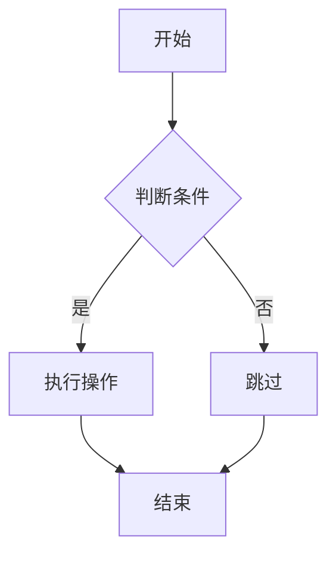
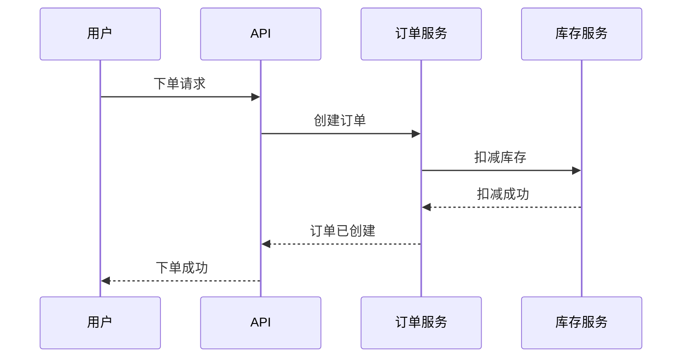
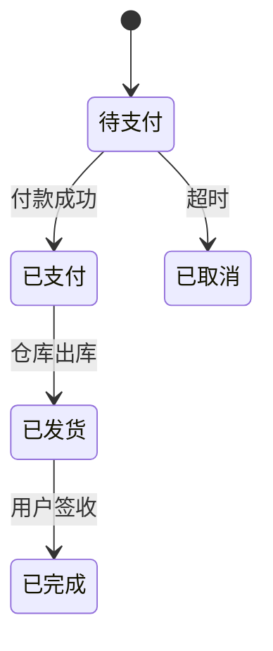

---
tags:
  - 教程
  - Skill
  - 大师课
  - Level6
  - gstack
created: 2026-05-03
updated: 2026-05-03
course_number: L6-Overview
prerequisites:
  - "[[L5-课程总览|Level 5 毕业]]"
---

# Level 6：宗师 —— gstack 企业级工程系统

> 👑 **目标**：掌握 gstack 虚拟工程团队的全部 50 门专业课程，理解企业级工程系统的设计哲学——从产品思维到代码审查到安全运维到浏览器工程。
> **难度**：⭐⭐⭐⭐⭐⭐ | **预计时间**：5 周

***

## Level 6 学什么？

Level 5 学的是 Anthropic 官方的独立 Skill。Level 6 进入一个完整的、相互协作的 Skill 生态系统——gstack。

gstack 不是一堆 Skill 的集合，而是一个**虚拟工程团队**。每个 Skill 扮演一个角色，Skills 之间通过共享协议（preamble、completion status、telemetry）协作。

你将理解：50 个 Skill 如何在同一套设计哲学下协同工作。

***

## 课程列表

### 第一部分：产品思维与计划（8 门）

| # | 课程 | 核心学习点 |
|---|------|-----------|
| 01 | [[L6-01-创业门诊室|创业门诊室 —— 像YC合伙人一样给你的项目把脉]] | YC 风格创业诊断，6 个强迫性问题暴露需求真相 |
| 02 | [[L6-02-CEO战略评审|CEO战略评审 —— 站在老板角度审视你的技术方案]] | 野心校准、范围界定、资源分配 |
| 03 | [[L6-03-工程架构评审|工程架构评审 —— 在写代码之前先把架子搭对]] | 系统边界、数据架构、技术选择 |
| 04 | [[L6-04-自动全流程计划|自动全流程计划 —— 从想法到完整开发计划一键生成]] | CEO→设计→工程三层评审管道 |
| 05 | [[L6-05-设计计划评审|设计计划评审 —— 确保产品设计在开工前就对了]] | 信息架构、视觉层次、交互模式 |
| 06 | [[L6-06-开发者体验评审|开发者体验评审 —— 让你的API和工具好用到让人上瘾]] | TTHW（TTHW：上手时间指标）、API 人体工学、STOP 方法 |
| 07 | [[L6-07-AI交互调优|AI交互调优 —— 让AI用你喜欢的语气和方式跟你说话]] | question_tuning、explain_level、proactive |
| 08 | [[L6-08-多模型交叉验证|多模型交叉验证 —— 让多个AI互相挑刺，找出隐藏的bug]] | 跨模型审查、分歧分析、盲区检测 |

### 第二部分：设计工程（6 门）

| # | 课程 | 核心学习点 |
|---|------|-----------|
| 09 | [[L6-09-设计系统咨询|设计系统咨询 —— 从零搭建专业级设计语言体系]] | 六阶段工作流、SAFE/RISK、品味记忆 |
| 10 | [[L6-10-设计审计与修复|设计审计与修复 —— 像X光一样扫描你产品的UI问题]] | 10 维度评分、AI Slop 检测、善意储备 |
| 11 | [[L6-11-设计方案散弹枪|设计方案散弹枪 —— 一口气探索5个完全不同的设计方向]] | 比较板方法、反收敛、5 方向发散 |
| 12 | [[L6-12-设计稿转代码|设计稿转代码 —— 把设计图变成能直接用的网页代码]] | 4 种 Pretext 模式、设计 Token 提取 |
| 13 | [[L6-13-开发者体验审计|活网站开发者体验审计 —— 像用户一样体验你自己的API]] | 八步审计、回旋镖比较、DX 记分卡 |
| 14 | [[L6-14-设计系统哲学|设计系统哲学 —— 理解为什么"好看"不是拍脑袋决定的]] | DESIGN.md 规范、工业/实用主义 |

### 第三部分：代码审查体系（5 门）

| # | 课程 | 核心学习点 |
|---|------|-----------|
| 15 | [[L6-15-PR代码审查|PR代码审查 —— AI帮你把关每一行代码的质量]] | 双 Pass、范围漂移、计划完成度、Fix-First |
| 16 | [[L6-16-专家审查军团|专家审查军团 —— 7个AI专家同时审查你的代码]] | 7 专家并行、自适应门控、指纹去重 |
| 17 | [[L6-17-审查清单体系|审查清单体系 —— 让代码审查像飞行员起飞前检查一样可靠]] | CRITICAL 5 类别、抑制规则、清单演化 |
| 18 | [[L6-18-审查仪表盘|审查仪表盘 —— 一眼看清你的代码质量在变好还是变差]] | 持久化、跨审查去重、/ship 集成 |
| 19 | [[L6-19-外部AI评论分诊|外部AI评论智能分诊 —— 过滤噪音、保留真问题]] | 分类、抑制、回复模板、升级检测 |

### 第四部分：QA 质量保证（5 门）

| # | 课程 | 核心学习点 |
|---|------|-----------|
| 20 | [[L6-20-自动化测试修复|自动化测试+自动修复 —— 发现bug并顺手帮你修好]] | 11 阶段、3 层测试、Health Score、Fix Loop |
| 21 | [[L6-21-纯报告式QA|纯报告式QA —— 只告诉你哪里有问题但不乱改代码]] | 报告不修改代码、CI 质量门禁 |
| 22 | [[L6-22-线上故障侦探|线上故障侦探 —— 像福尔摩斯一样追查bug的根因]] | Iron Law（Iron Law：根因分析铁律）、4 阶段、6 种 bug 模式 |
| 23 | [[L6-23-性能基准测试|性能基准测试 —— 确保你的代码没有越跑越慢]] | 9 阶段、基线对比、趋势分析 |
| 24 | [[L6-24-代码健康体检|代码健康体检 —— 给代码仓库做一次全面体检]] | 6 类别加权、GBrain 子评分 |

### 第五部分：发布与部署（6 门）

| # | 课程 | 核心学习点 |
|---|------|-----------|
| 25 | [[L6-25-发布上线管理|发布上线管理 —— 从PR到生产环境的完整发版流程]] | VERSION 碰撞检测、CHANGELOG 生成 |
| 26 | [[L6-26-自动部署落地|自动部署落地 —— 代码写完了，一键飞到服务器上]] | 平台检测、Pre-merge Gate、4 种合入路径 |
| 27 | [[L6-27-金丝雀监控|金丝雀监控 —— 新版本先让1%用户试水]] | 6 周期监控、基线对比、告警级别 |
| 28 | [[L6-28-代码冻结与解冻|代码冻结与解冻 —— 大促前给代码仓库上把锁]] | 封网期管理、Hotfix 通道 |
| 29 | [[L6-29-发布文档同步|发布文档自动同步 —— 发版了文档自动跟上]] | CHANGELOG、API 漂移检测 |
| 30 | [[L6-30-版本发布报告|版本发布报告 —— 每次上线都有一份完整报告]] | VERSION 碰撞、合入队列、部署历史 |

### 第六部分：安全与运维（9 门）

| # | 课程 | 核心学习点 |
|---|------|-----------|
| 31 | [[L6-31-首席安全官审计|首席安全官审计 —— 像黑客一样审视你系统的每个角落]] | OWASP（OWASP：开放Web应用安全项目） + STRIDE（STRIDE：微软威胁建模框架）、P0-P3 分级 |
| 32 | [[L6-32-五层安全防护盾|五层安全防护盾 —— 给你的线上系统穿上防弹衣]] | 5 层防御、注入检测、威胁日志 |
| 33 | [[L6-33-多模型对抗审查|多模型对抗审查 —— 让两个AI互相攻击找出隐藏漏洞]] | 3 种协作模式、跨模型分歧检测 |
| 34 | [[L6-34-AI工具自升级|AI工具自升级 —— 让你的开发工具像App一样自动更新]] | 升级检测、PATCH/MINOR 策略 |
| 35 | [[L6-35-一键部署配置|一键部署配置 —— 一次配置从此自动部署不再烦]] | 平台检测、健康检查、CLAUDE.md 持久化 |
| 36 | [[L6-36-项目复盘大师|项目复盘大师 —— 从历史数据中挖出团队成长密码]] | 5 数据源聚合、趋势分析、改进建议 |
| 37 | [[L6-37-浏览器自动化|浏览器自动化 —— 让AI自己打开网页帮你干活]] | 快照、控制台、性能指标 |
| 38 | [[L6-38-AI浏览器控制台|AI浏览器控制台 —— 给你的AI一双能看网页的眼睛]] | Chrome Profile、WebSocket 通信 |
| 39 | [[L6-39-浏览器身份配置|浏览器身份配置 —— 让AI以你的身份登录任何网站]] | 认证浏览、安全最佳实践 |

### 第七部分：进阶工程（11 门）

| # | 课程 | 核心学习点 |
|---|------|-----------|
| 40 | [[L6-40-设计深度审计|设计深度审计 —— 像顶尖设计师一样挑出每个像素的毛病]] | AI Slop 6 模式、排版、交互状态 |
| 41 | [[L6-41-设计发散探索|设计发散探索 —— 一个需求同时产出5种完全不同的方案]] | 5 方向发散、比较板反馈 |
| 42 | [[L6-42-设计到代码|设计到代码 —— AI帮你把设计稿一秒变成真实网页]] | 品牌色、响应式、交互态 |
| 43 | [[L6-43-设计系统搭建咨询|设计系统搭建咨询 —— 从零到一构建你自己的设计语言体系]] | 6 步搭建、DESIGN.md 持久化 |
| 44 | [[L6-44-文档生成器|文档生成器 —— 把Markdown一键转成精美PDF]] | Markdown → PDF 转换 |
| 45 | [[L6-45-AI结对编程|AI结对编程 —— 两个AI一唱一和写出更好的代码]] | 3 种模式、ngrok（ngrok：内网穿透工具） 隧道、SSE 会话 |
| 46 | [[L6-46-会话记忆保存|会话记忆保存 —— 让AI记住今天说了什么明天继续]] | 检查点、决策、下一步记录 |
| 47 | [[L6-47-会话记忆恢复|会话记忆恢复 —— 换个电脑也能无缝接上之前的讨论]] | 自动检测、分支切换、进度展示 |
| 48 | [[L6-48-项目知识积累|项目知识积累 —— 让AI越用越懂你的业务和代码]] | 3 种 Learning、记录→检索→应用 |
| 49 | [[L6-49-经验Skill化|经验Skill化 —— 把你重复做的事一键打包成可复用技能]] | 模式提取、参数识别、模板生成 |
| 50 | [[L6-50-创业深度诊断|创业深度诊断 —— 像顶级VC合伙人一样给你的项目挑刺]] | 5 追问维度、YC 风格诊断 |

***

## 宗师毕业标准

- [ ] 能独立使用 gstack 完整工程工作流（Think→Plan→Build→Review→Test→Ship→Reflect）
- [ ] 理解 50 个 Skill 的分工协作体系——从 CEO 评审到代码审查到安全审计
- [ ] 掌握代码审查的三层体系（清单→专家→仪表盘）和 Fix-First 启发式
- [ ] 能设计多层安全防御体系（cso + guard + codex 三层防护）
- [ ] 理解跨审查去重、抑制规则、升级检测等工程实践
- [ ] 能使用浏览器自动化和会话管理实现持续工程

***

## Mermaid 图解入门（Level 6-7 通用）

> 本级别及 Level 7 大量使用 **Mermaid** 来画架构图、流程图和时序图。如果你第一次见这种语法，这里用 60 秒讲清楚。

Mermaid 是一种**用纯文本画图的标记语言**——像 Markdown 是写文档的，Mermaid 是画图的。在 Obsidian 里写 ` ```mermaid ` 就能渲染成图表。

### 三种最常用的图

**流程图（flowchart）**——画流程和决策：



- `flowchart TD` = 从上到下（Top-Down），也可以用 `LR`（左到右）
- `A[文字]` = 矩形节点，`B{文字}` = 菱形判断节点
- `-->` = 箭头，`-->|标签|` = 带标签的箭头

**时序图（sequenceDiagram）**——画服务之间的调用交互：



- `->>` = 同步调用，`-->>` = 返回响应
- 参与者自动按出现顺序排列

**状态图（stateDiagram）**——画状态转换：



> 📖 **更多语法**：[Mermaid 官方文档](https://mermaid.js.org) | Obsidian 原生支持，无需安装插件

***

> 🎯 进入 [[L7-课程总览|Level 7：神级]]
