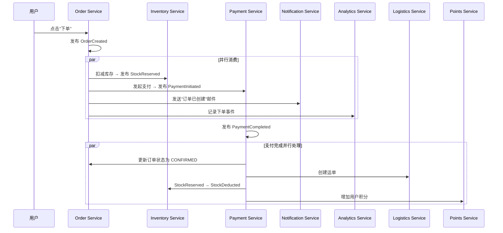

# L7-02：事件驱动架构 —— 用"发生的事情"而不是"调用链"来设计系统

> 🎯 **学电商平台的事件驱动架构设计**：不是简单的"用消息队列解耦"，而是从订单创建到支付确认、库存扣减、物流通知的全链路事件流设计——包括事件溯源、CQRS、最终一致性和 Saga 补偿事务。
>
> > 💡 **概念区分**：事件驱动架构是通信模式（服务间通过事件通信）；Event Sourcing 是持久化模式（存事件流而非当前状态）；CQRS 是读写分离模式（Command 模型和 Query 模型独立）。本课聚焦第一种。
> ⏱️ **预计时间**：40 分钟

***

> [!tip] 💡 白话小课堂
> 把系统设计想象成微信群聊，而不是打电话。打电话（同步调用）意味着你要等对方接听才能继续；微信群聊（事件驱动）意味着你发完消息就完事了，对方看到了自己处理。电商系统用事件驱动，每个服务只关心"发生了什么"而不是"谁需要知道"——订单创建后，库存服务自己扣库存、支付服务自己发起支付，互不等待。

> [!warning] ⚠️ 避坑指南
> 事件驱动不是万能药——如果流程只有2-3步且不需要独立扩展，直接RPC调用更简单。别为了"架构好看"引入不必要的复杂度。另外，异步意味着调试变难，一定要在第一天就建立好分布式追踪（Tracing），否则出了问题只能靠猜。

> [!info] 🔑 核心秘诀
> Saga补偿事务是分布式事务的工程实践——传统ACID事务是"大家一起成功或一起失败"，Saga是"先各自提交，失败了再补偿回来"。就像买家具：先买了沙发、床、桌子，发现沙发不合适，退沙发就行——不用连床也退了。记住：每个正向操作都要定义好对应的补偿操作。

***

> [!quote]- 📖 课程来源
> 本课为系统设计大师课，内容综合自真实电商工程实践经验，而非单一 Skill 文件。涵盖架构设计、分布式系统、团队管理等高级工程主题。

## 1. 电商为什么需要事件驱动？

```markdown
## 单体架构的电商问题

一个典型的电商下单流程涉及：
  → 订单服务：创建订单
  → 库存服务：扣减库存
  → 支付服务：处理支付
  → 物流服务：创建运单
  → 通知服务：发送邮件/短信
  → 积分服务：更新用户积分

单体/同步调用的问题：
  → 任何一个服务挂了 → 整个下单流程中断
  → 支付服务慢 → 用户等待超时
  → 库存扣减后支付失败 → 需要手动回滚
  → 新加一个"推荐服务"→ 需要改下单代码

## 事件驱动架构的核心思想
  → 订单服务发布 "OrderCreated" 事件
  → 其他服务订阅各自关心的事件
  → 每个服务独立处理，互不影响
  → 失败时通过补偿事件回滚
```

***

## 2. 电商核心事件流设计

````markdown
## 事件目录

### Order Events（订单事件）
  → OrderCreated {orderId, userId, items, total, timestamp}
  → OrderConfirmed {orderId, paymentId}
  → OrderCancelled {orderId, reason}
  → OrderShipped {orderId, trackingNumber}
  → OrderDelivered {orderId, timestamp}
  → OrderRefunded {orderId, amount, reason}

### Inventory Events（库存事件）
  → StockReserved {orderId, sku, quantity}
  → StockDeducted {orderId, sku, quantity}
  → StockReleased {orderId, sku, quantity} // 订单取消时释放
  → StockLow {sku, remaining} // 低库存告警

### Payment Events（支付事件）
  → PaymentInitiated {orderId, amount, method}
  → PaymentCompleted {orderId, transactionId}
  → PaymentFailed {orderId, reason}
  → PaymentRefunded {orderId, amount}

## 事件流示例


````

***

## 3. Saga 补偿事务

```markdown
## 为什么需要 Saga？

事件驱动架构没有 ACID 事务——每个服务独立提交。

问题场景：
  订单创建 ✓
  库存扣减 ✓
  支付处理 ✗（余额不足）
  → 库存已经扣了，但订单应该取消

Saga 解决这个问题：
  每个操作有一个对应的"补偿操作"
  → 库存扣减的补偿 = 库存释放（StockReleased）
  → 支付发起 = 无副作用（无需补偿）
  → 积分增加的补偿 = 积分扣回

## Saga 实现方式

### Choreography（编排式——推荐用于简单流程）
  每个服务发布事件 → 其他服务自行处理
  PaymentFailed → Inventory listens → StockReleased
  
### Orchestration（协调式——推荐用于复杂流程）
  一个 Saga Orchestrator 集中管理流程
  → 收到 OrderCreated
  → 依次调用各服务
  → 任一步失败 → 按逆序执行补偿
```

***

## 4. CQRS 与事件溯源

```markdown
## CQRS（Command Query Responsibility Segregation）

读和写使用不同的模型：
  → 写模型（Command）：完整的事件流，强一致性
  → 读模型（Query）：为查询优化的投影，最终一致性

电商示例：
  → 写侧：Order Aggregate（通过事件构建）
  → 读侧：OrderSummary（订单列表）、OrderDetail（订单详情）
  → 读侧从事件流中投影（project）出来

### 事件溯源（Event Sourcing）
  → 不存储当前状态，存储所有事件
  → 当前状态 = 重放所有事件
  → 优点：完整的审计日志、时间旅行、bug 复现
  → 挑战：事件量巨大时需要快照（snapshot）

电商应用：
  → 订单的完整生命周期可追溯
  → "为什么这笔订单被取消了？" → 查看事件流
  → "用户 A 在过去 30 天做了什么？" → 事件查询
```

***

## 5. 电商案例：订单全生命周期事件驱动架构

> 🛒 **实战案例**：某综合电商平台的订单系统在经历3年增长后陷入瓶颈——一次下单需要同步调用库存、支付、物流、积分、通知5个服务，P99延迟达2.8s，任何一个服务抖动就导致下单失败。618大促前夕，CTO决定用事件驱动架构彻底重构订单全生命周期。
>
> **用 gstack 架构体系设计事件驱动**：
> 1. /plan-eng-review 评审新架构 → 识别出订单生命周期8个关键事件：OrderCreated → PaymentInitiated → StockReserved → PaymentCompleted → OrderConfirmed → OrderShipped → OrderDelivered → SettlementTriggered
> 2. /review 审查事件Schema设计 → 发现3个问题：事件缺少version字段（Schema演进无法兼容）、amount字段未注明货币单位、事件timestamp使用服务端时间而非事件发生时间
> 3. 每个服务独立消费关注的事件：库存服务订阅OrderCreated/PaymentFailed→扣减/释放库存；物流服务订阅OrderConfirmed→生成运单；结算服务订阅OrderDelivered→触发商家结算；积分服务订阅PaymentCompleted→发放积分
> 4. /qa 构建事件回放测试 → 模拟3个月历史订单数据重放 → 验证所有消费者幂等性和最终一致性
>
> **效果**：
> - 下单P99延迟从2.8s降至320ms（订单服务发布事件即返回，不再等待下游）
> - 订单创建吞吐量从1200 QPS提升至8500 QPS（618峰值实测）
> - 新增"推荐服务"订阅OrderCreated事件：无需修改一行订单代码，2天完成接入
> - 支付失败场景的库存补偿自动化：PaymentFailed事件触发库存释放的平均延迟从人工15分钟→自动3秒
> - 事件溯源审计：任意一笔订单的完整生命周期可回溯（从创建到结算共11个事件，全程可查）
>
> > 🔑 **启示**：事件驱动架构的核心收益不是性能，而是组织解耦——订单团队不再需要知道库存团队、物流团队、结算团队的存在。营销说"我们要上拼团功能"，订单团队只需要发一个新事件GroupOrderCreated，其他团队各自订阅——新增业务能力不再需要跨5个团队的排期对齐。事件Schema设计的第一原则：每个事件必须自包含（谁、什么时间、发生了什么、涉及哪些实体），消费者不应该需要回调生产者才能理解事件含义。

***

## 6. 动手实践

1. **设计一个下单事件流**：画出一个简化的电商下单流程（创建订单→扣库存→发起支付→通知用户→记录日志），用事件图标注每个服务发布和订阅的事件。
2. **为支付失败设计 Saga 补偿**：假设订单已创建、库存已扣减，但支付失败。写出正向操作和对应的补偿操作，确保库存能被正确释放。
3. **选一个你现有的同步调用链**：找一段超过 3 个服务参与的同步调用代码，评估改为事件驱动的收益和成本。重点思考：失败重试、超时处理、分布式追踪如何解决。

> [!tip] 提示：不要为了"架构好看"而过度事件化。2-3 个服务之间的简单流程，同步调用可能更合适。事件驱动的真正价值在 5+ 个服务且需要独立扩展时才能体现。

***

## 7. 掌握检验

**Q1**：事件驱动架构中，"订单服务发布 OrderCreated 事件后即返回"对比"同步调用库存、支付、物流三个服务"，最核心的架构变化是什么？
- A) 系统变得更快，因为事件异步处理没有网络延迟
- B) 订单服务不再需要知道库存、支付、物流服务的存在——耦合从"调用链依赖"变为"事件订阅"，新增服务无需修改下单代码
- C) 系统自动获得强一致性，因为事件队列保证了事务
- D) 所有服务都必须改为事件驱动，否则无法通信

**Q2**：假设你在设计一个电商退款流程：用户申请退款后，需要关闭订单→释放库存→发起退款→扣回积分→发送通知。请设计这个流程的 Saga 补偿事务——写出正向操作序列和每一步对应的补偿操作，并说明如果"发起退款"这一步失败，前面完成的步骤如何回滚。

**Q3**：在秒杀系统的 CQRS 架构中，写侧（Command Side）和读侧（Query Side）分别承担什么职责？为什么不直接在写侧做查询？
- A) 写侧负责库存扣减和事件发布，读侧负责结果查询——分离后写侧用 Redis 原子操作保证高并发扣减，读侧用 PostgreSQL 投影表为查询优化，避免高并发读影响写性能
- B) 读和写用同一套代码，只是部署在不同服务器上
- C) CQRS 主要是为了数据备份
- D) 写侧用 PostgreSQL，读侧用 Redis

**Q4**：Saga 的两种实现方式（Choreography 编排式和 Orchestration 协调式）分别适合什么场景？请各举一个电商系统中的具体例子，说明选型理由。

**Q5**：事件溯源（Event Sourcing）的核心思想是"不存储当前状态，存储所有事件"。这在电商系统中提供了什么独特能力？同时带来了什么挑战？
- A) 没有独特能力，只是把数据库表换成了事件日志
- B) 提供完整的审计日志和时间旅行能力（可回溯任何时间点的订单状态），但挑战是事件量巨大时需要快照机制来避免全量重放
- C) 让系统性能大幅提升，因为写事件比写状态快
- D) 主要好处是节省存储空间

**Q6**：gstack 在事件驱动架构的开发和运维全流程中扮演什么角色？请从设计阶段（/plan-eng-review）、实现阶段（/review）、安全阶段（/cso）、测试阶段（/qa）四个维度分别说明。

***

## 8. 答案

<details>
<summary>点击查看答案</summary>

**Q1**：**B** — 事件驱动架构的核心变化是将"订单服务直接调用库存、支付、物流"的调用链依赖，变为"订单服务发布事件，各服务独立订阅"。订单服务不再需要知道谁在消费事件，新增推荐服务只需订阅 OrderCreated 事件，无需修改下单代码。这是从编译时耦合变为运行时解耦。

**Q2**：正向操作序列：T1 取消订单 → T2 释放库存(INCR) → T3 发起退款 → T4 扣回积分(减少) → T5 发送退款通知。补偿操作（逆序）：T5 无需补偿（通知无副作用）→ T4 的补偿：加回积分（恢复原值，需幂等）→ 如果 T3 发起退款失败，前面 T1/T2 已完成的操作需要补偿：T2 的补偿：重新扣减库存(DECR 恢复占用)、T1 的补偿：恢复订单状态为已取消但需标记"退款失败待处理"。Choreography 方式：T3 发布 RefundFailed 事件 → Inventory 服务和 Order 服务各自监听并执行补偿。Orchestration 方式：Saga Orchestrator 收到 T3 失败 → 依次调用 C2、C1。

**Q3**：**A** — 写侧专注高并发写入：Redis DECR 原子扣减库存（O(1)，单线程无锁），发布事件到 Kafka 持久化；读侧专注查询优化：从事件流投影出查询友好的表结构（PostgreSQL 投影表），可以为不同查询场景建立不同索引。分离的根本原因：高并发写操作（秒杀扣减）的性能瓶颈在锁竞争，高并发读操作（结果查询）的性能瓶颈在索引和连接，合在一起互相拖累。

**Q4**：Choreography 适用于简单流程：如"订单取消 → 释放库存 → 释放优惠券"。每个服务各自监听 OrderCancelled 事件并执行自己的补偿，流程简单、服务数量少（3-4个），无中心协调者。Orchestration 适用于复杂流程：如"大促凑单：创建订单 → 扣多仓库存 → 计算满减优惠 → 分摊优惠到各商品 → 发起支付"。步骤多且有顺序依赖，Orchestrator 集中管理流程状态和补偿逻辑易于监控和修改。选型核心标准：流程步骤数量和依赖复杂度。

**Q5**：**B** — 事件溯源的核心价值：(1) 完整审计日志——"这笔订单为什么被取消？"查看事件流即可回溯全生命周期；(2) 时间旅行——可重建任意历史时间点的系统状态，用于 bug 复现和数据分析；(3) 新读模型——未来需要新的查询维度时，不需要修改写模型，只需重新投影事件流。核心挑战：事件量随业务增长（一个订单可能产生 20+ 个事件），必须引入快照机制定期保存聚合状态，避免重放数百万事件。

**Q6**：设计阶段：/plan-eng-review 评审事件目录设计（事件粒度、schema 演进策略）、Saga 流程设计（正向/补偿操作完整性）、技术选型（Kafka vs RabbitMQ）；实现阶段：/review 审查事件发布消费代码的幂等性、死信队列处理、消息顺序保证；安全阶段：/cso 审计事件中包含的敏感数据是否脱敏、事件通道的访问控制；测试阶段：/qa 验证正常流程+异常流程（事件丢失、重复、乱序的恢复能力）+压力测试（Kafka 消费延迟和积压）。

（5/6 通过）
</details>

***

## 延伸阅读
- [[L7-01-AI原生工程团队|上一课：AI原生工程团队 —— 3个人+AI能干传统团队10个人的活]]
- [[L7-03-实时库存系统|下一课：实时库存系统 —— 100万人同时抢1件商品也不超卖的秘密]]
- [[L6-15-PR代码审查|相关：代码审查——竞态条件检测]]
