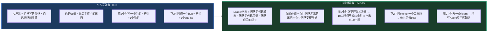
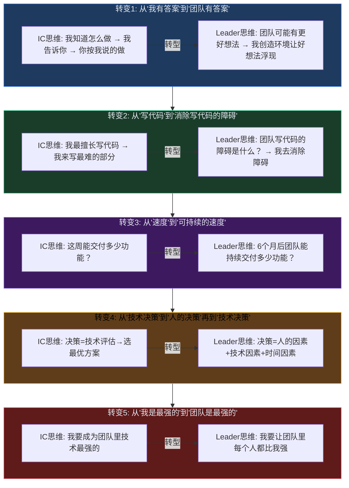
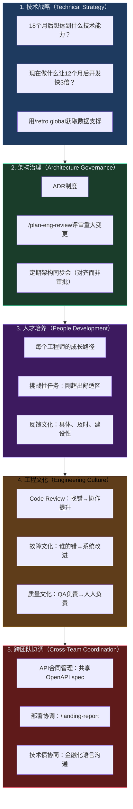

# L7-15：Dev到Leader的蜕变 —— 从"我写出最好的代码"到"我让团队写出最好的代码"

> 🎯 **学从 IC（Individual Contributor）到工程领导者的转型**：不是"终于不用写代码了"，而是从"我的代码质量"到"团队的系统质量"、从"我最懂技术"到"让团队做出最好的技术决策"、从"一个人快"到"一群人持续快"的思维转变。
> ⏱️ **预计时间**：40 分钟

***

> [!tip] 💡 白话小课堂
> IC（个人贡献者）和Leader的产出公式完全不同。IC产出=自己写的代码×自己代码的质量；Leader产出=团队代码输出×团队代码质量×团队成员成长。花2小时写一个功能=产出+1个功能；花2小时建立更好的代码审查流程=10个工程师每月节省10小时=产出+100小时。这个杠杆率的数字级差异，就是"从写代码的人"变成"让写代码变得容易的人"的核心逻辑。

> [!warning] ⚠️ 避坑指南
> 转型最难的不是学新技能——是"放手"。看着队友用"不够完美"的方案解决，你本能想上手说"我来！"。但你上手=你成为瓶颈=队友学不会=系统不可持续。队友的方案虽然不够完美，但队友完全理解→可持续；你的完美方案，只有你理解→不可持续。掌握"你决定"和"我来"的分寸：架构和安全你决定，实现细节队友决定。

> [!info] 🔑 核心秘诀
> Leader的新"代码"不再是.ts文件——是CI/CD管道、Code Review流程、ADR（ADR：架构决策记录）制度、On-Call手册、知识沉淀系统。这些"系统"的杠杆是代码的100倍。写一个功能=产出1个功能；建立一个让所有功能都高质量交付的系统=产出无限放大。AI不是替代工程师——是放大Leader的杠杆：AI替你审查代码，你把精力释放出来建立更好的系统。

***

> [!quote]- 📖 课程来源
> 本课为系统设计大师课，内容综合自真实电商工程实践经验，而非单一 Skill 文件。涵盖架构设计、分布式系统、团队管理等高级工程主题。

## 1. 转型的本质——产出公式变了

**关键洞察**：你的时间投入的杠杆率（Leverage）发生了数量级的变化。

***

## 2. 五个思维转变

***

## 3. 工程领导者的工具箱

***

## 4. 电商案例：从"我写代码"到"我让团队写好代码"——一个Tech Lead的蜕变

> 🛒 **实战案例**：张浩（化名）是某电商平台最资深的工程师，32岁，5年全栈经验，支付模块和秒杀系统都是他一个人写的。CTO对他说："你带订单Squad吧，5个人。"张浩犹豫了——"Tech Lead是不是就少写点代码多开点会？那我不就变成我最讨厌的那种'不写代码的经理'了？"但当时订单Squad的现状让他无法拒绝：5个工程师等他的Code Review平均排队2天；支付模块除了他没人敢改；团队遇到架构问题永远等他拍板；他每周工作60+小时——写最难的代码+帮别人debug+补齐缺失的测试+开会——开始burnout。
>
> **用 gstack 支撑转型前90天**：
> 1. Week 1-2（还在挣扎）：张浩仍习惯性上手——队友问"这个支付状态机怎么设计？"→他花2小时画出完整方案→队友变成打字员。PR还是等着他审查（/review已配置但他不信任跳过不看）。Week 2结束时他自己统计：写了400行代码，审查了7个PR共2.5小时，帮3个队友debug共4小时——产出=1个高级IC的量，但Squad总产出没有增加
> 2. Week 3-4（觉醒时刻）：张浩感冒请假2天→回来发现：2个PR等着他approve无法合并、支付模块有个线上问题3个同事看了2小时没搞定、Sprint承诺的5个功能点只完成了1个。他第一次意识到——"我的存在本身成了团队的瓶颈。如果我不在，团队就停了。"→当晚找CTO深聊→决定改变
> 3. Week 5-8（建立系统）：(1)引入 /review 全自动CR——张浩不再逐行读代码，只看AI标注的CRITICAL和ASK，审查时间从2.5小时/天降至15分钟/天；(2)花3天写完订单模块ADR（为什么订单ID用Snowflake、为什么状态机这样设计、为什么支付幂等键用out_trade_no+event_type）→之后队友不再需要问他"为什么这样设计"；(3)设定"不直接给答案"规则——队友带着问题来时，先问"你觉得有几种方案？每种方案的优缺点？你推荐哪种？"→前2周队友不适应，第3周开始独立给出完整方案；(4)每周1:1 30分钟聊成长目标——每个队友都有一张"12个月成长地图"
> 4. Week 9-12（杠杆开始生效）：队友开始独立完成复杂功能——王工程师独立完成"多仓发货库存路由"（之前这种级别需求一定是张浩做）；PR审查从2天排队→15分钟自动完成；Sprint 5个功能点全量完成且0上线bug；张浩自己开始写prototype和基础设施代码（不是常规功能代码）→一个统一的事件Schema校验库让4个Squad都受益
>
> **效果（6个月后）**：
> - Squad部署频率：3次/周→22次/周（/review+CI/CD消除人工瓶颈）
> - 代码健康度：62→84（/health趋势持续改善）
> - PR审查时间：从排队2天→AI 2分钟+人工15分钟确认关键决策
> - 张浩工作饱和度：从每周60+小时burnout→稳定45小时，且工作内容从"修bug+写CRUD"变成"架构决策+人才培养+系统建设"
> - 团队流失率：6个月前40%年化→0%（所有工程师的12个月成长地图在推进）
> - 张浩自己定义的"新产出"：本月写了0行常规功能代码，但建立了Code Review流程为Squad月节省60小时、写的ADR让新成员上手从2周→3天、建立的统一事件Schema让跨Squad集成bug减少70%
>
> > 🔑 **启示**：Tech Lead最难的不是学新技术——是"放手"。看着队友用"不够完美"的方案解决问题，本能想上手说"我来！"。但你上手=你成为瓶颈=队友学不会=系统不可持续。队友的方案虽然不够完美但队友完全理解→6个月后需要改这段代码时队友立刻知道怎么改→可持续；你的完美方案只有你理解→任何人改这段代码都要找你→你不在或离职→系统变黑盒。Leader的新"代码"不再是.ts文件——是CI/CD管道、Code Review流程、ADR制度、On-Call手册、知识沉淀系统。写一个功能=产出+1，建立一个让所有功能都高质量交付的系统=产出无限放大——这就是100倍杠杆的数学本质。

***

## 5. 动手实践

1. **做一次自我评估**：列出 IC（个人贡献者）的 5 个产出指标（如代码行数、Bug 修复数、功能交付数）和 Leader 的 5 个产出指标（如团队产出、决策质量、人才培养、系统健康度、技术方向）。对比你目前的精力分配。
2. **写一份"如果我不在"文档**：假设你需要离开团队 4 周，写一份文档让团队能在此期间正常运作——关键决策记录、待办事项优先级、谁负责什么、升级路径是什么。这份文档的"完备程度"就是你作为 Leader 的成熟度指标。
3. **做一次"不直接给答案"的练习**：当下属带着问题来找你时，刻意不直接给解决方案，而是问"你觉得有几种方案？""每种方案的优缺点是什么？""你推荐哪一种？"记录这次对话的结果。

> [!tip] 提示：Leader 最难的转变不是技能，而是心态——从"我的代码最好"到"我让团队写出最好的代码"。如果你发现自己在深夜写代码而团队在等你决策——停下来，你已经成了瓶颈。

***

## 6. 掌握检验

**Q1**：IC 和 Leader 的产出公式有数量级的差异。以下哪个公式最准确地表达了这种差异？
- A) IC 产出 = 自己写的代码行数；Leader 产出 = 团队写的代码行数
- B) IC 产出 = 自己写的代码 x 自己的代码质量；Leader 产出 = 团队的代码输出 x 团队代码质量 x 团队成员成长——Leader 的杠杆在于"花 2 小时建立好的 CI/CD 流程让 10 个工程师每人每月节省 10 小时"
- C) IC 和 Leader 的产出公式完全相同，只是 Leader 写的代码更少
- D) Leader 的产出 = 开会数量 x 邮件数量

**Q2**：五个思维转变中，"从我有答案到团队有答案"（转变 1）是最根本的转变。小明转型案例中，他第 3-4 周"病假→项目停滞→意识到自己是瓶颈"是这个转变的触发点。请解释：(a) 为什么"你的方案虽然不够完美但队友理解→可持续，你的完美方案只有你理解→不可持续"？(b) 在实践层面，当队友的方案在技术上比你的方案差 20%——你应该让他用他的方案还是坚持你的方案？为什么？

**Q3**：五个思维转变中，"从速度到可持续的速度"（转变 3）在工程决策中体现为哪些具体选择？请从以下选项中选出正确的 Leader 决策模式：
- A) 这周能交付多少功能就做多少，质量可以以后补
- B) 拒绝一个本周末可以交付但会跳过测试的功能需求——因为"这周上线但下周修 bug"的总耗时 > "下周上线且不需要修 bug"的总耗时。可持续的速度 = 宁可慢一周，不让质量债累积
- C) 永远选择最快的方案
- D) 功能交付速度是唯一指标

**Q4**：为什么说"不直接给答案，而是问'你觉得有几种方案？每种方案的优缺点是什么？你推荐哪一种？'"是 Leader 的核心教练技能？如果 Leader 每次都直接给答案，3 个月后会出现什么问题？

**Q5**：工程领导者的"新代码"不再是 .ts 文件——而是 CI/CD 管道、Code Review 流程、ADR 制度、On-Call 手册、知识沉淀系统。请为这 5 个"系统"分别举出一个对团队产出的具体杠杆效应（如"CI/CD 管道——每次部署从 30 分钟降到 2 分钟，乘以 300 次部署/年 = 节省 140 小时/年"），并说明为什么这些系统的杠杆是写代码的 100 倍。

**Q6**：案例中转型后的大明每天 09:00-17:00 的日程不再包含"写常规功能代码"。如果大明的老板质疑"你这个月写了多少行代码？"——请用本课的框架帮大明回答这个问题：他应该如何重新定义"产出"并向老板展示他作为 Leader 的实际贡献（不只是写代码行数）？

***

## 7. 答案

点击查看答案

**Q1**：**B** — IC 产出是线性的一维（自己写代码），Leader 产出是乘法的三维（团队输出 x 质量 x 成长）。杠杆体现在：(1) 建立一个好流程→N 个人受益→产出放大 N 倍；(2) Mentor 一个工程师→他变快 50%→他再 mentor 别人→效应几何级传递；(3) 写一条 /learn→所有 Agent 和工程师应用→知识无限复制。最关键的数学：花 2 小时写功能=产出+1 个功能；花 2 小时建立代码审查流程让 10 个工程师每月各节省 10 小时=年产出+1200 小时。这就是 600 倍的杠杆差异。

**Q2**：(a) 队友的方案虽不够完美但队友完全理解——队友知道代码的每个假设、边界条件、已知局限→6 个月后需要改这段代码时→队友立刻知道怎么改、不会引入新 bug→系统可持续维护。你的完美方案只有你理解——别人看不懂为什么这样设计、不敢改→每次需要改动必须找你→你成为瓶颈→某天你不在或离职→系统变成不可维护的黑盒。可持续性 > 局部最优。(b) 差 20% 时：如果是架构层面的 20%（影响可扩展性、安全性）→坚持你的方案但花时间解释为什么，让队友学到你的思路。如果是实现细节层面的 20%（如代码组织方式、变量命名）→让队友用他的方案。关键判断：这个差异是否在"不可逆决策"的范畴（如数据模型设计、API 合同、安全策略）→如果是则必须对齐；如果是可逆的→让队友自主决定，经验是最好的老师。

**Q3**：**B** — 可持续速度的思维是：短期的"快"如果以质量为代价，必然在下一周/月以修复 bug、偿还技术债的形式"还回来"——且利息远比本金高。跳过测试本周上线一个功能 = 本周"速度"看起来 +1，但下周可能花 3 天修这个功能引入的 bug = 净速度为负。Leader 的核心判断：不是"这周能交付多少"，是"6 个月后团队的持续交付速率是多少"。为了让 6 个月后的速率保持或增长——今天必须拒绝一些"看起来快但产生技术债"的捷径。

**Q4**：如果 Leader 每次都直接给答案：(1) 队友形成依赖——"有问题找 TL，反正他会告诉我怎么做"——不再独立思考。3 个月后：队友的技术决策能力退化，所有稍微复杂的问题都升级到 TL→TL 成为瓶颈→团队从 5 个能思考的人变成 1 个大脑 + 4 双手。(2) 队友没有 ownership——TL 的方案出问题时队友态度是"TL 让我这么做的"而非"这是我的决策，我来修复"。正确方式：教练式提问→队友自己想出方案→队友对方案有 ownership→方案出问题时队友主动修复→队友在实践中成长→下一次能处理更复杂的问题→TL 的"可升级范围"缩小→TL 可以做更多高杠杆的事。

**Q5**：五个系统的杠杆效应：(1) CI/CD 管道：每次部署从 30 分钟手动操作→2 分钟自动执行，乘以 300 次部署/年 = 节省 140 小时/年，且消除了"部署日焦虑"和人工操作失误导致的宕机。(2) Code Review 流程：AI 审查覆盖率 100%、审查时间从 4 小时→15 分钟，乘以 500 PR/年 = 节省约 2000 小时/年，同时 bug 发现率从上线后 55%→8%。(3) ADR 制度：新成员入职理解架构从 2 周口述→3 小时阅读 ADR，节省时间 + 消除"口述不完整导致的理解偏差"产生 bug 的成本。(4) On-Call 手册：故障平均修复时间(MTTR)从 4 小时（凭记忆+摸索）→12 分钟（按手册执行），每次故障节省 3.8 小时，如果年均 12 次故障 = 节省 45.6 小时 + 减少 GMV 损失。(5) 知识沉淀(/learn)：每次 bug 的根因和教训被永久记录→同样的错误不会在团队中发生第二次→知识资产随时间和人员增长而累积，不随人员离职而丢失。写一个功能=产出+1，建立一个系统=产出放大 N 倍——这就是 100 倍杠杆的数学本质。

**Q6**：大明的回答框架：(1) 重新定义产出指标：我的产出不是代码行数，是"Squad 的部署频率从 3 次/周→25 次/周"、"代码健康分数从 62→84"、"团队成员流失率从 40%→0%"、"MTTR 从 4 小时→8 分钟"、"新成员上手时间从 2 周→3 天"。(2) 量化杠杆效应：我用 /retro global 和 /health 提供的数据追踪我的"系统产出"——我建立的 CI/CD 管道每年节省 140 小时、我引入的 Code Review 流程使上线前 bug 发现率从 45%→92%、我写的 18 条 ADR 让新成员理解架构的时间缩短了 80%。(3) 最重要的：如果我用这些时间去写代码，我可以再写约 5000 行——但 5000 行代码的价值远不及我建立的"让整个团队持续高质高产的系统"。Leader 的价值不在于自己写了多少代码——在于团队的代码写得多好、多快、多可持续。

（5/6 通过）

***

## 延伸阅读
- [[L7-14-AI原生代码审查文化|上一课：AI原生代码审查文化 —— 把找bug的时间从2小时压缩到2分钟的团队变革]]
- [[L7-16-gstack完整体系总装|下一课：gstack完整体系总装 —— 40+AI技能如何协同运作完成一个真实电商项目]]
- [[L7-01-AI原生工程团队|相关：AI原生工程团队 —— 3个人+AI能干传统团队10个人的活]]
