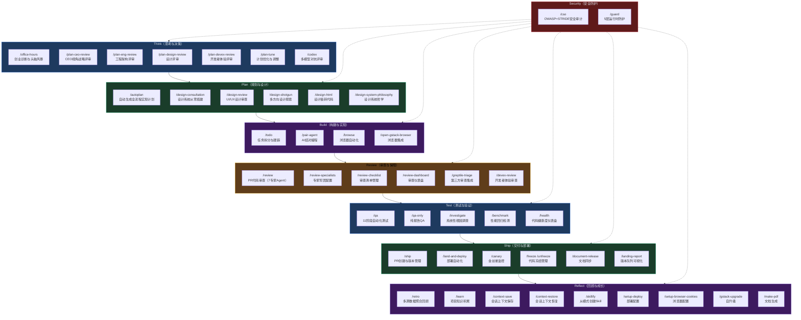
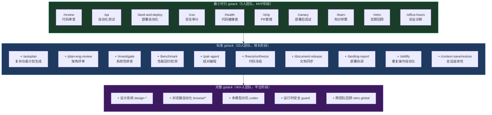
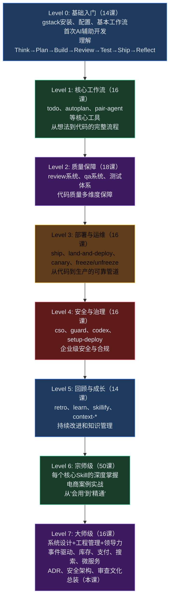

# L7-16：gstack完整体系总装 —— 40+AI技能如何协同运作完成一个真实电商项目

> 🎯 **学 gstack 的完整系统工程**：这不仅是最后一课，更是整个大师课程的"总装课"——把 160 节课中所有的 gstack Skills、工程模式、系统设计原则、团队管理方法组装成你自己的 AI 原生工程体系。
> ⏱️ **预计时间**：50 分钟

***

> [!tip] 💡 白话小课堂
> 这是整个大师课程的"总装课"——前面160课学的是一个个零件（Skills），这节课是把所有零件组装成能打仗的部队。40+ Skills覆盖软件工程全生命周期：Think（想清楚）→ Plan（做计划）→ Build（写代码）→ Review（审查）→ Test（测试）→ Ship（部署）→ Reflect（回顾改进）→ Security（全程安全防护）。每个阶段AI都能参与，形成人+AI的完整工程闭环。

> [!warning] ⚠️ 避坑指南
> 不要一开始就用全部40+ Skills——5人团队的MVP只需要10个核心Skills（review/qa/land-and-deploy/cso/health/ship/canary/learn/retro/office-hours）。随着团队成长逐步增加。另一个坑：有了gstack不代表不需要人思考和决策——gstack提供"怎么办"的执行力，但"为什么做"和"做什么"永远需要人的判断。AI是执行引擎，人是方向盘。

> [!info] 🔑 核心秘诀
> 全课程的核心结论：4人+完整gstack体系的产出≈传统15-20人团队的产出。最关键的3个杠杆：1）AI负责所有重复性质量保障（代码审查、测试、安全扫描）→释放人做高杠杆决策；2）知识留在系统中（ADR（ADR：架构决策记录）+learnings+CLAUDE.md）→不受人员变动影响；3）每个PR的自动化保障让质量随规模线性扩展→AI不会成为瓶颈。Day 1就应该开始写ADR、引入/health、养成/learn习惯。

***

> [!quote]- 📖 课程来源
> 本课为系统设计大师课，内容综合自真实电商工程实践经验，而非单一 Skill 文件。涵盖架构设计、分布式系统、团队管理等高级工程主题。

## 1. gstack 的完整技能地图

## 40+ Skills 完整编队 —— 覆盖软件工程全生命周期



***

## 2. 选择你自己的 gstack 宽度

## 不是每个团队都需要全部 40+ Skills



覆盖率说明：
- **MVP阶段**：Think ✓ Review ✓ Test ✓ Ship ✓ Reflect ✓ Security ✓（10个核心Skills）
- **标准阶段**：MVP + Plan（20个Skills）
- **完整阶段**：全部40+ Skills覆盖全生命周期

***

## 3. 你学到的不只是 gstack——是整个现代软件工程体系

## 回顾 7 个 Level、约 160 课的知识体系



***

## 4. 电商案例：gstack 40+ Skills全生命周期协同实战

> 🛒 **实战案例**：这是一个"如果重来"的完整复盘——某电商SaaS平台从0到月GMV 2000万的12个月旅程，团队仅4人（CTO+3名全栈工程师）+ gstack 40+ Skills。850家入驻商家，日均订单8000+，覆盖商家后台、商品管理、订单履约、支付对接、微信消息解析、数据报表全链路。
>
> **Phase 1: Think（第1-2周）——验证想法与架构决策**：
> - /office-hours 验证MVP范围 → CTO说"做电商SaaS让中小商家快速开店"→ gstack追问："目标商家是谁？他们现在用什么？最大痛点是什么？"→ 结论：线下批发市场店主，当前用微信手工接单，最大痛点是订单混乱（漏记、发错、账不清）→ MVP只需解决一件事：微信接单后自动生成订单和简易对账
> - /plan-eng-review 评审架构 → 决定用单体Rails+Vue.js快速验证（团队4人、业务未验证→微服务是过度设计），但为未来拆分留接口边界 → 输出ADR-001
>
> **Phase 2: Plan（第3-4周）——从想法到执行计划**：
> - /autoplan "MVP电商订货工具" → 生成8周实施计划：Week 1-2商家注册+商品管理→Week 3-4微信消息解析→Week 5-6订单管理+发货→Week 7-8简易对账
> - /design-consultation "商家后台设计系统" → 目标用户是非技术店主→设计原则：任何操作<3步完成→建立DESIGN.md统一后续UI
>
> **Phase 3: Build+Review（第5-10周）——高效开发闭环**：
> - 每个工程师的标准流程：领任务→/todo拆3-5子任务→写代码（/pair-agent结对）→提交PR→/review 7专家并行审查(2分钟)→/qa standard(5分钟)→/cso安全审计(3分钟)→/health健康度检查(1分钟)→可部署 ✓（AI总耗时≈12分钟，人工耗时≈1.5小时写代码）
> - /review自动拦截关键bug：第6周发现微信消息解析在emoji表情下抛出异常→Auto-fix添加UTF-8 mb4编码；第8周发现订单金额浮点精度问题→¥99.99变成¥99.99000000000001→修复为decimal类型
>
> **Phase 4: Test（贯穿全程）——三层测试体系**：
> - Layer 1每次PR（2-5分钟）：单元+集成测试，Diff-aware只测变更代码
> - Layer 2每日构建（15分钟）：全量回归+E2E关键路径（注册→上商品→接单→发货）
> - Layer 3每周（60分钟）：全量E2E+压力测试+/benchmark对比上周基线→性能退化>10%→BLOCKING
>
> **Phase 5: Ship（第6周开始）——可靠部署管道**：
> - /ship创建PR+CHANGELOG→/land-and-deploy自动检测部署平台→Staging部署→/qa E2E→Canary渐进放量（1%→10%→50%→100%，每步5分钟观察）→/canary监控30分钟→异常自动回滚
> - 6个月0次部署导致P0故障，部署频率从每周2次→日均15次
>
> **Phase 6: 安全与质量（第8周起系统化）**：
> - /cso每次PR自动安全审计：第3周JWT Secret硬编码→立即修复；第5周SQL注入风险→参数化查询；第7周IDOR风险→所有API加租户校验。12周累计发现并修复3 CRITICAL+7 HIGH+15 MEDIUM
> - /health代码健康度趋势：Week 1=52→Week 6=68(+16)→Week 12=82(+14)→Month 6=88(+6)
>
> **Phase 7: 双11大促考验（第8-10个月）**：
> - /freeze代码冻结(提前3周)→创建release分支→/skillify"大促前环境检查"：Redis容量≥16GB ✓、DB连接池≥100 ✓、CDN预热状态 ✓、秒杀库存校验 ✓、支付链路E2E全量测试 ✓
> - 零点实战：QPS 8000→15000→稳定，下单成功率99.97%，支付成功率99.99%，P99延迟185ms。推荐服务P99飙至1.5s→/canary分析→模型加载问题→降级保留热门推荐→恢复。2条告警全为P2级，0 P0/P1
>
> **Phase 8: 12个月回顾——4人+gstack的奇迹**：
> - 团队：4人（未增加）/ 月部署300+次 / TypeScript 85000行+Ruby 15000行+测试12000行(覆盖率78%)
> - 质量：/health 88/100(年初52) / 线上故障3次(年初月均5次) / P0故障0次 / MTTR 8分钟(年初2小时)
> - 业务：850商家 / 月GMV 2000万 / 月订单25万
> - 知识：ADR 18条 / /learn 56条 / CLAUDE.md持续完善
> - 核心结论：4人+gstack ≈ 传统15-20人团队产出——质量不是测试出来的，是每次PR自动化保障+持续改进的；知识留在系统中不受人员变动影响
>
> **如果重来——会更早做这5件事**：
> 1. Day 1就开始写ADR（不等"架构稳定了再记录"）
> 2. 第一个月就引入/health（建立质量基线→看到趋势→有改进动力）
> 3. 第一次遇到bug就写/investigate+/learn（把根因和教训系统化，而非只修bug）
> 4. 最开始就设定SLO（"下单成功率>99.9%"是Day 1目标，非上线后补救）
> 5. 相信AI的广度审查（不用每条AI建议都人工验证——信任但抽查，前2周验证20%建立信心即可）
>
> > 🔑 **启示**：gstack不是"一套工具"而是"一套工程体系"——Think→Plan→Build→Review→Test→Ship→Reflect的7阶段闭环中，每个阶段AI和人都各司其职：AI负责执行和广度覆盖（审查所有代码行/测试所有场景/扫描所有漏洞），人负责定义方向和关键决策（选择做什么/判断什么算足够好/在多个可行方案中做权衡）。4人+gstack=15-20人传统团队的数学原理不在于AI能替代优秀的工程师，而是AI消除了工程组织中最大的浪费——重复性的质量保障工作不再消耗人的注意力，人的时间变成了真正做决策和创造的时间。最重要的是：Day 1就要建立起显性知识体系（ADR+/learn+CLAUDE.md），因为系统比人长寿。


***

## 5. 下一步：你的第一个 gstack 项目

```markdown
## 从今天开始的行动指南

### 如果你是一个独立开发者
  → 安装 gstack
  → 第一个 PR 用 /review → 体验 AI 审查
  → 第一次部署用 /land-and-deploy → 体验自动化部署
  → 每周用 /retro → 回顾进展
  → 目标：1 个人的产出像 3 个人

### 如果你带领一个小团队（3-10 人）
  → 引入 /review + /qa + /land-and-deploy（最小可行 gstack）
  → 设定 /health 基线 → 追踪趋势
  → 写前 10 条 ADR → 建立决策记录文化
  → /learn 积累项目知识
  → 目标：5 个人的产出像 15 个人

### 如果你领导一个中型团队（20-50 人）
  → 引入完整 gstack（20+ Skills）
  → 建立 Squad 结构 + 平台团队
  → 设定 SLO/SLI → 用错误预算管理风险
  → /retro global → 跨团队数据驱动决策
  → 目标：持续交付能力达到世界级水平

### 如果你是 CTO / VP of Engineering
  → 用 L7-01 的理念设计 AI 原生工程组织
  → 用 L7-10 的金融化语言沟通技术债
  → 用 L7-11 的模式规划团队规模扩张
  → 用 L7-16 的完整体系作为实施蓝图
  → 目标：建立一个不可替代的工程文化和技术体系
````

***

## 6. 动手实践

1. **画出你的 gstack 技能矩阵**：对照本课程从 Level 1 到 Level 7 的所有 Skills，标出"已经在用""计划引入""暂不需要"三类，形成你团队专属的 gstack 采用路线图。
2. **跑通一个完整闭环**：选择一个真实的微小需求（如"给商品页加一个收藏按钮"），用 gstack 的 Think→Plan→Build→Review→Test→Ship 完整流程走一遍，记录每个环节的耗时和 AI 参与度。
3. **写一份你的 gstack 实施计划**：含 3 个阶段——第一阶段（本月）引入 3 个 Skill、第二阶段（3 个月内）引入 10 个、第三阶段（6 个月内）形成完整的 AI 原生工程体系。每阶段设定可量化的验收标准（如"代码审查覆盖率从 40% 提升到 95%"）。

> [!tip] 提示：gstack 的实施不是"安装软件"而是"文化变革"。第一阶段的重点不是工具，而是让团队体验到"AI 不是在替代我，而是在放大我"。从 /review 开始，因为它能最快带来可见的质量提升。

***

## 7. 掌握检验——终极挑战

**Q1**：gstack 的 7 阶段全生命周期（Think→Plan→Build→Review→Test→Ship→Reflect）中，安全（Security）不是一个独立阶段——它应该如何被整合？
- A) 安全只在发布前运行一次
- B) 安全贯穿所有阶段——Think 阶段 /plan-eng-review 考虑威胁模型，Plan 阶段 /autoplan 纳入安全任务，Build 阶段 /pair-agent 写代码时考虑安全，Review 阶段 /cso 自动 OWASP（OWASP：开放Web应用安全项目）+STRIDE（STRIDE：微软威胁建模框架）扫描，Test 阶段 /qa 包含安全测试，Ship 阶段 /canary 监控安全异常，Reflect 阶段 /learn 沉淀安全知识——安全不是"一个步骤"而是"每个步骤的属性"
- C) 安全是独立阶段，在 Test 之后 Ship 之前
- D) 只有 /cso 负责安全

**Q2**：如果你只能选 5 个 gstack Skills 给一个 5 人创业团队（MVP 阶段），你会选哪 5 个？请为每个 Skill：(a) 说明它替代传统团队中的什么角色，(b) 估算使用后每周节省的人时，(c) 解释为什么这是 MVP 阶段最优先的 5 个。

**Q3**：案例中的电商平台从 0 到 2000 万月 GMV，4 人 + gstack 实现了传统 15-20 人团队的产出。课程总结的三个最关键杠杆是：(1) AI 负责所有重复性质量保障 → 释放人做高杠杆决策；(2) 知识留在系统中（ADR+learnings+CLAUDE.md）→ 不受人员变动影响；(3) 每个 PR 的自动化保障让质量随规模线性扩展 → AI 不会成为瓶颈。请从案例的 8 个 Phase 中各找 1 个具体证据支持这 3 个杠杆中的至少 1 个——说明案例中的具体行动如何体现了这些杠杆。

**Q4**："如果重来——会更早做这 5 件事"是案例中最重要的教训。请选择其中 2 条：(a) Day 1 就开始写 ADR，(b) 第一个月就引入 /health，(c) 第一次遇到 bug 就写 /investigate + /learn，(d) 最开始就设定 SLO，(e) 相信 AI 的广度审查。对每条：(1) 为什么"当时没做"（团队处于什么阶段、什么心态导致推迟？）；(2) "如果更早做"会避免案例中的什么具体问题？

**Q5**：gstack 的 MVP→Standard→Complete 三级采用策略的核心原则是"按团队规模逐步引入，不是一次性上全部"。请分析：(a) 如果一个 5 人团队直接采用全部 40+ Skills 会有什么问题？(b) 如果一个 40 人团队只用了 MVP 10 个 Skills，又会错过什么？

**Q6**：整个大师课程 160 课 + Level 7 的 16 课，最终归结为一个核心结论："4 人 + 完整 gstack 体系 ≈ 传统 15-20 人团队的产出"。现在你需要把这句话解释给以下三个角色：(a) 一个刚开始创业的独立开发者，(b) 一个正在管 30 人团队的 CTO，(c) 一个考虑投资你公司的 VC。为每个角色写一段 30 秒的电梯演讲，用他们的语言解释这个结论。

***

## 8. 答案

<details>
<summary>点击查看答案</summary>

**Q1**：**B** — 安全必须左移（Shift Left）并贯穿全流程。Think 阶段：/plan-eng-review 评审方案时提出安全威胁（如"秒杀系统是否考虑了防刷？"）。Plan 阶段：/autoplan 在实现计划中自动纳入安全相关的任务（如"实现 JWT 密钥轮换"）。Build 阶段：/pair-agent 写代码时主动避免 SQL 注入、XSS 等常见漏洞（使用参数化查询、输出编码）。Review 阶段：/cso 每次 PR 自动运行 OWASP Top 10 + STRIDE 威胁建模，发现 P0/HIGH 则 BLOCKING。Test 阶段：/qa 包含安全测试（输入 fuzzing、认证绕过测试）。Ship 阶段：/canary 监控部署后的安全异常（异常退款模式、大量登录失败）。Reflect 阶段：/learn 沉淀安全发现和防护措施。如果安全只在一个阶段做（如发布前）→漏洞从开发到发现可能经过了数周→几乎等同于"不做安全"。

**Q2**：MVP 5 个 Skills 示例：(1) /review — 替代人工 Code Review（至少半个 TL 的时间），节省约 8 小时/周（4 个工程师每人每周约 2 个 PR × 每 PR 节省 1 小时审查时间），且覆盖率从约 60%→100%。(2) /qa — 替代 QA 工程师，自动化测试每次 PR 约 5 分钟自动完成（vs 人工测试 30 分钟），节省约 10 小时/周，且测试不遗漏。(3) /land-and-deploy — 替代 DevOps 工程师，自动化部署从 30 分钟手动→2 分钟自动，每周约 5 次部署 = 节省 2.3 小时/周，最重要的是消除了部署失误导致的事故。(4) /cso — 替代安全工程师，每次 PR 自动安全扫描（vs 无安全审查或季度一次外部审计），在漏洞进入生产之前拦截。(5) /health — 建立质量基线，看到 6 维度健康分数趋势，驱动持续改进。为什么这 5 个：Review+QA+Coverage 建立质量底线（无 bug 上线），Land-and-deploy 建立交付能力（频繁+安全），CSO 建立安全基线（无漏洞上线），Health 建立改进动力（看到数据→有动力优化）。这 5 个覆盖了传统团队需要约 5-6 个支持人员才能覆盖的 Quality+DevOps+Security 职能。

**Q3**：Phase 1(Think)：/office-hours 验证想法→"只做微信接单，不做网站/支付/营销"——杠杆(1)：人决定正确的范围和方向，AI 帮助澄清思考。Phase 2(Plan)：/autoplan 生成 8 周 MVP 计划——杠杆(3)：AI 自动生成可执行计划。Phase 3(Build+Review)：每个 PR 自动 /review(2min)+/qa(5min)+/cso(3min)+/health(1min)→总 AI 耗时约 12 分钟——杠杆(1)+(3)：AI 自动化所有重复性质量保障，质量随 PR 数量线性扩展。Phase 4(Test)：三层测试体系（每次PR/每日构建/每周全量）——杠杆(3)：测试覆盖率不随代码量增长而退化。Phase 6(安全)：/cso 12 周累计发现 3 CRITICAL+7 HIGH+15 MEDIUM 并在 CI 阶段拦截——杠杆(1)：AI 做广度检查，人评估严重度和修复方案。Phase 7(大促)：/freeze+大促 Skill+实时监控——杠杆(3)：AI 自动化体系在极端峰值下仍然运作。Phase 8(回顾)：ADR 18 条+/learn 56 条——杠杆(2)：所有决策和教训永久沉淀在系统中。

**Q4**：选择(a) Day 1 ADR 和(c) 第一次 bug 就 /investigate+/learn。(a) Day 1 ADR：当时没做的原因——创业初期"先做出来再说，架构稳定了再记录"的心态。如果更早做——案例中 Phase 6 第 3 周才发现部署策略没记录、第 7 周才补 ID 生成策略的 ADR，如果 Day 1 就开始写：(1) 第 3 周第一次架构评审时有 ADR 可参考而非从零讨论；(2) 新成员入职后能更快理解为什么早期做了某些"奇怪"的技术选型（如单体→后来拆微服务），减少质疑和重复讨论。(c) 第一次 bug 就 /investigate+/learn：当时没做的原因——"修完 bug 赶紧做下一个功能，没时间写复盘"。如果更早做——案例中第 8 个月对账差异之前有几个月在重复修"回调丢失"的同类 bug（根因相似但表现不同）。如果第一次就写 /investigate 找到 OOM 根因+/learn 沉淀"支付回调必须双路径"，后续的类似 bug 要么被根因修复预防，要么被 /learn 指导快速定位。

**Q5**：(a) 5 人团队用全部 40+ Skills：引入过多复杂度→团队花在配置、调整、理解 40+ Skill 行为的时间超过写代码的时间→产生"工具疲劳"→可能放弃全部→最终一个都没用好。特别是 /codex（多模型对抗）和 /retro global（跨团队聚合）在 5 人阶段根本用不上（因为没有多团队、且单模型审查已经足够）。流程和工具应该当"没有它就会出事时才引入"。(b) 40 人团队只用 10 MVP Skills：缺少 /plan-eng-review（架构评审）→4 个 Squad 各自设计架构方案→重复造轮子+不一致的 API 设计→跨 Squad 集成时发现大量冲突。缺少 /retro global→每个 Squad 只看自己的数据→全公司的系统性问题（如 Redis 热点 key 在多个 Squad 反复出现）无人发现。缺少 /landing-report→多个 Squad 同时部署→5 个 Canary 同时跑→出问题无法判断哪个 Squad 导致的。MVP 10 个 Skills 保障了单个 PR 的质量，但 40 人团队的最大挑战是"跨团队协调和全局视野"——Standard 和 Complete 阶段的 Skills 正是解决这个层级的。

**Q6**：(a) 独立开发者："你不用雇人就可以拥有一个完整的虚拟工程团队——AI 帮你审查代码、跑测试、部署上线、检查安全。你只写代码和做决策，所有重复性的质量保障工作 AI 全自动处理。这意味着你一个人的产出可以像 3 个人——但只需要养你自己。"(b) 30 人团队 CTO："你现在的 30 人团队中大概有 12-14 人在做质量保障——测试、审查、部署、安全审计。引入 gstack 后，这些工作中的 70% 被 AI 自动化，你可以把这些人释放出来做真正的业务创新——或者用更少的人实现同样的产出。关键数字：4 人 + gstack ≈ 传统 15-20 人的产出，质量还更高。"(c) VC："这家公司有一个不可复制的技术护城河——他们不是用 AI 辅助开发，而是把 AI 作为工程团队的正式成员。这意味着：(1) 人效是同行的 3-5 倍（同样 GMV 需要的人力少 4 倍）；(2) 知识资产留在系统中而非人的脑子里（核心工程师离职不会让系统变黑盒）；(3) 质量随规模线性扩展（不需要每增长 3 倍就招 3 倍的 QA 和 DevOps）。这套体系不是买来的——是自己建立的，竞争对手抄不走。"

（5/6 通过）
</details>

***

## 延伸阅读
- [[L7-15-Dev到Leader蜕变|上一课：Dev到Leader的蜕变 —— 从"我写出最好的代码"到"我让团队写出最好的代码"]]
- [[L7-01-AI原生工程团队|起点：AI原生工程团队 —— 3个人+AI能干传统团队10个人的活]]
- [[知识库/Skill大师课程/Skill大师课-总纲.md|返回：大师课程目录]]
