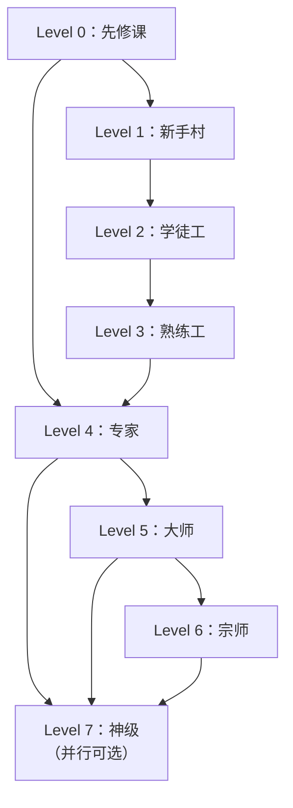

# Skill 大师课 · 总纲

> 🎓 从零到神级 —— 覆盖全部 150+ 个 Skill 的完整学习体系。
> 每个 Skill 都有独立专项课程，确保你达到大师级水准。

***

## 课程地图

```
Level 0  先修课    ██░░░░░░░░  3 门   Skill 本质 / 环境搭建 / CLAUDE.md 配置
Level 1  新手村    ███░░░░░░░  17 门  工具型 Skill，单步操作
Level 2  学徒工    ████░░░░░░  15 门  基础模式，角色+步骤型
Level 3  熟练工    █████░░░░░  18 门  多步骤流水线，模板化输出
Level 4  专家      ██████░░░░  19 门  复杂业务 Skill，多数据源整合
Level 5  大师      ████████░░  26 门  Anthropic 官方 + 进阶 Skill + 方法学框架
Level 6  宗师      █████████░  50 门  gstack 企业级工程体系
Level 7  神级      ██████████  16 门  元技能 / 思维蒸馏 / 自我进化
─────────────────────────────────────────────────
合计                         ~166 门
```

***

## Level 0：先修课 —— 入场券

> **目标**：理解 Skill 的底层机制，具备阅读和安装任何 Skill 的能力。

| 编号 | 课程 | 核心内容 | 时长 |
|------|------|----------|------|
| L0-01 | [[Skill大师课程/Level0-先修课/L0-01-Skill的本质与工作原理]] | Agent Skills 协议、三级加载、上下文管理 | 30min |
| L0-02 | [[Skill大师课程/Level0-先修课/L0-02-环境搭建与工具链]] | Claude Code / OpenClaw 安装、npx skills、插件市场 | 45min |
| L0-03 | [[Skill大师课程/Level0-先修课/L0-03-Karpathy行为规范与CLAUDE.md配置]] | CLAUDE.md 三层配置、Karpathy 四大行为原则、项目级 AI 约束 | 35min |

> **先修课毕业标准**：能独立安装任意 Skill，能读懂任意 SKILL.md 的结构，能为项目定制 CLAUDE.md 行为约束。

***

## Level 1：新手村 —— 工具型 Skill

> **目标**：掌握最简单的"单一功能 + 工具调用"型 Skill，建立信心。
> **难度**：⭐ | **模式**：工具调用型（模式 6）

每个课程含：源码精读 → 结构拆解 → 手写模仿 → 变体练习 → 掌握检验

| # | 课程 | Skill | 为什么从这里开始 | 所属仓库 |
|---|------|-------|------------------|----------|
| 01 | baoyu-compress-image | 图片压缩 | 一个脚本调用，最简单结构 | baoyu |
| 02 | baoyu-url-to-markdown | URL 转 Markdown | 单一转换逻辑 | baoyu |
| 03 | baoyu-format-markdown | Markdown 格式化 | 纯文本处理，零依赖 | baoyu |
| 04 | baoyu-youtube-transcript | YouTube 字幕提取 | API 调用 + 格式化 | baoyu |
| 05 | baoyu-cover-image | 文章封面图生成 | 输入→AI→输出的标准流程 | baoyu |
| 06 | baoyu-image-cards | 图片卡片生成 | 图文混排模板 | baoyu |
| 07 | baoyu-danger-gemini-web | Gemini Web 接口 | API 封装型 Skill | baoyu |
| 08 | baoyu-danger-x-to-markdown | X/Twitter 转 Markdown | 数据提取+格式化 | baoyu |
| 09 | baoyu-markdown-to-html | Markdown 转 HTML | 格式转换经典案例 | baoyu |
| 10 | popup-cro | 弹窗转化优化 | 单页面优化，简单结构 | marketing |
| 11 | form-cro | 表单转化优化 | 表单逻辑，条件判断 | marketing |
| 12 | image | AI 图片处理 | Prompt 工程基础 | marketing |
| 13 | copy-editing | 文案润色 | 文本处理基础 | marketing |
| 14 | social-content | 社交媒体内容 | 模板化输出 | marketing |
| 15 | cold-email | 冷邮件撰写 | 模板 + 个性化 | marketing |
| 16 | tavily-search | 联网搜索套件 | 多工具 Skill：5工具+原生/脚本双轨+API Key管理 | framix-team |
| 17 | agent-browser | 浏览器自动化 | CLI 型 Skill：50+命令+@ref定位+内置Skill系统 | TheSethRose |

> **新手村毕业标准**：能独立写工具型 Skill（含多工具型和 CLI 型），理解 name/description/正文三要素和三种设计模式。

***

## Level 2：学徒工 —— 基础模式

> **目标**：掌握 6 种基础模式中的前 3 种，能处理需要多步骤逻辑的 Skill。
> **难度**：⭐⭐ | **模式**：角色+步骤（1）、原则+框架（2）、调查+分析+输出（3）

| # | 课程 | Skill | 学什么 | 仓库 |
|---|------|-------|--------|------|
| 16 | baoyu-image-gen | AI 图片生成 | Prompt 工程 + 参数调优 | baoyu |
| 17 | baoyu-diagram | 图表生成 | 结构化数据→可视图表 | baoyu |
| 18 | baoyu-translate | AI 翻译 | 多模式 + 语言判断 | baoyu |
| 19 | marketing-ideas | 营销创意生成 | 创意发散框架 | marketing |
| 20 | marketing-psychology | 营销心理学 | 心理学原则→文案应用 | marketing |
| 21 | competitor-alternatives | 竞品替代分析 | 竞品调研框架 | marketing |
| 22 | lead-magnets | 引流磁铁 | 用户心理+内容设计 | marketing |
| 23 | free-tool-strategy | 免费工具策略 | 增长策略设计 | marketing |
| 24 | sales-enablement | 销售赋能 | 销售材料体系 | marketing |
| 25 | directory-submissions | 目录提交 | 自动化工作流 | marketing |
| 26 | baoyu-post-to-x | 发布到 X/Twitter | 平台适配+格式转换 | baoyu |
| 27 | baoyu-post-to-weibo | 发布到微博 | 跨平台发布模式 | baoyu |
| 28 | baoyu-slide-deck | Markdown→PPT | 格式转换+风格系统+16风格 | baoyu |
| 29 | baoyu-imagine | AI 创意设计 | 创意发散+约束平衡 | baoyu |
| 30 | product-marketing-context | 产品营销上下文 | 上下文管理基础 | marketing |

> **学徒毕业标准**：能独立设计一个 3 步以内的 Skill，正确使用 ✅/❌ 标注常见错误。

***

## Level 3：熟练工 —— 多步骤流水线

> **目标**：掌握决策树（模式 5）和多步骤流水线（模式 4），能处理需要多轮判断的 Skill。
> **难度**：⭐⭐⭐

| # | 课程 | Skill | 学什么 | 仓库 |
|---|------|-------|--------|------|
| 31 | baoyu-post-to-wechat | 一键发布公众号 | 多平台发布+格式转换+样式选择 | baoyu |
| 32 | baoyu-infographic | 专业信息图 | 20布局×17风格矩阵 | baoyu |
| 33 | baoyu-comic | 知识漫画 | 5画风×7基调×6布局矩阵 | baoyu |
| 34 | baoyu-article-illustrator | 文章智能插图 | 内容分析→插图匹配 | baoyu |
| 35 | copywriting | 转化文案撰写 | 原则+框架+好/坏示例+输出格式 | marketing |
| 36 | content-strategy | 内容策略 | 调查→分析→输出完整链路 | marketing |
| 37 | page-cro | 页面转化优化 | 决策树+多因素分析 | marketing |
| 38 | pricing-strategy | 定价策略 | 定价心理学+竞品分析+分层设计 | marketing |
| 39 | email-sequence | 邮件序列 | 多触点时间线设计 | marketing |
| 40 | seo-audit | SEO 审计 | 技术+内容+外链三维分析 | marketing |
| 41 | ai-seo | AI SEO | AI 时代搜索优化 | marketing |
| 42 | schema-markup | Schema 标记 | 结构化数据标记 | marketing |
| 43 | onboarding-cro | 新用户引导优化 | 用户旅程+转化漏斗 | marketing |
| 44 | signup-flow-cro | 注册流程优化 | 表单优化+心理障碍消除 | marketing |
| 45 | launch-strategy | 产品发布策略 | 多阶段发布规划 | marketing |
| 46 | paid-ads | 付费广告 | 广告文案+受众+预算 | marketing |
| 47 | ad-creative | 广告创意 | 创意测试框架 | marketing |
| 48 | aso-audit | ASO 审计 | 应用商店优化 | marketing |

> **熟练工毕业标准**：能设计带决策树的多步骤 Skill，正确使用 references/ 管理复杂度。

***

## Level 4：专家 —— 复杂业务系统

> **目标**：掌握复杂业务 Skill 的设计，能整合多个数据源、处理模糊需求。
> **难度**：⭐⭐⭐⭐

| # | 课程 | Skill | 学什么 | 仓库 |
|---|------|-------|--------|------|
| 49 | ab-test-setup | A/B 测试设置 | 实验设计+统计显著性 | marketing |
| 50 | analytics-tracking | 分析追踪 | 事件追踪+指标设计 | marketing |
| 51 | churn-prevention | 流失预警 | 预测模型+干预策略 | marketing |
| 52 | community-marketing | 社区营销 | 社区运营体系 | marketing |
| 53 | competitor-profiling | 竞品画像 | 深度竞品分析框架 | marketing |
| 54 | customer-research | 客户调研 | 调研方法论+洞察提取 | marketing |
| 55 | programmatic-seo | 程序化 SEO | 规模化内容生成 | marketing |
| 56 | referral-program | 推荐计划 | 病毒传播机制设计 | marketing |
| 57 | revops | 收入运营 | 跨部门营收优化 | marketing |
| 58 | site-architecture | 网站架构 | 信息架构+SEO结构 | marketing |
| 59 | video | 视频营销 | 视频内容策略 | marketing |
| 60 | paywall-upgrade-cro | 付费墙优化 | 升级时机+价值展示+触发模式 | marketing |
| 61 | baoyu-release-skills | Skill 发布管理 | 版本管理+发布流程 | baoyu |
| 62 | canary | 灰度发布管理 | 渐进式部署策略 | gstack |
| 63 | freeze/unfreeze | 代码冻结 | 开发流程控制 | gstack |
| 64 | guard | 护栏部署 | 安全检查+审批流 | gstack |
| 65 | careful | 谨慎模式 | 风险感知+安全基线 | gstack |
| 66 | investigate | 问题调查 | 根因分析方法 | gstack |
| 67 | learn | 学习模式 | 知识获取+文档化 | gstack |

> **专家毕业标准**：能设计需要多数据源整合的复杂 Skill，正确使用 scripts/ 和 references/。

***

## Level 5：大师 —— Anthropic 官方 + 进阶模式

> **目标**：掌握 Anthropic 官方顶级 Skill，理解企业级 Skill 设计哲学。
> **难度**：⭐⭐⭐⭐⭐

| # | 课程 | Skill | 为什么是大师级 | 仓库 |
|---|------|-------|----------------|------|
| 69 | canvas-design | AI 设计 | 一句话生成专业设计 | anthropic |
| 70 | frontend-design | 前端设计 | 前端界面快速生成 | anthropic |
| 71 | brand-guidelines | 品牌规范 | 品牌设计系统 | anthropic |
| 72 | algorithmic-art | 算法艺术 | 代码生成艺术 | anthropic |
| 73 | theme-factory | 主题工厂 | 主题系统设计 | anthropic |
| 74 | web-artifacts-builder | Web 构件 | 复杂 Web 组件生成 | anthropic |
| 75 | webapp-testing | Web 应用测试 | Playwright + 决策树 + 侦察模式 | anthropic |
| 76 | mcp-builder | MCP 构建器 | 工具协议构建 | anthropic |
| 77 | skill-creator | Skill 创建器 | 元技能：用 Skill 写 Skill | anthropic |
| 78 | slack-gif-creator | Slack GIF | 动画生成 | anthropic |
| 79 | internal-comms | 内部沟通 | 企业内部沟通模板 | anthropic |
| 80 | doc-coauthoring | 文档协作 | 人机协作写作 | anthropic |
| 81 | document-docx | Word 文档 | 文档创建/修订/批注 | anthropic |
| 82 | document-pdf | PDF 处理 | PDF 提取/合并/拆分/标注 | anthropic |
| 83 | document-pptx | PPT 幻灯片 | 幻灯片创建/格式化 | anthropic |
| 84 | document-xlsx | Excel 表格 | 电子表格/公式/图表 | anthropic |
| 85 | claude-api | Claude API | API 最佳实践指南 | anthropic |
| 86 | browser-use | 浏览器自动化 | 取代 Playwright MCP，节省 80% token | browser-use |
| 87 | browser-use-cloud | 云端浏览器 | 远程浏览器 + 持久会话 | browser-use |
| 88 | browser-use-open-source | 开源浏览器 | 自托管浏览器自动化 | browser-use |
| 89 | browser-use-remote | 远程浏览器 | 远程控制 + Cookie 管理 | browser-use |
| 90 | remotion-best-practices | 视频生成 | React+TS→MP4 编程式视频 | remotion |
| 91 | baoyu-imagine | AI 创意脑暴 | 高级创意发散技术 | baoyu |
| 92 | baoyu-slide-deck-advanced | 高级 PPT | 演讲者备注+动画 | baoyu |
| 93 | superpowers | [[L5-25-Superpowers超能力框架\|超能力框架]] | 14个互锁Skill的方法学框架，门控设计强制流程纪律 | obra |
| 94 | openspec | [[L5-26-OpenSpec规范驱动开发\|OpenSpec规范驱动]] | Propose→Apply→Archive 三阶段规范驱动，30+工具兼容 | Fission-AI |

> **大师毕业标准**：能设计企业级 Skill，理解 Anthropic 官方设计哲学，能写出 <500 行但功能完整的 Skill，能选择和组合方法论框架。

***

## Level 6：宗师 —— gstack 企业级工程体系（50 门）

> **目标**：完整掌握 AI 软件工程团队协作体系，理解多 Agent 编排。
> **难度**：⭐⭐⭐⭐⭐➕

### 产品思维与计划（8 门）

| 编号 | 课程 | 核心内容 |
|------|------|----------|
| L6-01 | [[L6-01-创业门诊室\|创业门诊室 —— 像YC合伙人一样给你的项目把脉]] | 6 个强迫性问题、需求验证框架 |
| L6-02 | [[L6-02-CEO战略评审\|CEO战略评审 —— 站在老板角度审视你的技术方案]] | 野心校准、范围界定、资源分配 |
| L6-03 | [[L6-03-工程架构评审\|工程架构评审 —— 在写代码之前先把架子搭对]] | 系统边界、数据架构、技术选择 |
| L6-04 | [[L6-04-自动全流程计划\|自动全流程计划 —— 从想法到完整开发计划一键生成]] | CEO→设计→工程三层评审管道 |
| L6-05 | [[L6-05-设计计划评审\|设计计划评审 —— 确保产品设计在开工前就对了]] | 信息架构、视觉层次、交互模式 |
| L6-06 | [[L6-06-开发者体验评审\|开发者体验评审 —— 让你的API和工具好用到让人上瘾]] | TTHW、API 人体工学、STOP 方法 |
| L6-07 | [[L6-07-AI交互调优\|AI交互调优 —— 让AI用你喜欢的语气和方式跟你说话]] | question_tuning、explain_level、proactive |
| L6-08 | [[L6-08-多模型交叉验证\|多模型交叉验证 —— 让多个AI互相挑刺]] | 跨模型审查、分歧分析、盲区检测 |

### 设计工程（6 门）

| 编号 | 课程 | 核心内容 |
|------|------|----------|
| L6-09 | [[L6-09-设计系统咨询\|设计系统咨询 —— 从零搭建专业级设计语言体系]] | 六阶段工作流、SAFE/RISK、品味记忆 |
| L6-10 | [[L6-10-设计审计与修复\|设计审计与修复 —— 像X光一样扫描你产品的UI问题]] | 10 维度评分、AI Slop 检测、善意储备 |
| L6-11 | [[L6-11-设计方案散弹枪\|设计方案散弹枪 —— 一口气探索5个不同的设计方向]] | 比较板方法、反收敛、5 方向发散 |
| L6-12 | [[L6-12-设计稿转代码\|设计稿转代码 —— 把设计图变成能直接用的网页代码]] | 4 种 Pretext 模式、设计 Token 提取 |
| L6-13 | [[L6-13-开发者体验审计\|活网站开发者体验审计 —— 像用户一样体验你自己的API]] | 八步审计、回旋镖比较、DX 记分卡 |
| L6-14 | [[L6-14-设计系统哲学\|设计系统哲学 —— 为什么"好看"不是拍脑袋决定的]] | DESIGN.md 规范、工业/实用主义 |

### 代码审查体系（5 门）

| 编号 | 课程 | 核心内容 |
|------|------|----------|
| L6-15 | [[L6-15-PR代码审查\|PR代码审查 —— AI帮你把关每一行代码的质量]] | 双 Pass、范围漂移、计划完成度、Fix-First |
| L6-16 | [[L6-16-专家审查军团\|专家审查军团 —— 7个AI专家同时审查你的代码]] | 7 专家并行、自适应门控、指纹去重 |
| L6-17 | [[L6-17-审查清单体系\|审查清单体系 —— 让代码审查像飞行员起飞前检查一样可靠]] | CRITICAL 5 类别、抑制规则、清单演化 |
| L6-18 | [[L6-18-审查仪表盘\|审查仪表盘 —— 一眼看清你的代码质量在变好还是变差]] | 持久化、跨审查去重、/ship 集成 |
| L6-19 | [[L6-19-外部AI评论分诊\|外部AI评论智能分诊 —— 过滤噪音、保留真问题]] | 分类、抑制、回复模板、升级检测 |

### QA 质量保证（5 门）

| 编号 | 课程 | 核心内容 |
|------|------|----------|
| L6-20 | [[L6-20-自动化测试修复\|自动化测试+自动修复 —— 发现bug并顺手帮你修好]] | 11 阶段、3 层测试、Health Score、Fix Loop |
| L6-21 | [[L6-21-纯报告式QA\|纯报告式QA —— 只告诉你哪里有问题但不乱改代码]] | 报告不修改代码、CI 质量门禁 |
| L6-22 | [[L6-22-线上故障侦探\|线上故障侦探 —— 像福尔摩斯一样追查bug的根因]] | Iron Law、4 阶段、6 种 bug 模式 |
| L6-23 | [[L6-23-性能基准测试\|性能基准测试 —— 确保你的代码没有越跑越慢]] | 9 阶段、基线对比、趋势分析 |
| L6-24 | [[L6-24-代码健康体检\|代码健康体检 —— 给代码仓库做一次全面体检]] | 6 类别加权、GBrain 子评分 |

### 发布与部署（6 门）

| 编号 | 课程 | 核心内容 |
|------|------|----------|
| L6-25 | [[L6-25-发布上线管理\|发布上线管理 —— 从PR到生产环境的完整发版流程]] | VERSION 碰撞检测、CHANGELOG 生成 |
| L6-26 | [[L6-26-自动部署落地\|自动部署落地 —— 代码写完了，一键飞到服务器上]] | 平台检测、Pre-merge Gate、4 种合入路径 |
| L6-27 | [[L6-27-金丝雀监控\|金丝雀监控 —— 新版本先让1%用户试水]] | 6 周期监控、基线对比、告警级别 |
| L6-28 | [[L6-28-代码冻结与解冻\|代码冻结与解冻 —— 大促前给代码仓库上把锁]] | 封网期管理、Hotfix 通道 |
| L6-29 | [[L6-29-发布文档同步\|发布文档自动同步 —— 发版了文档自动跟上]] | CHANGELOG、API 漂移检测 |
| L6-30 | [[L6-30-版本发布报告\|版本发布报告 —— 每次上线都有一份完整报告]] | VERSION 碰撞、合入队列、部署历史 |

### 安全与运维（9 门）

| 编号 | 课程 | 核心内容 |
|------|------|----------|
| L6-31 | [[L6-31-首席安全官审计\|首席安全官审计 —— 像黑客一样审视你系统的每个角落]] | OWASP + STRIDE、P0-P3 分级 |
| L6-32 | [[L6-32-五层安全防护盾\|五层安全防护盾 —— 给你的线上系统穿上防弹衣]] | 5 层防御、注入检测、威胁日志 |
| L6-33 | [[L6-33-多模型对抗审查\|多模型对抗审查 —— 让两个AI互相攻击找出隐藏漏洞]] | 3 种协作模式、跨模型分歧检测 |
| L6-34 | [[L6-34-AI工具自升级\|AI工具自升级 —— 让你的开发工具像App一样自动更新]] | 升级检测、PATCH/MINOR 策略 |
| L6-35 | [[L6-35-一键部署配置\|一键部署配置 —— 一次配置从此自动部署不再烦]] | 平台检测、健康检查、CLAUDE.md 持久化 |
| L6-36 | [[L6-36-项目复盘大师\|项目复盘大师 —— 从历史数据中挖出团队成长密码]] | 5 数据源聚合、趋势分析、改进建议 |
| L6-37 | [[L6-37-浏览器自动化\|浏览器自动化 —— 让AI自己打开网页帮你干活]] | 快照、控制台、性能指标 |
| L6-38 | [[L6-38-AI浏览器控制台\|AI浏览器控制台 —— 给你的AI一双能看网页的眼睛]] | Chrome Profile、WebSocket 通信 |
| L6-39 | [[L6-39-浏览器身份配置\|浏览器身份配置 —— 让AI以你的身份登录任何网站]] | 认证浏览、安全最佳实践 |

### 进阶工程（11 门）

| 编号 | 课程 | 核心内容 |
|------|------|----------|
| L6-40 | [[L6-40-设计深度审计\|设计深度审计 —— 像顶尖设计师一样挑出每个像素的毛病]] | AI Slop 6 模式、排版、交互状态 |
| L6-41 | [[L6-41-设计发散探索\|设计发散探索 —— 一个需求同时产出5种完全不同的方案]] | 5 方向发散、比较板反馈 |
| L6-42 | [[L6-42-设计到代码\|设计到代码 —— AI帮你把设计稿一秒变成真实网页]] | 品牌色、响应式、交互态 |
| L6-43 | [[L6-43-设计系统搭建咨询\|设计系统搭建咨询 —— 从零到一构建你自己的设计语言体系]] | 6 步搭建、DESIGN.md 持久化 |
| L6-44 | [[L6-44-文档生成器\|文档生成器 —— 把Markdown一键转成精美PDF]] | Markdown → PDF 转换 |
| L6-45 | [[L6-45-AI结对编程\|AI结对编程 —— 两个AI一唱一和写出更好的代码]] | 3 种模式、ngrok 隧道、SSE 会话 |
| L6-46 | [[L6-46-会话记忆保存\|会话记忆保存 —— 让AI记住今天说了什么明天继续]] | 检查点、决策、下一步记录 |
| L6-47 | [[L6-47-会话记忆恢复\|会话记忆恢复 —— 换个电脑也能无缝接上之前的讨论]] | 自动检测、分支切换、进度展示 |
| L6-48 | [[L6-48-项目知识积累\|项目知识积累 —— 让AI越用越懂你的业务和代码]] | 3 种 Learning、记录→检索→应用 |
| L6-49 | [[L6-49-经验Skill化\|经验Skill化 —— 把你重复做的事一键打包成可复用技能]] | 模式提取、参数识别、模板生成 |
| L6-50 | [[L6-50-创业深度诊断\|创业深度诊断 —— 像顶级VC合伙人一样给你的项目挑刺]] | 5 追问维度、YC 风格诊断 |

> **宗师毕业标准**：能编排多 Agent 协作，能设计类似的工程体系 Skill，理解团队角色模拟的底层逻辑。

***

## Level 7：神级 —— 系统设计与工程领导力（16 门）

> **目标**：从系统架构到团队管理——既能设计千万并发的电商系统，也能带领 AI 增强的工程团队。
> **难度**：⭐⭐⭐⭐⭐⭐

| 编号 | 课程 | 核心内容 |
|------|------|----------|
| L7-01 | [[L7-01-AI原生工程团队\|AI原生工程团队 —— 3个人+AI能干传统团队10个人的活]] | 3 人+AI vs 传统 8-10 人团队 |
| L7-02 | [[L7-02-事件驱动架构\|事件驱动架构 —— 用"发生的事情"而不是"调用链"来设计系统]] | 事件目录、Saga 补偿、CQRS、Event Sourcing |
| L7-03 | [[L7-03-实时库存系统\|实时库存系统 —— 100万人同时抢1件商品也不超卖的秘密]] | 四层架构、DECR 原子操作、五层防超卖 |
| L7-04 | [[L7-04-支付链路可靠性\|支付链路可靠性 —— 每笔订单都像银行转账一样分毫不差]] | 六大模式、状态机、对账体系 |
| L7-05 | [[L7-05-搜索推荐双引擎\|搜索推荐双引擎 —— 让用户3秒内找到他都不知道自己想要的东西]] | 四层搜索、多路召回、LTR 排序 |
| L7-06 | [[L7-06-微服务拆分\|微服务拆分 —— 把大泥球一步步拆成乐高积木的正确姿势]] | DDD 边界、Strangler Fig、渐进迁移 |
| L7-07 | [[L7-07-分布式数据一致性\|分布式数据一致性 —— 钱和库存永远对得上的工程方法]] | CAP 工程含义、幂等性、Saga、对账 |
| L7-08 | [[L7-08-可观测性与故障响应\|可观测性与故障响应 —— 系统出问题3分钟内定位而不是3小时]] | 三支柱、告警策略、On-Call、SLO/SLI |
| L7-09 | [[L7-09-架构决策记录\|架构决策记录 —— 让每个"为什么这么设计"都有据可查永不遗忘]] | ADR 模板、生命周期、AI 双审 |
| L7-10 | [[L7-10-技术债金融化度量\|技术债金融化度量 —— 用利率和本金让老板秒懂"代码烂"的真实代价]] | 本金/利息/ROI、四种类型 |
| L7-11 | [[L7-11-工程团队扩张\|工程团队扩张 —— 从5人到500人每个阶段该用什么组织模式]] | 4 阶段演化、Squad 模式、平台团队 |
| L7-12 | [[L7-12-超大规模持续部署\|超大规模持续部署 —— 每天部署50次而用户完全无感的工程体系]] | 五层安全网、Canary、Feature Flag |
| L7-13 | [[L7-13-多租户安全架构\|多租户安全架构 —— 商家A绝不可能看到商家B的订单数据]] | 五层防御、多租户隔离、12 漏洞修复 |
| L7-14 | [[L7-14-AI原生代码审查文化\|AI原生代码审查文化 —— 把找bug的时间从2小时压缩到2分钟的团队变革]] | 三层架构、四个转变、预防性编码 |
| L7-15 | [[L7-15-Dev到Leader蜕变\|Dev到Leader的蜕变 —— 从"我写出最好的代码"到"我让团队写出最好的代码"]] | 五个思维转变、Leader 工具箱 |
| L7-16 | [[L7-16-gstack完整体系总装\|gstack完整体系总装 —— 40+AI技能如何协同运作完成一个真实电商项目]] | 40+ Skills 总装、完整电商案例复盘 |

> **神级毕业标准**：能设计千万并发系统，能用金融语言度量技术债，能带领 AI 增强工程团队，能复盘完整电商平台构建过程。

***

## 学习路线图



### 建议学习节奏

| 阶段 | 时间 | 每日投入 | 里程碑 |
|------|------|----------|--------|
| Level 0-1 | 第 1-2 周 | 2h/天 | 能独立写简单 Skill |
| Level 2-3 | 第 3-5 周 | 2h/天 | 能设计多步骤 Skill |
| Level 4-5 | 第 6-10 周 | 3h/天 | 能设计企业级 Skill |
| Level 6 | 第 11-14 周 | 3h/天 | 能编排多 Agent 协作 |
| Level 7 | 第 15-20 周 | 4h/天 | 达到大师级水准 |

> **总计约 20 周（5 个月），从零到大师。**

***

## 每门课的标准结构

每一门 Skill 专项课程包含以下 10 个模块：

```
1. 课程概览     —— 这个 Skill 是什么、解决什么问题、为什么值得学
2. 先修要求     —— 需要先掌握哪些知识和 Skill
3. 源码精读     —— 逐段阅读 SKILL.md，理解每个设计决策
4. 结构拆解     —— 用了哪种模式？YAML 为什么这样写？正文为什么这样组织？
5. 手写模仿     —— 不看源码，凭理解重写一个简化版
6. 变体练习     —— 修改功能 / 换个场景 / 优化 description
7. 深度思考     —— 设计者的核心决策和取舍
8. 常见错误     —— 初学者最容易犯的错误
9. 掌握检验     —— 5 道自测题，能答对 4 道才算通过
10. 延伸阅读     —— 相关的 Skill、理论、工具
```

***

## 下一步

从 [[Skill大师课程/Level0-先修课/L0-01-Skill的本质与工作原理|L0-01 第一课]] 开始你的大师之旅。

> 🎯 **记住**：大师不是学出来的，是做出来的。每学完一门课，立刻动手写一个自己的 Skill。
